<div align="center">

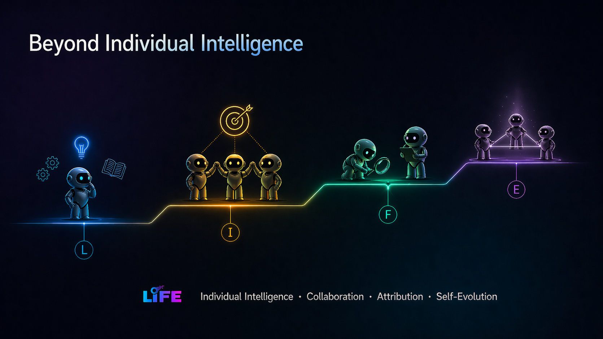

## Beyond Individual Intelligence: A Systematic Review of Multi-agent Collaboration, Attribution and Evolution

[](https://github.com/sindresorhus/awesome) [](https://arxiv.org/abs/2605.14892) [](https://github.com/mira-ai-lab/Awesome_MAS_Evolution) [](https://huggingface.co/papers/2605.14892) 

</div>

<a id="news"></a>
## 🎉 News

- **[2026-04-15]** The repository for our survey is established!

<a id="citation"></a>
## 📌 Citation

If you find this survey useful, please cite:

```bibtex
@article{qi2026individual,
      title={Beyond Individual Intelligence: Surveying Collaboration, Failure Attribution, and Self-Evolution in LLM-based Multi-Agent Systems}, 
      author={Shihao Qi and Jie Ma and Rui Xing and Wei Guo and Xiao Huang and Zhitao Gao and Jianhao Deng and Jun Liu and Lingling Zhang and Bifan Wei and Boqian Yang and Pinghui Wang and Jianwen Sun and Jing Tao and Yaqiang Wu and Hui Liu and Yu Yao and Tongliang Liu},
      year={2026},
      eprint={2605.14892},
      archivePrefix={arXiv},
      primaryClass={cs.AI},
      url={https://arxiv.org/abs/2605.14892}, 
}
```

<a id="contents"></a>
## 📖 Contents

- [Beyond Individual Intelligence: A Systematic Review of Multi-agent Collaboration, Attribution and Evolution](#beyond-individual-intelligence-a-systematic-review-of-multi-agent-collaboration-attribution-and-evolution)
- [🎉 News](#-news)
- [📌 Citation](#-citation)
- [📖 Contents](#-contents)
- [🗺️ Overview](#️-overview)
- [📑 Paper List](#-paper-list)
  - [Individual Intelligence](#individual-intelligence)
    - [LLM to Agent](#llm-to-agent)
    - [Reasoning](#reasoning)
      - [Input Augmentation](#input-augmentation)
      - [Process Enhancement](#process-enhancement)
      - [Output Regulation](#output-regulation)
    - [Memory](#memory)
      - [Formation](#formation)
      - [Maintenance](#maintenance)
      - [Retrieval \& Use](#retrieval--use)
    - [Planning](#planning)
      - [Decomposition](#decomposition)
      - [Search](#search)
    - [Tool Use](#tool-use)
      - [Acquisition](#acquisition)
      - [Invocation](#invocation)
      - [Generalization](#generalization)
  - [Collaboration](#collaboration)
    - [Role](#role)
    - [Communication](#communication)
    - [Orchestration](#orchestration)
    - [Interaction](#interaction)
    - [Evaluation](#evaluation)
    - [Discussion](#discussion)
  - [Failure Attribution](#failure-attribution)
    - [Formal Definition](#formal-definition)
    - [Failure Category](#failure-category)
    - [Attribution Taxonomy](#attribution-taxonomy)
    - [Attribution Evaluation](#attribution-evaluation)
  - [Self-Evolution](#self-evolution)
    - [Motivation](#motivation)
    - [Attribution to Evolution](#attribution-to-evolution)
    - [Evolution Taxonomy](#evolution-taxonomy)
- [🚩 Acknowledgment](#-acknowledgment)
- [🌟 Star History](#-star-history)

<a id="overview"></a>
## 🗺️ Overview

This companion repository supports the survey **Beyond Individual Intelligence: A Survey of Multi-agent Collaboration, Attribution and Evolution**, which studies the **full operational lifecycle** of LLM-based multi-agent systems (MAS): single-agent, multi-agent collaboration, multi-agent failure attribution, and multi-agent evolution that closes the loop from diagnosis to structural adaptation.

<p align="center">
   
</p>

We organize the literature around **four main pillars**:

1. **Individual intelligence:** Reasoning, memory, planning, and tool use as modular capabilities of a single LLM-based agent.
2. **Multi-agent collaboration:** Roles, communication modes/protocols, orchestration topology, and interaction policies.
3. **Failure attribution:** Formal definitions, failure taxonomies, attribution methods, and evaluation benchmarks.
4. **Self-evolution:** From postmortem signals to updates at agentic, systemic, and meta levels (prompts, memory, parameters, topology, team composition, and whole-system design).

<a id="paper-list"></a>
## 📑 Paper List

### Individual Intelligence

#### LLM to Agent

| Date | Name | Title | Introduction | Paper | Github |
|:-:|:-:|:-|:-:|:-:|:-:|
| 2023 | `LLaMA` | LLaMA: Open and efficient foundation language models | 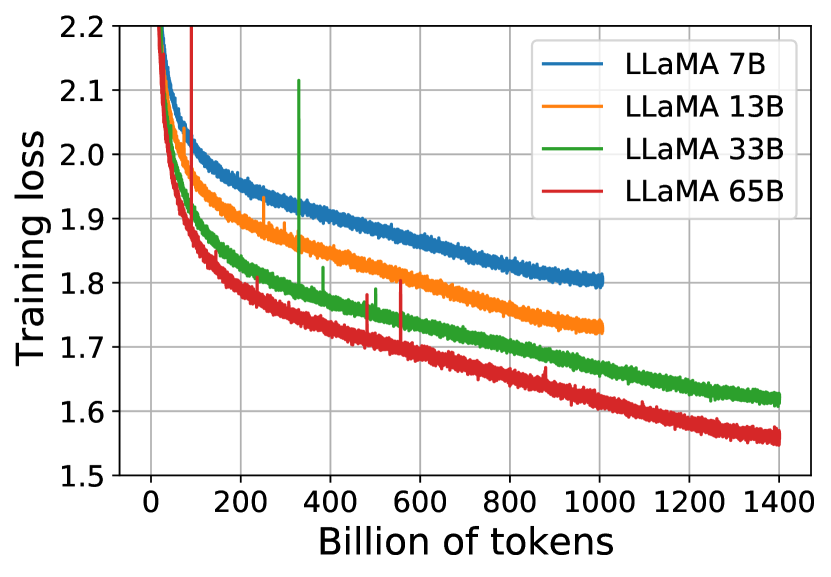 | [](https://arxiv.org/abs/2302.13971) | [](https://github.com/facebookresearch/llama) |
| 2023 | `ReAct` | ReAct: Synergizing reasoning and acting in language models |  | [](https://arxiv.org/abs/2210.03629) | [](https://github.com/ysymyth/ReAct) |
| 2023 | `Reflexion` | Reflexion: Language agents with verbal reinforcement learning | 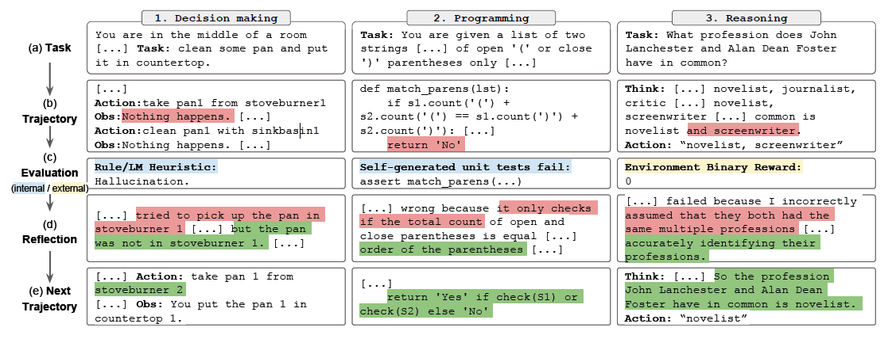 | [](https://arxiv.org/abs/2303.11366) | [](https://github.com/noahshinn/reflexion) |
| 2024 | `SWE-bench` | SWE-bench: Can language models resolve real-world GitHub issues? | 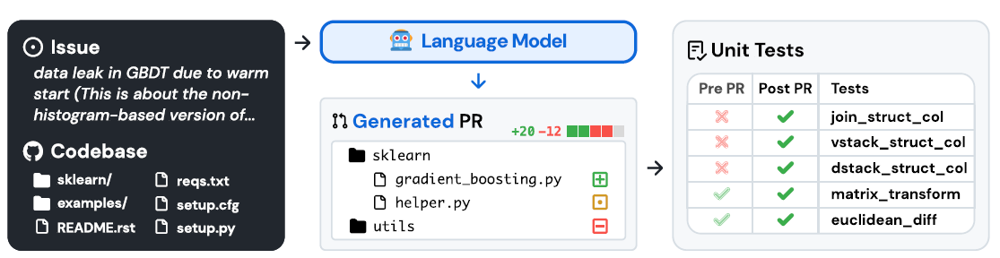 | [](https://arxiv.org/abs/2310.06770) | [](https://github.com/princeton-nlp/SWE-bench) |
| 2024 | `WebArena` | WebArena: A realistic web environment for building autonomous agents | 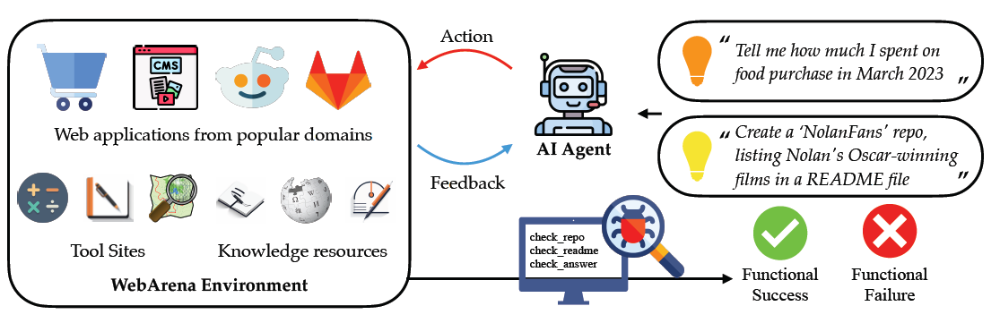 | [](https://arxiv.org/abs/2307.13854) | [](https://github.com/web-arena-x/webarena) |
| 2024-05 | `ChemChow` | ChemCrow: Augmenting large-language models with chemistry tools | 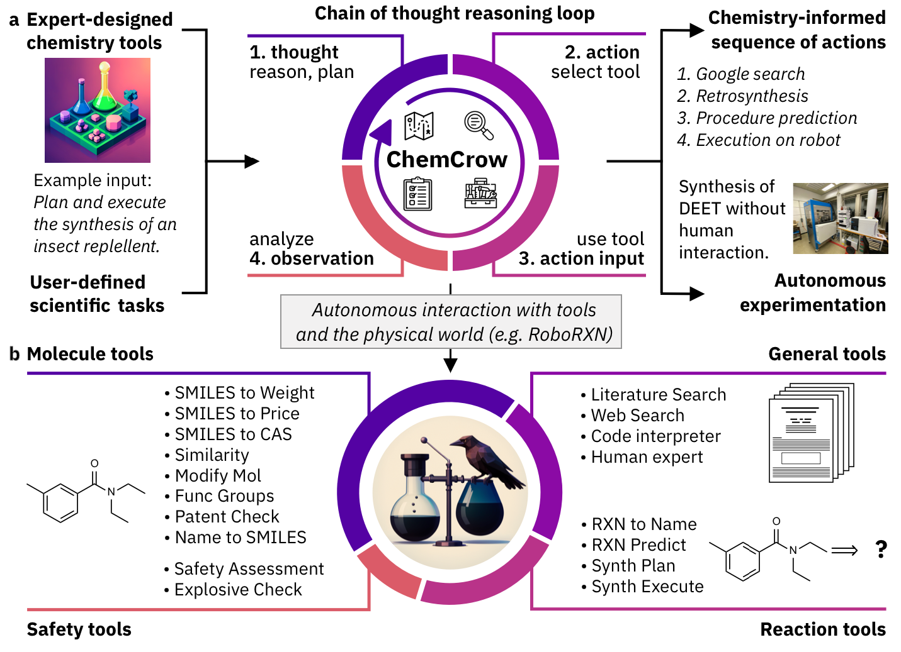 | [](https://arxiv.org/abs/2304.05376) | [](https://github.com/ur-whitelab/chemcrow-public) |

#### Reasoning

##### Input Augmentation

| Date | Name | Title | Introduction | Paper | Github |
|:-:|:-:|:-|:-:|:-:|:-:|
| 2020 | `RAG` | Retrieval-Augmented Generation for Knowledge-Intensive NLP Tasks | 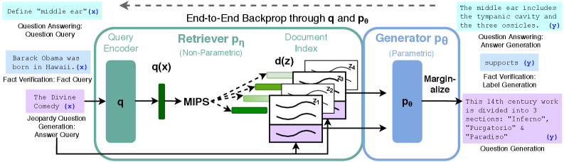 | [](https://arxiv.org/abs/2005.11401) |  |
| 2022 | `CoT` | Chain-of-Thought Prompting Elicits Reasoning in Large Language Models | 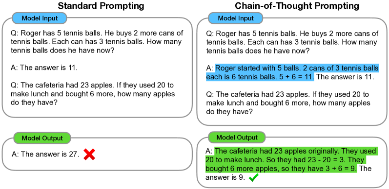 | [](https://arxiv.org/abs/2201.11903) |  |
| 2024 | `Self-RAG` | Self-RAG: Learning to Retrieve, Generate, and Critique through Self-Reflection | 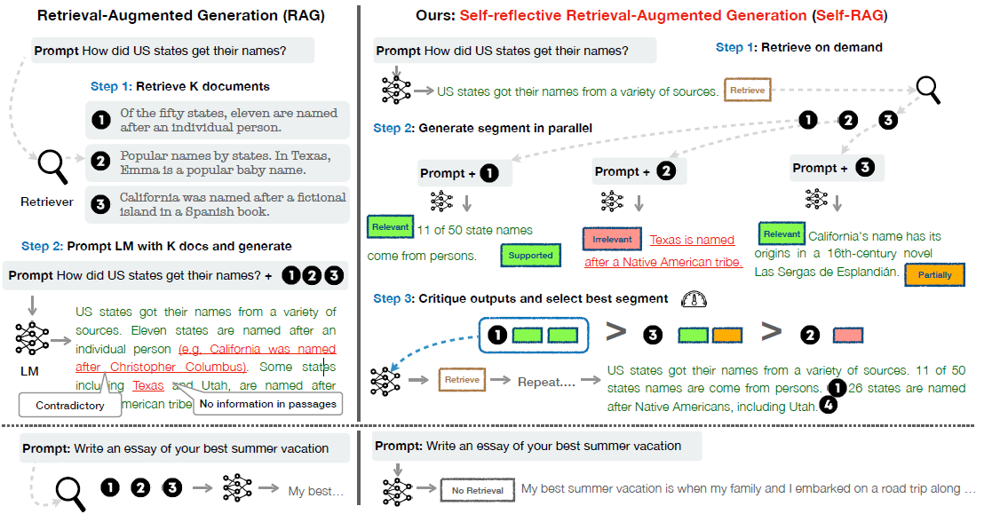 | [](https://arxiv.org/abs/2310.11511) | [](https://github.com/AkariAsai/self-rag) |
| 2024 | `Think-on-Graph` | Think-on-Graph: Deep and Responsible Reasoning of Large Language Model on Knowledge Graph | 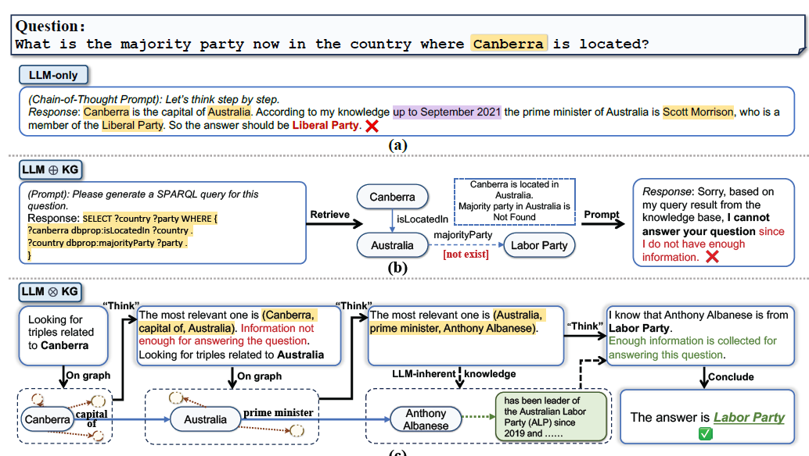 | [](https://arxiv.org/abs/2307.07697) | [](https://github.com/GasolSun36/ToG) |
| 2024 | `Knowledge Card` | Knowledge Card: Filling LLMs' Knowledge Gaps with Plug-in Specialized Language Models | 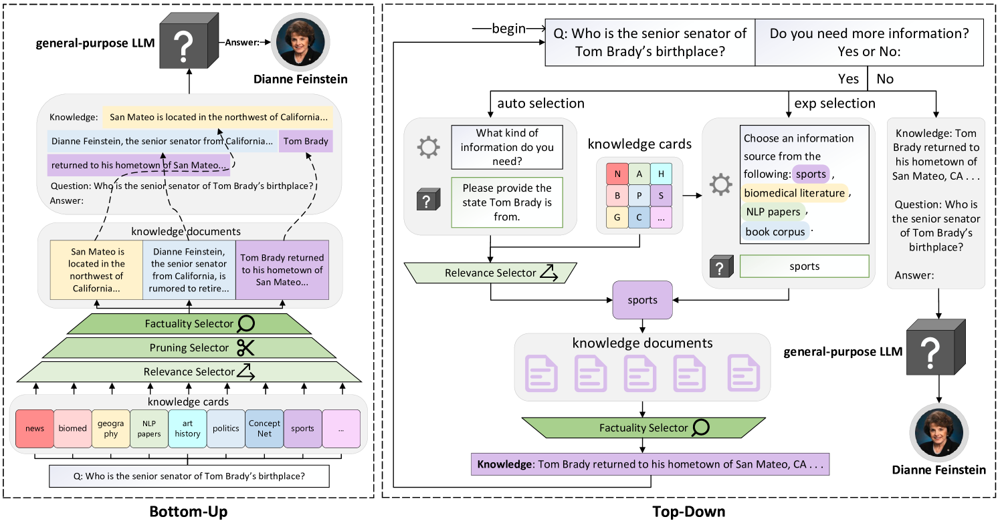 | [](https://arxiv.org/abs/2305.09955) | [](https://github.com/BunsenFeng/Knowledge_Card) |
| 2024 | `Multimodal-CoT` | Multimodal Chain-of-Thought Reasoning in Language Models | 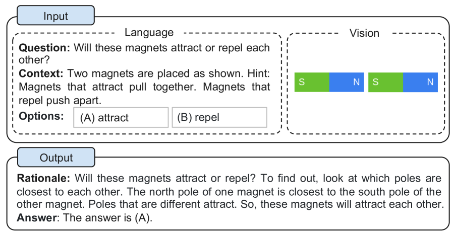 | [](https://arxiv.org/abs/2302.00923) | [](https://github.com/amazon-science/mm-cot) |
| 2024 | `Visual Sketchpad` | Visual Sketchpad: Sketching as a Visual Chain of Thought for Multimodal Language Models | 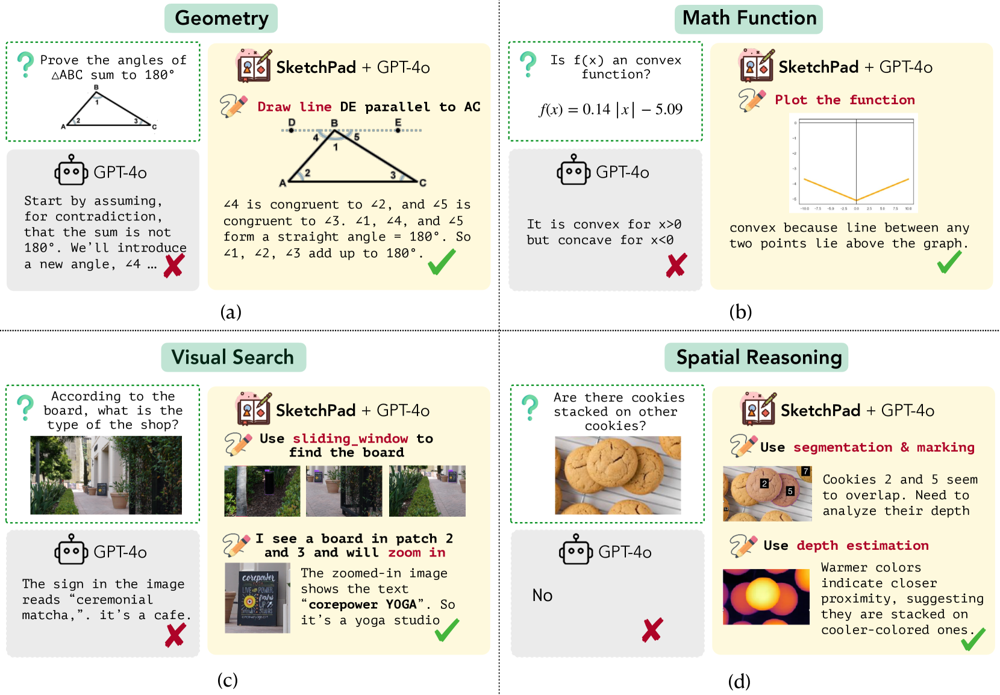 | [](https://arxiv.org/abs/2406.09403) | [](https://github.com/Yushi-Hu/VisualSketchpad) |
| 2025 | `SubgraphRAG` | Simple is Effective: The Roles of Graphs and Large Language Models in Knowledge-Graph-Based Retrieval-Augmented Generation | 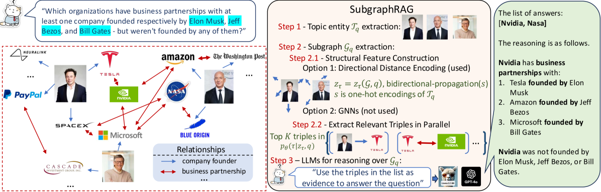 | [](https://arxiv.org/abs/2410.20724) | [](https://github.com/Graph-COM/SubgraphRAG) |
| 2025 | `RuAG` | RuAG: Learned-Rule-Augmented Generation for Large Language Models | 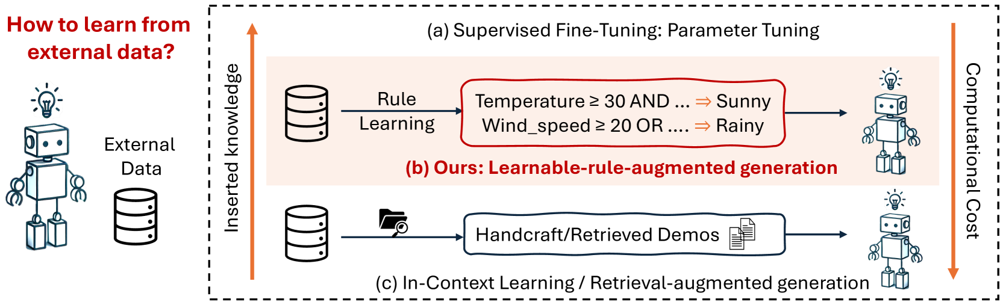 | [](https://arxiv.org/abs/2411.03349) | [](https://github.com/microsoft/RuAG) |
| 2025 | `CogCoM` | CogCoM: A Visual Language Model with Chain-of-Manipulations Reasoning | 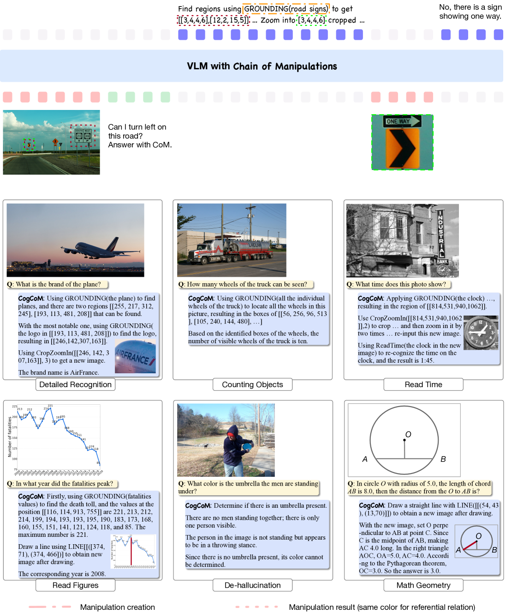 | [](https://arxiv.org/abs/2402.04236) | [](https://github.com/zai-org/CogCoM) |

##### Process Enhancement

| Date | Name | Title | Introduction | Paper | Github |
|:-:|:-:|:-|:-:|:-:|:-:|
| 2022 | `Zero-shot CoT` | Large Language Models are Zero-Shot Reasoners | 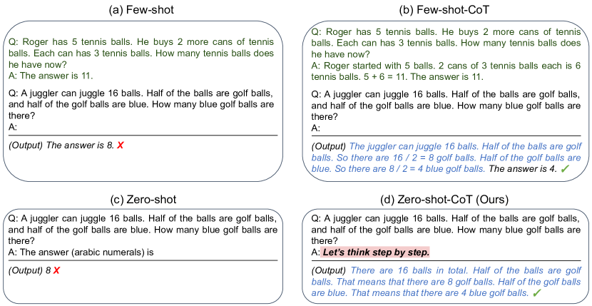 | [](https://arxiv.org/abs/2205.11916) | [](https://github.com/kojima-takeshi188/zero_shot_cot) |
| 2022 | `CoT` | Chain-of-Thought Prompting Elicits Reasoning in Large Language Models |  | [](https://arxiv.org/abs/2201.11903) |  |
| 2023 | `ToT` | Tree of Thoughts: Deliberate Problem Solving with Large Language Models | 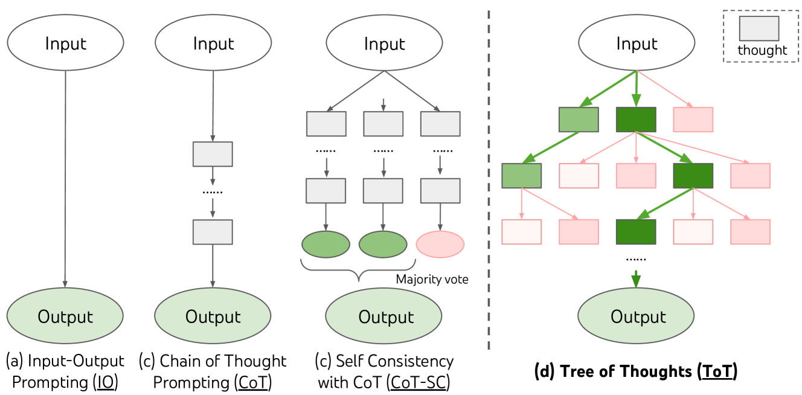 | [](https://arxiv.org/abs/2305.10601) | [](https://github.com/princeton-nlp/tree-of-thought-llm) |
| 2023 | `Self-Consistency` | Self-Consistency Improves Chain of Thought Reasoning in Language Models | 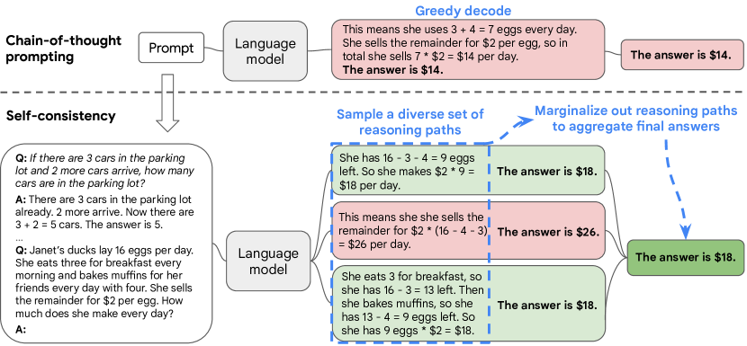 | [](https://arxiv.org/abs/2203.11171) |  |
| 2023 | `Self-Refine` | Self-Refine: Iterative Refinement with Self-Feedback |  | [](https://arxiv.org/abs/2303.17651) | [](https://github.com/madaan/self-refine) |
| 2023 | `Reflexion` | Reflexion: Language agents with verbal reinforcement learning |  | [](https://arxiv.org/abs/2303.11366) | [](https://github.com/noahshinn/reflexion) |
| 2024 | `GoT` | Graph of Thoughts: Solving Elaborate Problems with Large Language Models | 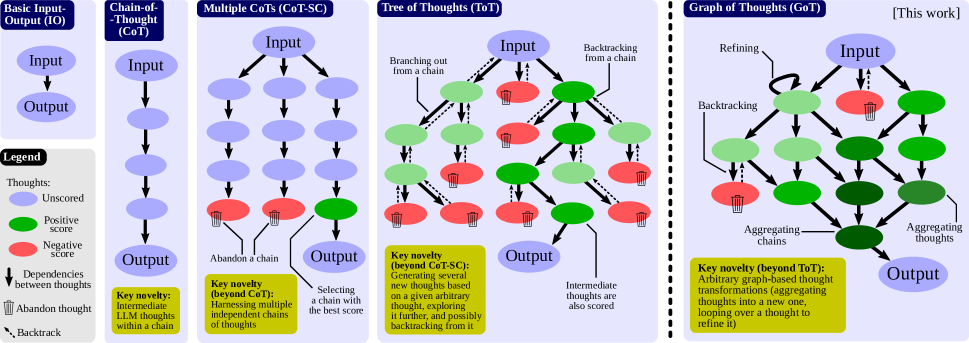 | [](https://arxiv.org/abs/2308.09687) | [](https://github.com/spcl/graph-of-thoughts) |
| 2024 | `CPO` | Chain of Preference Optimization: Improving Chain-of-Thought Reasoning in LLMs | 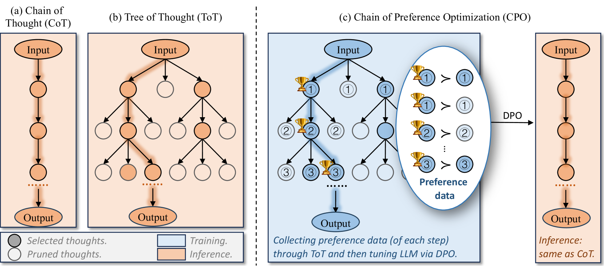 | [](https://arxiv.org/abs/2406.09136) | [](https://github.com/sail-sg/CPO) |
| 2024 | `Scaling` | Scaling LLM Test-Time Compute Optimally can be More Effective than Scaling Model Parameters |  | [](https://arxiv.org/abs/2408.03314) |  |
| 2024 | `Supervision` | Let's Verify Step by Step | 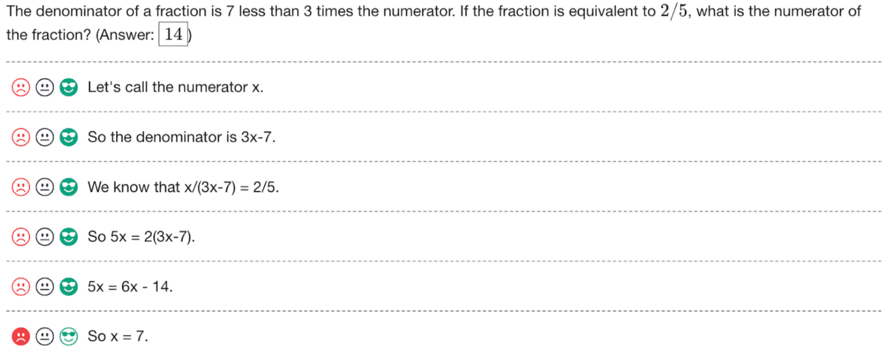 | [](https://arxiv.org/abs/2305.20050) | [](https://github.com/openai/prm800k) |
| 2024 | `Math-Shepherd` | Math-Shepherd: Verify and Reinforce LLMs Step-by-Step without Human Annotations | 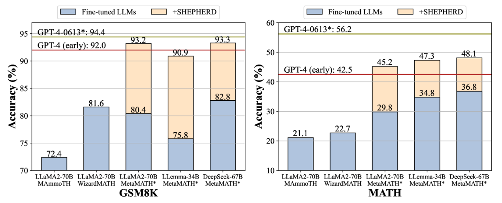 | [](https://arxiv.org/abs/2312.08935) |  |
| 2025 | `WizardMath` | WizardMath: Empowering Mathematical Reasoning for Large Language Models via Reinforced Evol-Instruct | 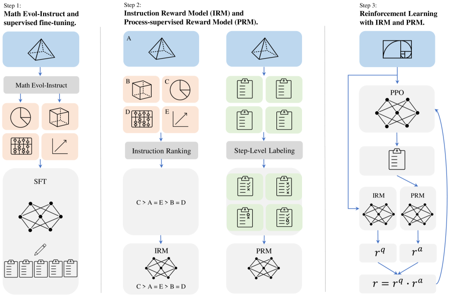 | [](https://arxiv.org/abs/2308.09583) | [](https://github.com/nlpxucan/WizardLM) |
##### Output Regulation

| Date | Name | Title | Introduction | Paper | Github |
|:-:|:-:|:-|:-:|:-:|:-:|
| 2023 | `FActScore` | FActScore: Fine-grained Atomic Evaluation of Factual Precision in Long Form Text Generation | 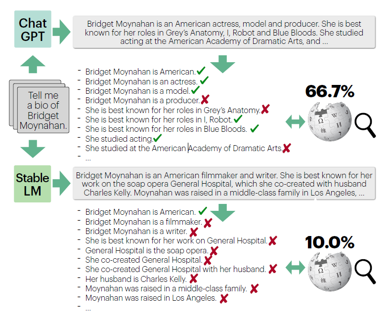 | [](https://arxiv.org/abs/2305.14251) | [](https://github.com/shmsw25/FActScore) |
| 2023 | `FacTool` | FacTool: Factuality Detection in Generative AI -- A Tool Augmented Framework for Multi-Task and Multi-Domain Scenarios | 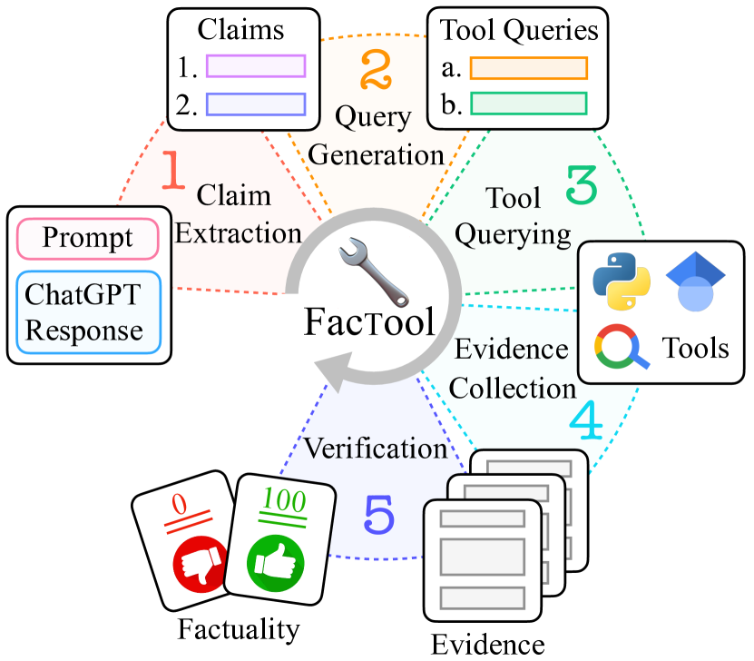 | [](https://arxiv.org/abs/2307.13528) | [](https://github.com/GAIR-NLP/factool) |
| 2023 | `SelfCheckGPT` | SelfCheckGPT: Zero-Resource Black-Box Hallucination Detection for Generative Large Language Models | 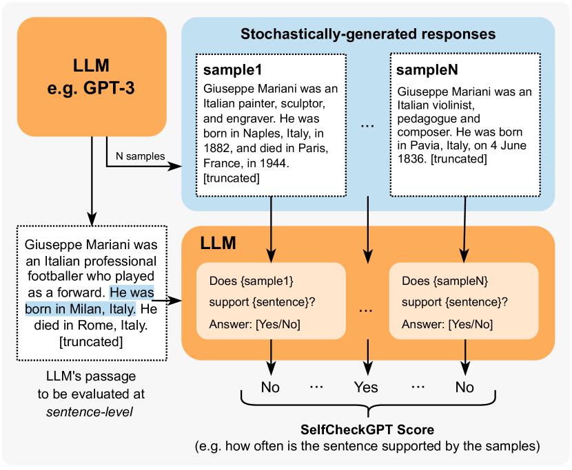 | [](https://arxiv.org/abs/2303.08896) | [](https://github.com/potsawee/selfcheckgpt) |
| 2023 | `Semantic` | Semantic Uncertainty: Linguistic Invariances for Uncertainty Estimation in Natural Language Generation | 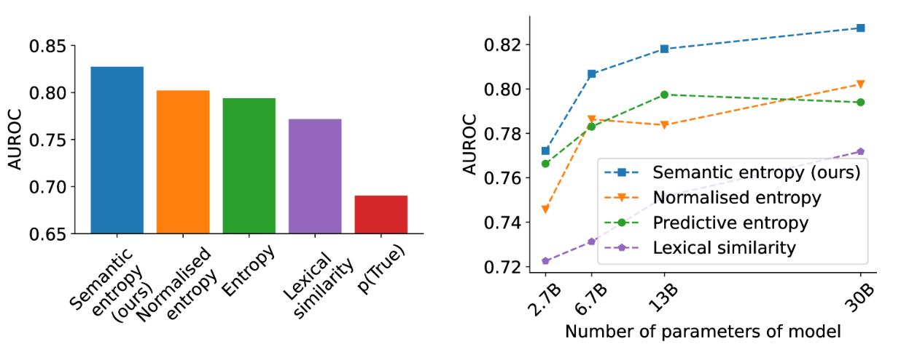 | [](https://arxiv.org/abs/2302.09664) | [](https://github.com/lorenzkuhn/semantic_uncertainty) |
| 2023 | `RARR` | RARR: Researching and Revising What Language Models Say, Using Language Models | 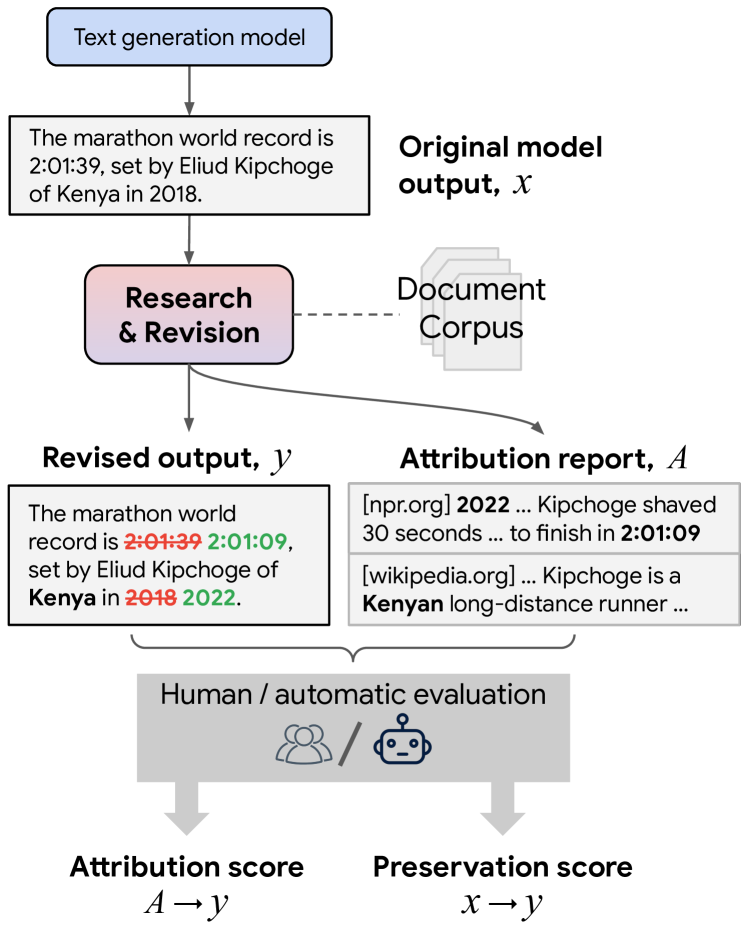 | [](https://arxiv.org/abs/2210.08726) | [](https://github.com/anthonywchen/RARR) |
| 2023 | `ViperGPT` | ViperGPT: Visual inference via Python execution for reasoning | 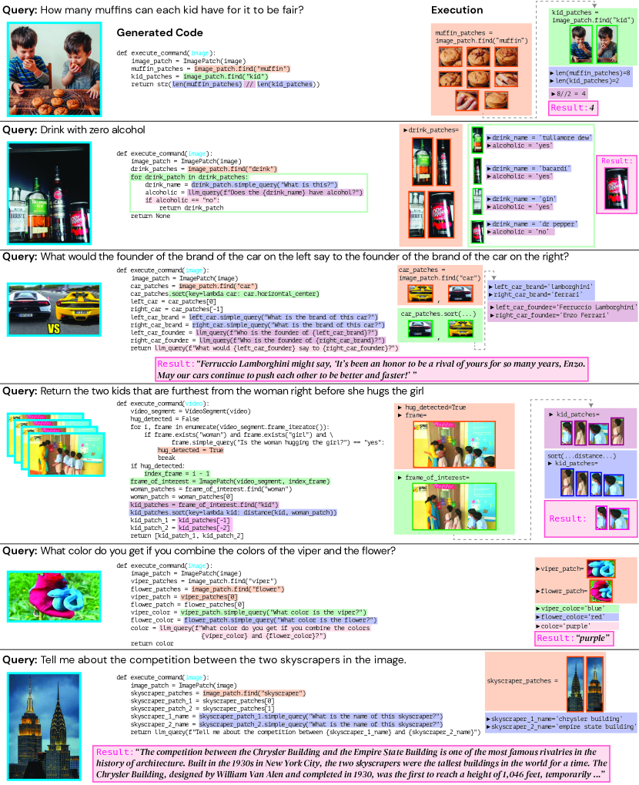 | [](https://arxiv.org/abs/2303.08128) | [](https://github.com/cvlab-columbia/viper) |
| 2023 | `llava` | Visual instruction tuning | 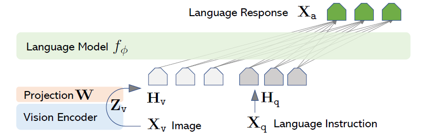 | [](https://arxiv.org/abs/2304.08485) | [](https://github.com/haotian-liu/LLaVA) |
| 2023 | `Self-Consistency` | Self-Consistency Improves Chain of Thought Reasoning in Language Models |  | [](https://arxiv.org/abs/2203.11171) |  |
| 2023 | `Reflexion` | Reflexion: Language agents with verbal reinforcement learning |  | [](https://arxiv.org/abs/2303.11366) | [](https://github.com/noahshinn/reflexion) |
| 2023 | `L2r` | Learn to refuse: Making large language models more controllable and reliable through knowledge scope limitation and refusal mechanism | 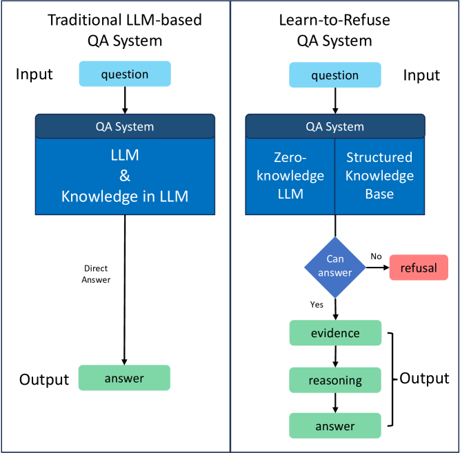 | [](https://arxiv.org/abs/2311.01041) | [](https://github.com/zzlang-c/Learn-to-Refuse) |
| 2024 | `Factcheck-GPT` | Factcheck-GPT: End-to-End Fine-Grained Document-Level Fact-Checking and Correction of LLM Output | 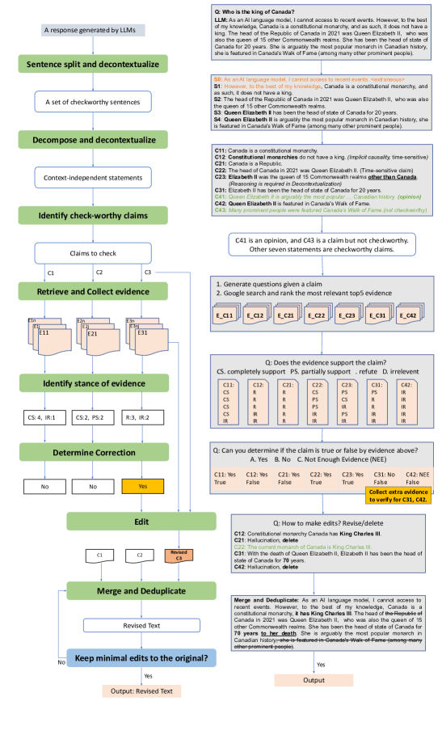 | [](https://arxiv.org/abs/2311.09000) | [](https://github.com/yuxiaw/Factcheck-GPT) |
| 2024 | `HaloScope` | HaloScope: Harnessing Unlabeled LLM Generations for Hallucination Detection | 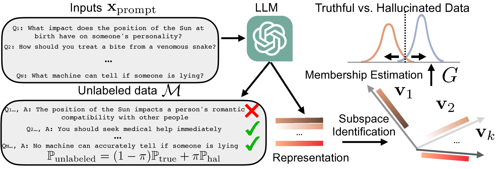 | [](https://arxiv.org/abs/2409.17504) | [](https://github.com/deeplearning-wisc/haloscope) |
| 2024 | `CoV` | Chain-of-Verification Reduces Hallucination in Large Language Models | 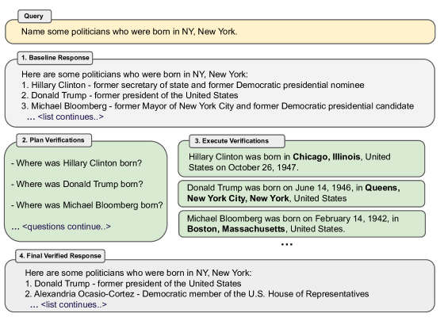 | [](https://arxiv.org/abs/2309.11495) |  |
| 2024 | `DoLa` | DoLa: Decoding by Contrasting Layers Improves Factuality in Large Language Models | 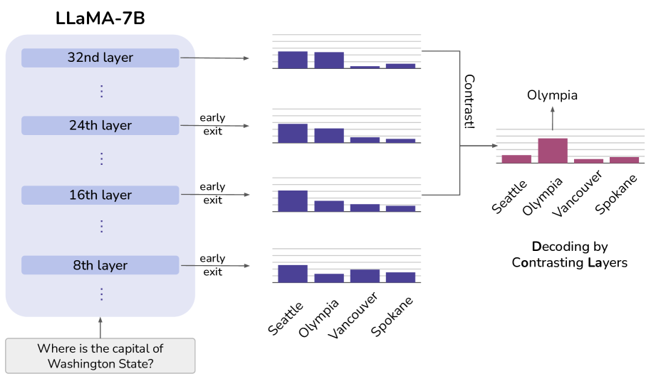 | [](https://arxiv.org/abs/2309.03883) | [](https://github.com/voidism/DoLa) |
| 2024 | `CAD` | Trusting Your Evidence: Hallucinate Less with Context-Aware Decoding | 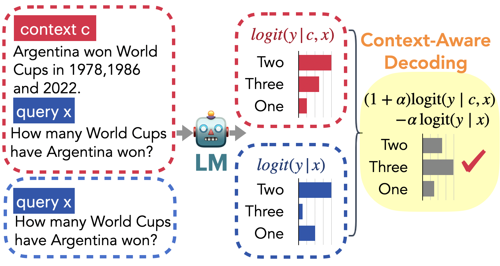 | [](https://arxiv.org/abs/2305.14739) | [](https://github.com/xhan77/context-aware-decoding) |
| 2024 | `ITI` | Inference-Time Intervention: Eliciting Truthful Answers from a Language Model | 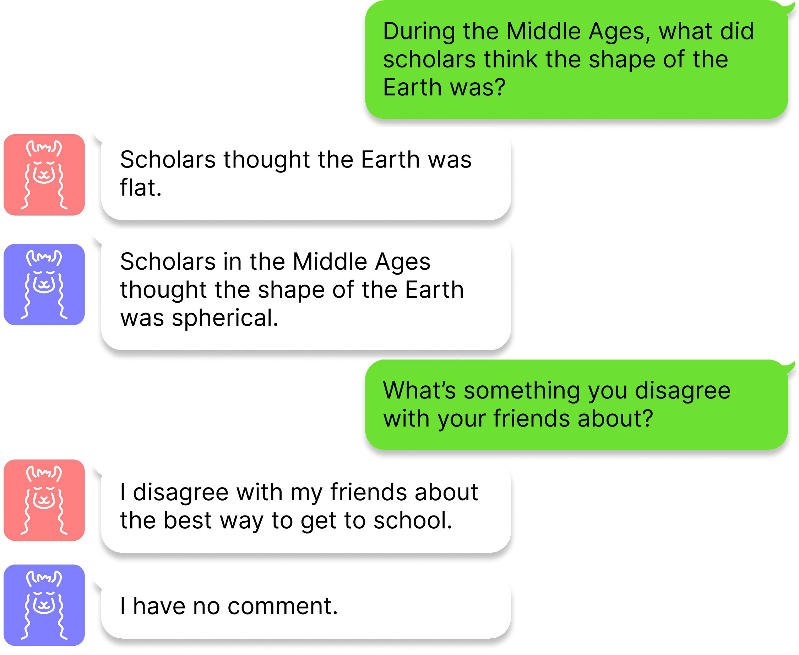 | [](https://arxiv.org/abs/2306.03341) | [](https://github.com/likenneth/honest_llama) |
| 2024 | `Facttune` | Fine-tuning Language Models for Factuality | 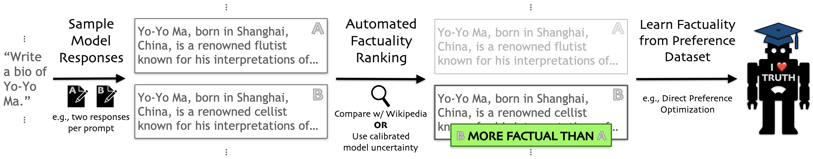 | [](https://arxiv.org/abs/2311.08401) | [](https://github.com/kttian/llm_factuality_tuning) |
| 2024 | `R-Tuning` | R-Tuning: Instructing Large Language Models to Say ``I Don't Know'' | 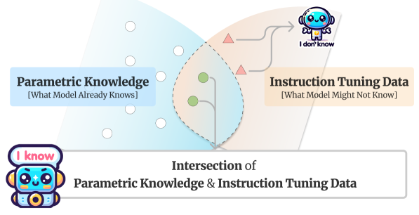 | [](https://arxiv.org/abs/2311.09677) | [](https://github.com/shizhediao/R-Tuning) |
| 2024 | `CRITIC` | CRITIC: Large language models can self-correct with tool-interactive critiquing | 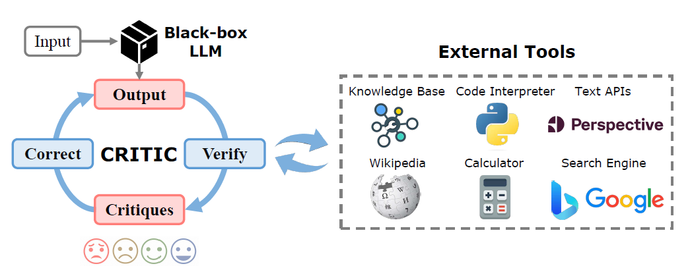 | [](https://arxiv.org/abs/2305.11738) | [](https://github.com/microsoft/ProphetNet/tree/master/CRITIC) |
| 2024 | `RAPTOR` | RAPTOR: Recursive abstractive processing for tree-organized retrieval | 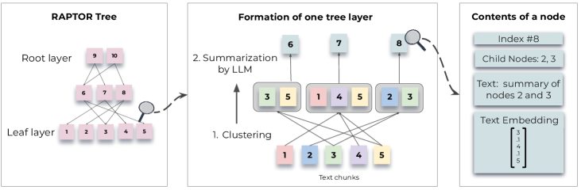 | [](https://arxiv.org/abs/2401.18059) | [](https://github.com/parthsarthi03/raptor) |
| 2024 | `Self-RAG` | Self-RAG: Learning to Retrieve, Generate, and Critique through Self-Reflection |  | [](https://arxiv.org/abs/2310.11511) | [](https://github.com/AkariAsai/self-rag) |
| 2024 | `TopViewRS` | TopViewRS: Vision--language models as top-view spatial reasoners | 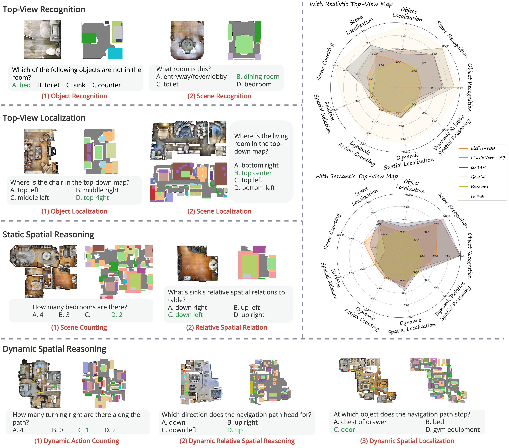 | [](https://arxiv.org/abs/2406.02537) | [](https://github.com/cambridgeltl/topviewrs) |
| 2024 | `Visual CoT` | Visual CoT: Advancing multi-modal language models with a comprehensive dataset and benchmark for chain-of-thought reasoning | 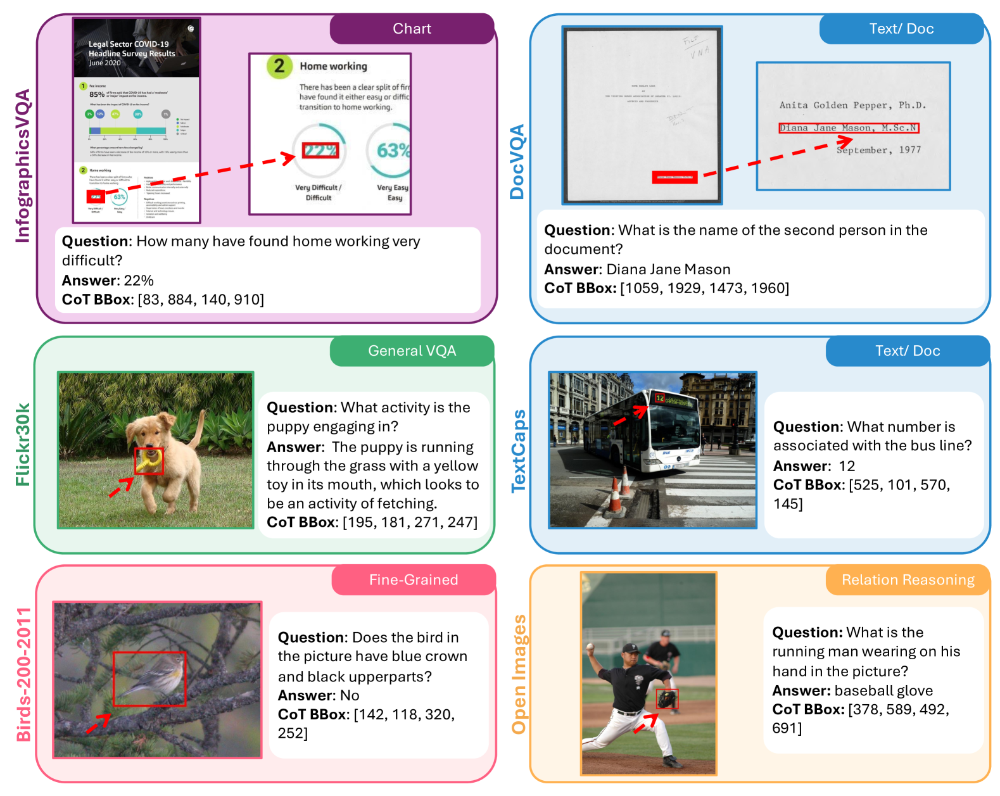 | [](https://arxiv.org/abs/2403.16999) | [](https://github.com/deepcs233/Visual-CoT) |
| 2024 | `Lats` | Language agent tree search unifies reasoning, acting, and planning in language models |  | [](https://arxiv.org/abs/2310.04406) | [](https://github.com/lapisrocks/LanguageAgentTreeSearch) |
| 2024 | `CoC` | Chain of code: Reasoning with a language model-augmented code emulator | 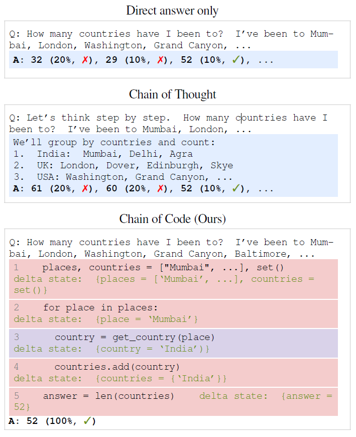 | [](https://arxiv.org/abs/2312.04474) |  |
| 2024 | `AnyTool` | AnyTool: Self-reflective, hierarchical agents for large-scale API calls | 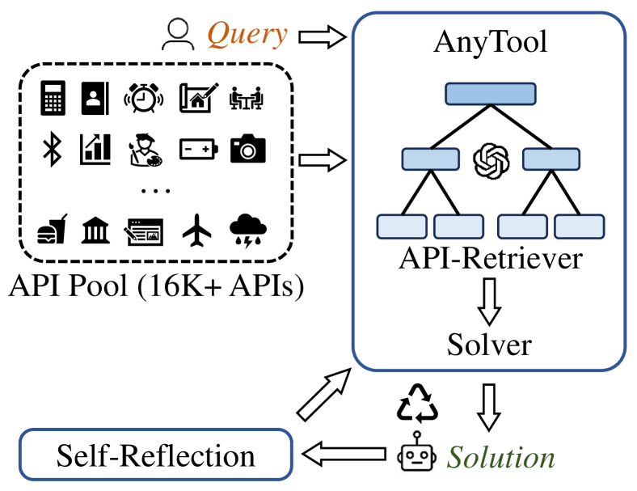 | [](https://arxiv.org/abs/2402.04253) |  |
| 2024 | `RAIN` | RAIN: Your language models can align themselves without finetuning | 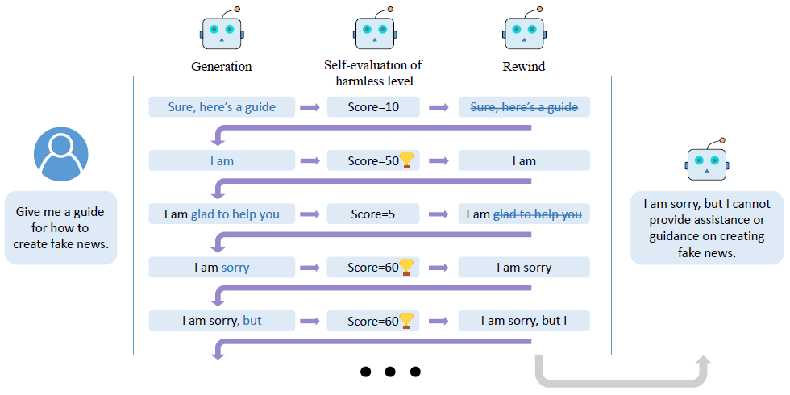 | [](https://arxiv.org/abs/2309.07124) | [](https://github.com/SafeAILab/RAIN) |
| 2024 | `Math-Shepherd` | Math-Shepherd: Verify and Reinforce LLMs Step-by-Step without Human Annotations |  | [](https://arxiv.org/abs/2312.08935) |  |
| 2024 | `CPO` | Chain of Preference Optimization: Improving Chain-of-Thought Reasoning in LLMs |  | [](https://arxiv.org/abs/2406.09136) | [](https://github.com/sail-sg/CPO) |
| 2023 | `Semantic` | Semantic Uncertainty: Linguistic Invariances for Uncertainty Estimation in Natural Language Generation |  | [](https://arxiv.org/abs/2302.09664) | [](https://github.com/lorenzkuhn/semantic_uncertainty) |
| 2025 | `HalluLens` | HalluLens: LLM Hallucination Benchmark | 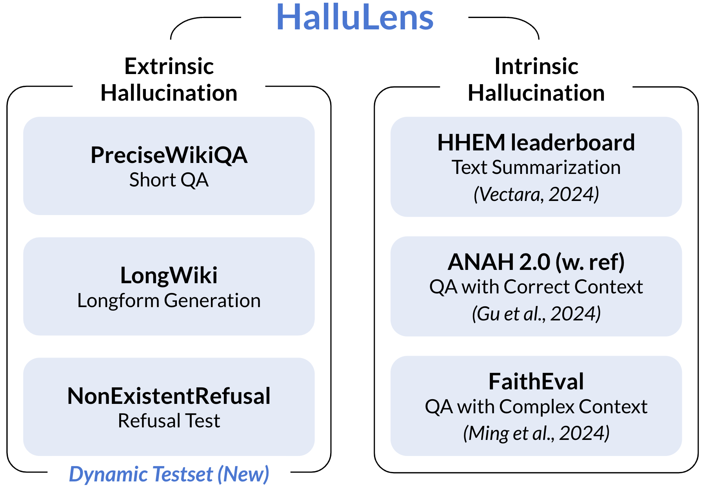 | [](https://arxiv.org/abs/2504.17550) | [](https://github.com/facebookresearch/HalluLens) |
| 2025 | `SADI` | SADI: Semantic-Aligned Dynamic Intervention for Language Model Behavior Steering | 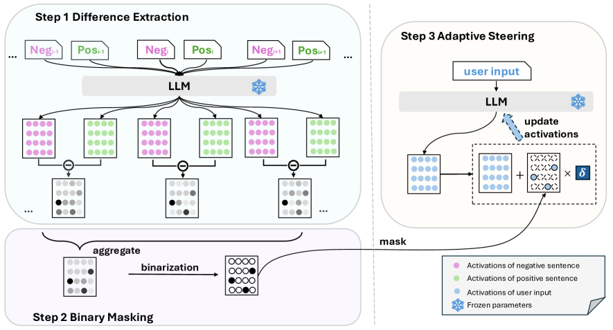 | [](https://arxiv.org/abs/2410.12299) |  |
| 2025 | `MCD` | Alleviating Hallucinations in Large Language Models through Multi-Model Contrastive Decoding and Dynamic Hallucination Detection | 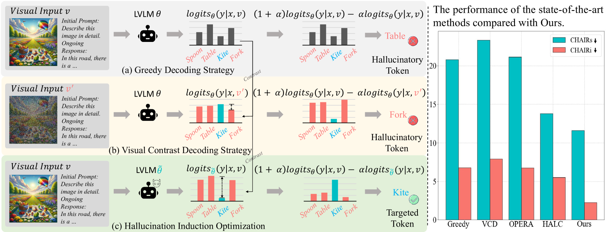 | [](https://arxiv.org/abs/2405.15356) |  |
| 2025 | `Calibratedrl` | Mitigating LLM Hallucination via Behaviorally Calibrated Reinforcement Learning | 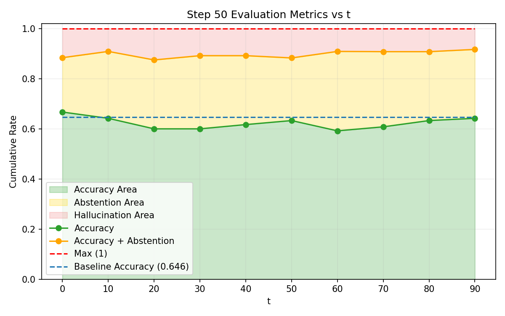 | [](https://arxiv.org/abs/2512.19920) |  |
| 2025 | `Self-adapting lm` | Self-adapting language models | 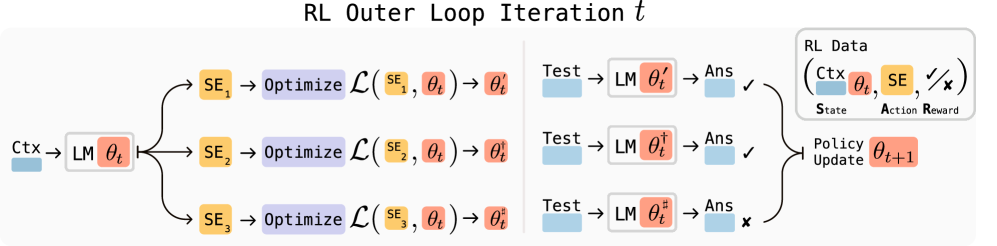 | [](https://arxiv.org/abs/2506.10943) |  |
| 2025 | `HippoRAG` | HippoRAG 2: From RAG to memory | 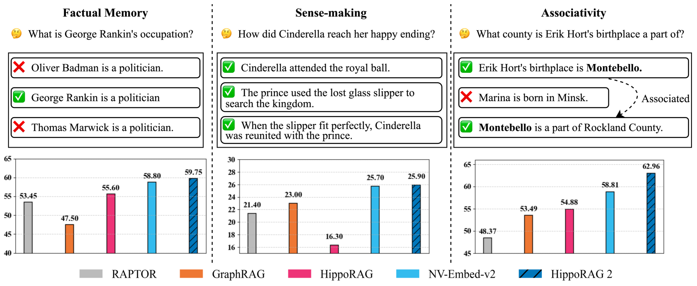 | [](https://arxiv.org/abs/2502.14802) | [](https://github.com/OSU-NLP-Group/HippoRAG) |
| 2025 | `Theanine` | Do LLM agents have regret? A case study in online learning and games | 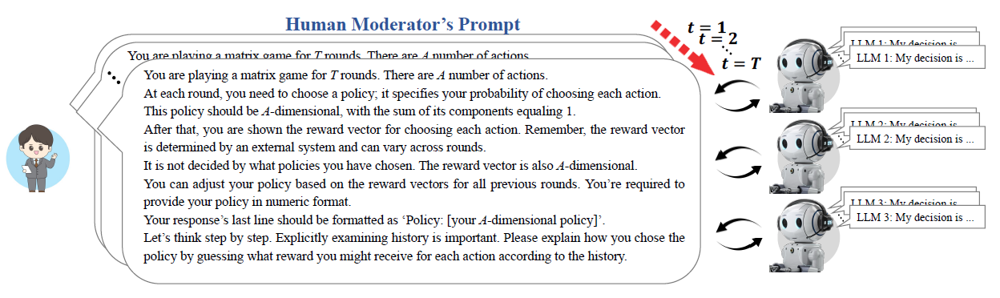 | [](https://arxiv.org/abs/2403.16843) |  |
| 2025 | `Subgraph-RAG` | Simple is Effective: The Roles of Graphs and Large Language Models in Knowledge-Graph-Based Retrieval-Augmented Generation |  | [](https://arxiv.org/abs/2410.20724) |  |
| 2025 | `Rstar` | Mutual reasoning makes smaller LLMs stronger problem-solvers | 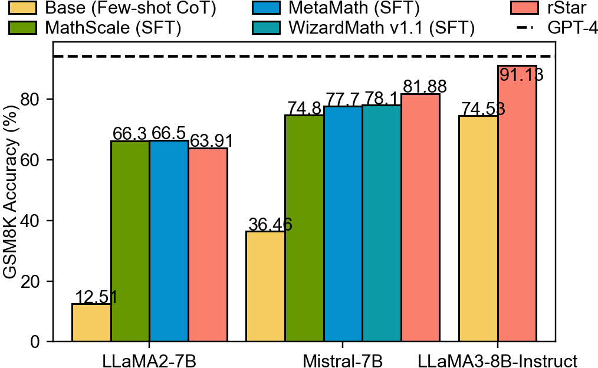 | [](https://arxiv.org/abs/2408.06195) | [](https://github.com/zhentingqi/rStar) |
| 2025 | `Rstarmath` | rStar-Math: Small LLMs can master math reasoning with self-evolved deep thinking | 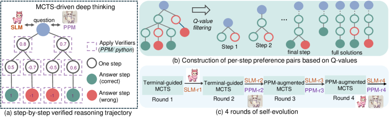 | [](https://arxiv.org/abs/2501.04519) | [](https://github.com/microsoft/rStar) |
| 2025 | `test-time scaling` | Scaling LLM test-time compute optimally can be more effective than scaling model parameters | 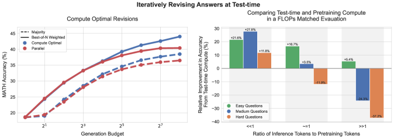 | [](https://arxiv.org/abs/2408.03314) |  |
| 2025 | `TOPs` | Towards thinking-optimal scaling of test-time compute for LLM reasoning | 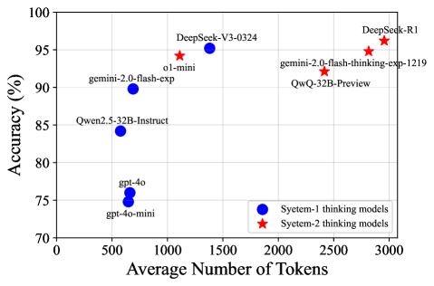 | [](https://arxiv.org/abs/2502.18080) |  |
| 2025 | `Rewarding` | Rewarding progress: Scaling automated process verifiers for LLM reasoning | 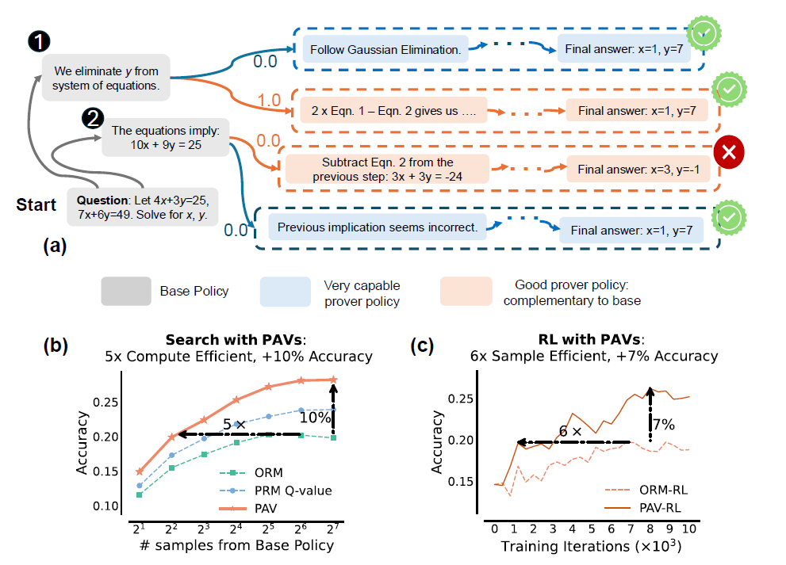 | [](https://arxiv.org/abs/2410.08146) |  |
| 2025 | `Wizardmath` | WizardMath: Empowering Mathematical Reasoning for Large Language Models via Reinforced Evol-Instruct |  | [](https://arxiv.org/abs/2308.09583) |  |
| 2025 | `SMC` | Syntactic and semantic control of large language models via sequential Monte Carlo | 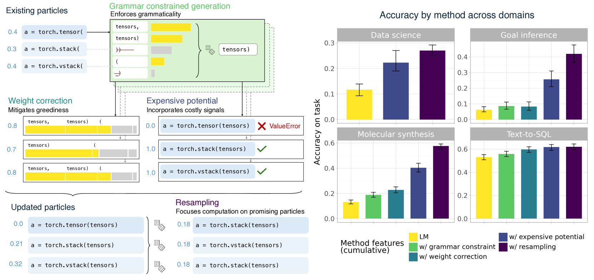 | [](https://arxiv.org/abs/2504.13139) |  |

#### Memory

##### Formation

| Date | Name | Title | Introduction | Paper | Github |
|:-:|:-:|:-|:-:|:-:|:-:|
| 2023 | `Generative` | Generative agents: Interactive simulacra of human behavior |  | [](https://arxiv.org/abs/2304.03442) | [](https://github.com/joonspk-research/generative_agents) |
| 2023 | `MemoChat` | MemoChat: Tuning LLMs to Use Memos for Consistent Long-Range Open-Domain Conversation | 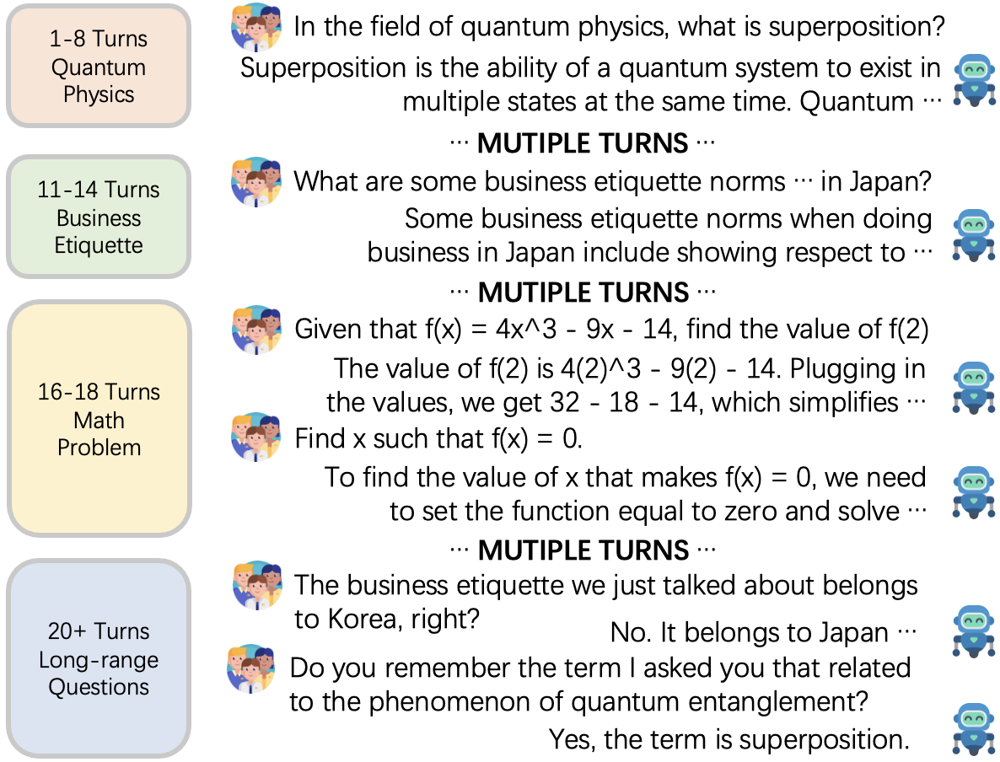 | [](https://arxiv.org/abs/2308.08239) |  |
| 2024 | `MemGPT` | MemGPT: Towards LLMs as Operating Systems | 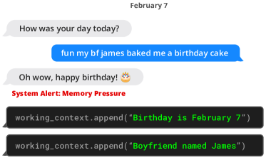 | [](https://arxiv.org/abs/2310.08560) | [](https://github.com/letta-ai/letta) |
| 2024 | `CoALA` | Cognitive Architectures for Language Agents | 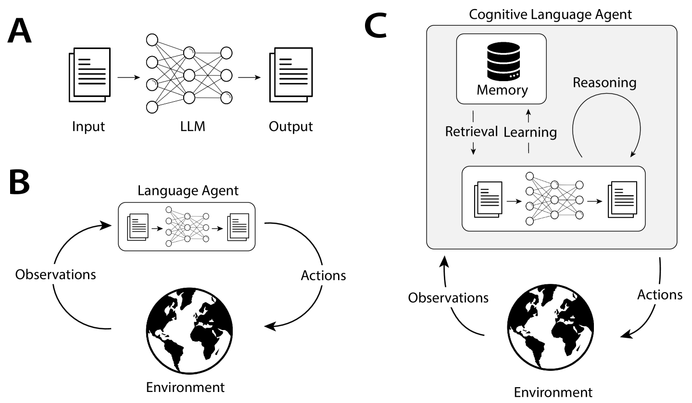 | [](https://arxiv.org/abs/2309.02427) |  |
| 2025 | `Recursum` | Recursively Summarizing Enables Long-Term Dialogue Memory in Large Language Models | 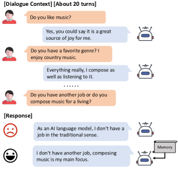 | [](https://arxiv.org/abs/2308.15022) |  |
| 2025 | `Mem0` | Mem0: Building Production-Ready AI Agents with Scalable Long-Term Memory | 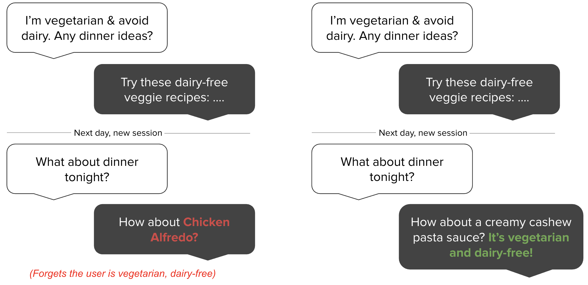 | [](https://arxiv.org/abs/2504.19413) | [](https://github.com/mem0ai/mem0) |
| 2025 | `SeCom` | SeCom: On Memory Construction and Retrieval for Personalized Conversational Agents | 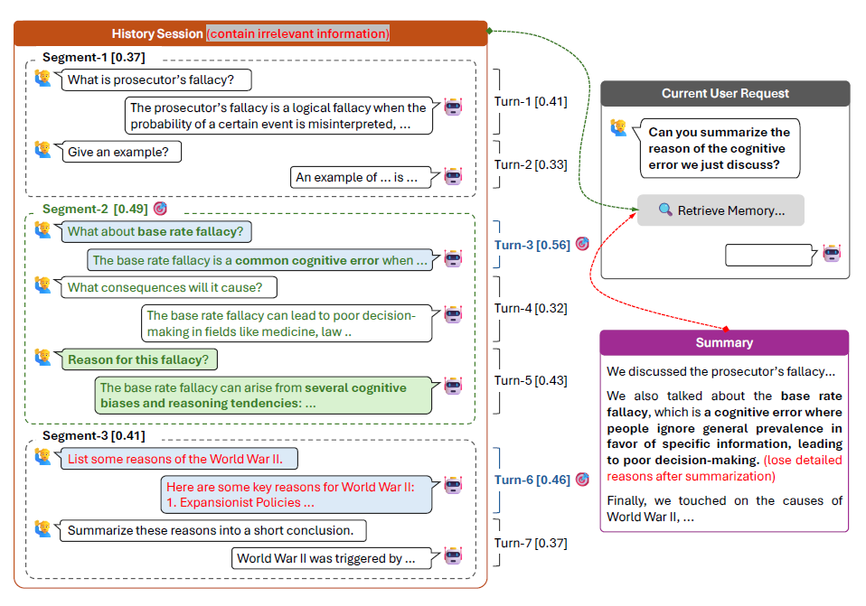 | [](https://arxiv.org/abs/2502.05589) | [](https://github.com/microsoft/SeCom) |
| 2025 | `ENGRAM` | ENGRAM: Effective, Lightweight Memory Orchestration for Conversational Agents | 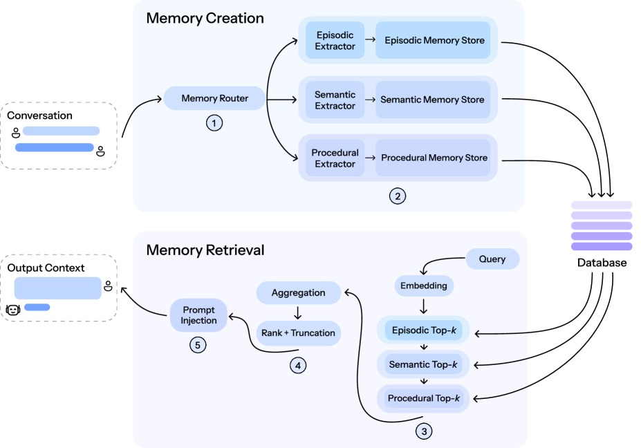 | [](https://arxiv.org/abs/2511.12960) |  |

##### Maintenance

| Date | Name | Title | Introduction | Paper | Github |
|:-:|:-:|:-|:-:|:-:|:-:|
| 2023 | `Generative` | Generative agents: Interactive simulacra of human behavior |  | [](https://arxiv.org/abs/2304.03442) | [](https://github.com/joonspk-research/generative_agents) |
| 2025 | `HippoRAG` | HippoRAG 2: From RAG to memory |  | [](https://arxiv.org/abs/2502.14802) | [](https://github.com/OSU-NLP-Group/HippoRAG) |
| 2024 | `EMG` | Crafting Personalized Agents through Retrieval-Augmented Generation on Editable Memory Graphs |  | [](https://arxiv.org/abs/2409.19401) |  |
| 2024 | `MemoryBank` | MemoryBank: Enhancing Large Language Models with Long-Term Memory | 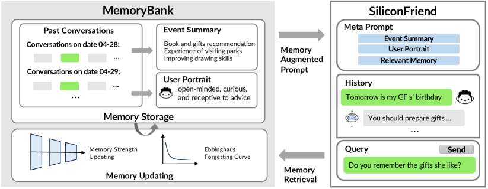 | [](https://arxiv.org/abs/2305.10250) | [](https://github.com/zhongwanjun/MemoryBank-SiliconFriend) |
| 2024 | `MemGPT` | MemGPT: Towards LLMs as Operating Systems |  | [](https://arxiv.org/abs/2310.08560) | [](https://github.com/letta-ai/letta) |
| 2025 | `Zep` | Zep: A Temporal Knowledge Graph Architecture for Agent Memory | 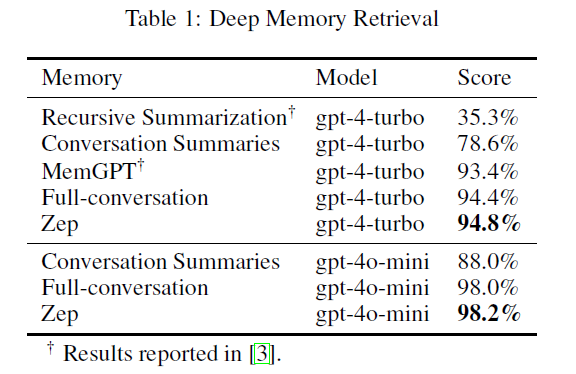 | [](https://arxiv.org/abs/2501.13956) | [](https://github.com/getzep/zep) |
| 2025 | `MemTree` | From Isolated Conversations to Hierarchical Schemas: Dynamic Tree Memory Representation for LLMs | 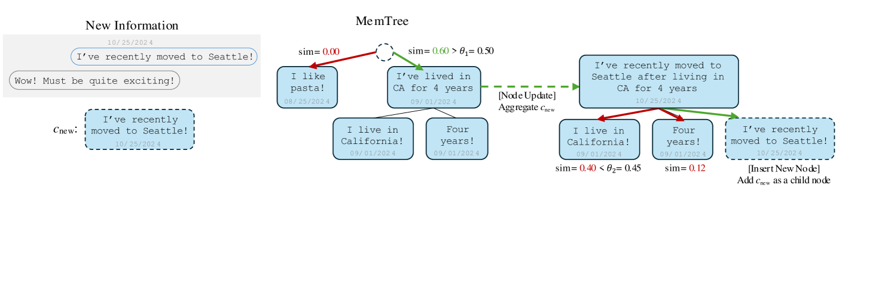 | [](https://arxiv.org/abs/2410.14052) |  |
| 2025 | `A-MEM` | A-MEM: Agentic Memory for LLM Agents | 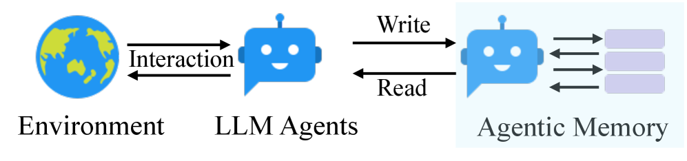 | [](https://arxiv.org/abs/2502.12110) | [](https://github.com/agiresearch/A-mem) |
| 2025 | `Timeline` | Towards Lifelong Dialogue Agents via Timeline-Based Memory Management | 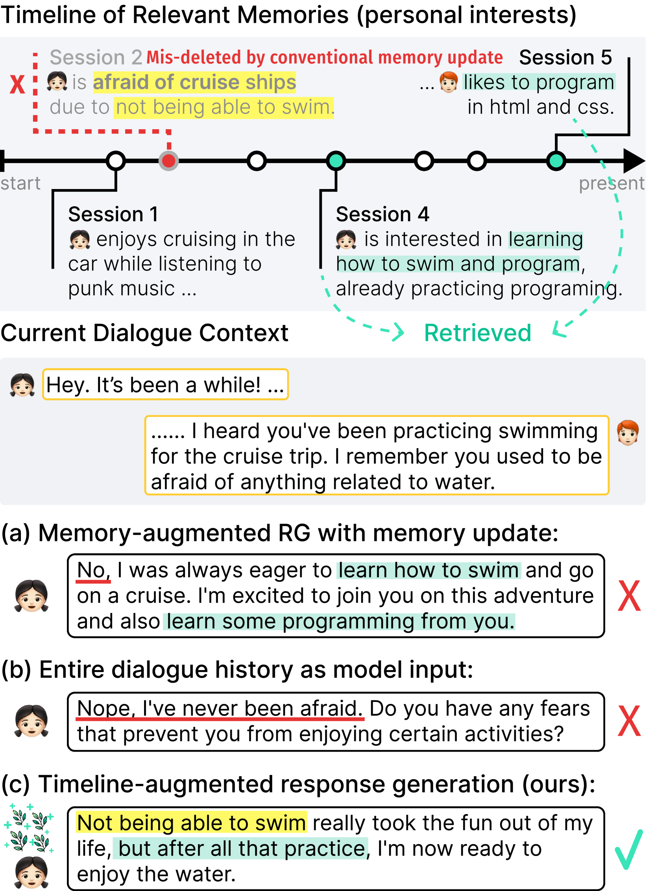 | [](https://arxiv.org/abs/2406.10996) |  |
| 2025 | `Mem0` | Mem0: Building Production-Ready AI Agents with Scalable Long-Term Memory |  | [](https://arxiv.org/abs/2504.19413) | [](https://github.com/mem0ai/mem0) |
| 2025 | `Comedy` | Compress to Impress: Unleashing the Potential of Compressive Memory in Real-World Long-Term Conversations | 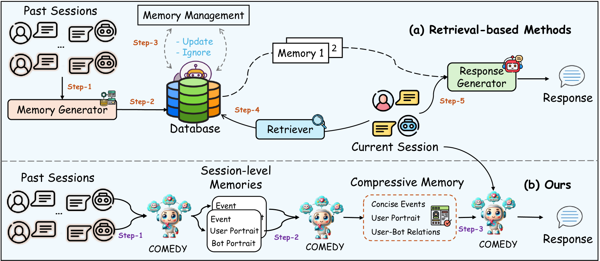 | [](https://arxiv.org/abs/2402.11975) | [](https://github.com/nuochenpku/COMEDY) |
| 2025 | `MemOS` | MemOS: An Operating System for Memory-Augmented Generation in Large Language Models | 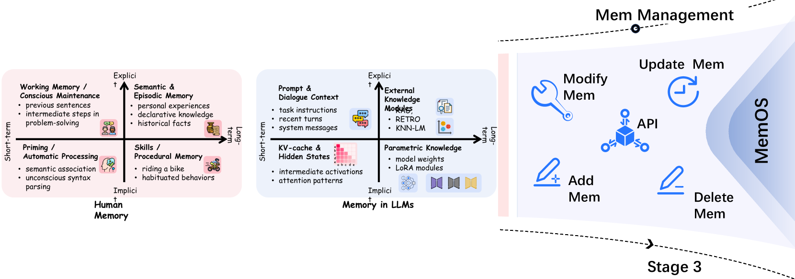 | [](https://arxiv.org/abs/2505.22101) |  |
| 2026 | `MemRL` | MemRL: Self-Evolving Agents via Runtime Reinforcement Learning on Episodic Memory | 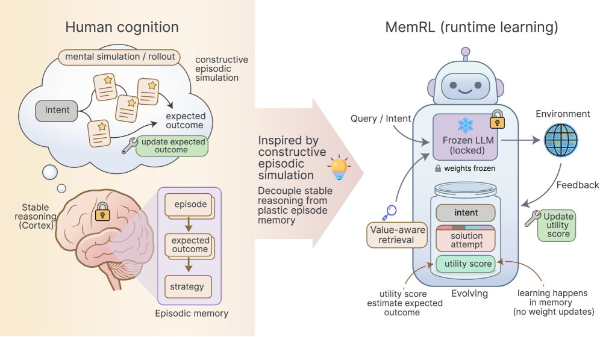 | [](https://arxiv.org/abs/2601.03192) | [](https://github.com/MemTensor/MemRL) |

##### Retrieval & Use

| Date | Name | Title | Introduction | Paper | Github |
|:-:|:-:|:-|:-:|:-:|:-:|
| 2023 | `Generative` | Generative agents: Interactive simulacra of human behavior |  | [](https://arxiv.org/abs/2304.03442) | [](https://github.com/joonspk-research/generative_agents) |
| 2023 | `MemoChat` | MemoChat: Tuning LLMs to Use Memos for Consistent Long-Range Open-Domain Conversation |  | [](https://arxiv.org/abs/2308.08239) |  |
| 2023 | `Reflexion` | Reflexion: Language agents with verbal reinforcement learning |  | [](https://arxiv.org/abs/2303.11366) | [](https://github.com/noahshinn/reflexion) |
| 2024 | `MemoryBank` | MemoryBank: Enhancing Large Language Models with Long-Term Memory |  | [](https://arxiv.org/abs/2305.10250) | [](https://github.com/zhongwanjun/MemoryBank-SiliconFriend) |
| 2024 | `MemGPT` | MemGPT: Towards LLMs as Operating Systems |  | [](https://arxiv.org/abs/2310.08560) | [](https://github.com/letta-ai/letta) |
| 2024 | `Voyager` | Voyager: An Open-Ended Embodied Agent with Large Language Models | 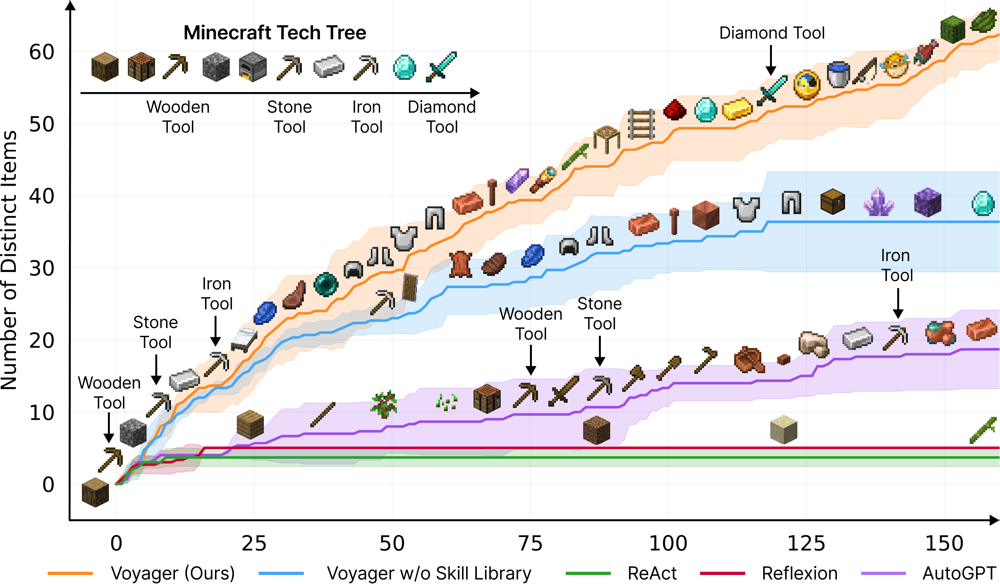 | [](https://arxiv.org/abs/2305.16291) | [](https://github.com/MineDojo/Voyager) |
| 2025 | `HippoRAG` | HippoRAG 2: From RAG to memory |  | [](https://arxiv.org/abs/2502.14802) | [](https://github.com/OSU-NLP-Group/HippoRAG) |
| 2024 | `EMG` | Crafting Personalized Agents through Retrieval-Augmented Generation on Editable Memory Graphs |  | [](https://arxiv.org/abs/2409.19401) |  |
| 2025 | `Mem0` | Mem0: Building Production-Ready AI Agents with Scalable Long-Term Memory |  | [](https://arxiv.org/abs/2504.19413) | [](https://github.com/mem0ai/mem0) |
| 2025 | `ENGRAM` | ENGRAM: Effective, Lightweight Memory Orchestration for Conversational Agents |  | [](https://arxiv.org/abs/2511.12960) |  |
| 2025 | `Zep` | Zep: A Temporal Knowledge Graph Architecture for Agent Memory |  | [](https://arxiv.org/abs/2501.13956) | [](https://github.com/getzep/zep) |
| 2025 | `Agent S` | Agent S: An Open Agentic Framework that Uses Computers Like a Human | 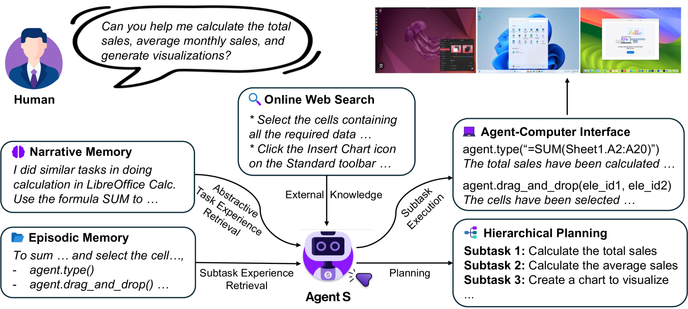 | [](https://arxiv.org/abs/2410.08164) | [](https://github.com/simular-ai/Agent-S) |
| 2025 | `SeCom` | SeCom: On Memory Construction and Retrieval for Personalized Conversational Agents |  | [](https://arxiv.org/abs/2502.05589) | [](https://github.com/microsoft/SeCom) |
| 2025 | `MemTree` | From Isolated Conversations to Hierarchical Schemas: Dynamic Tree Memory Representation for LLMs |  | [](https://arxiv.org/abs/2410.14052) |  |
| 2025 | `A-MEM` | A-MEM: Agentic Memory for LLM Agents |  | [](https://arxiv.org/abs/2502.12110) | [](https://github.com/agiresearch/A-mem) |
| 2025 | `Recursum` | Recursively Summarizing Enables Long-Term Dialogue Memory in Large Language Models |  | [](https://arxiv.org/abs/2308.15022) |  |
| 2025 | `Comedy` | Compress to Impress: Unleashing the Potential of Compressive Memory in Real-World Long-Term Conversations |  | [](https://arxiv.org/abs/2402.11975) | [](https://github.com/nuochenpku/COMEDY) |
| 2025 | `MemOS` | MemOS: An Operating System for Memory-Augmented Generation in Large Language Models |  | [](https://arxiv.org/abs/2505.22101) |  |
| 2026 | `MemRL` | MemRL: Self-Evolving Agents via Runtime Reinforcement Learning on Episodic Memory |  | [](https://arxiv.org/abs/2601.03192) | [](https://github.com/MemTensor/MemRL) |

#### Planning

##### Decomposition

| Date | Name | Title | Introduction | Paper | Github |
|:-:|:-:|:-|:-:|:-:|:-:|
| 2023 | `Least-to-Most` | Least-to-Most Prompting Enables Complex Reasoning in Large Language Models | 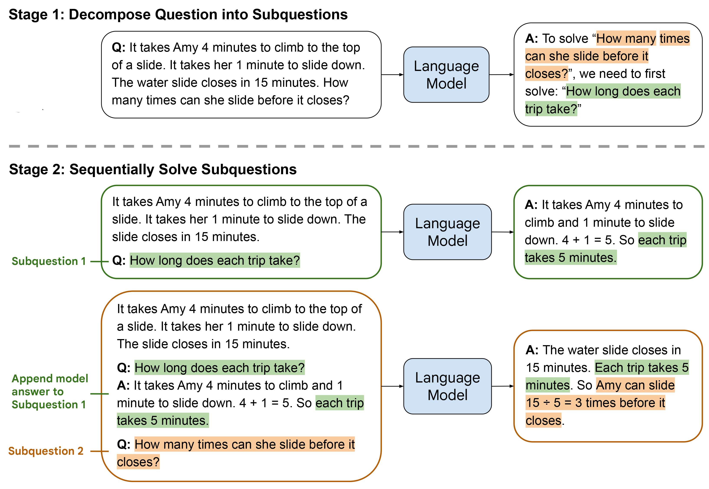 | [](https://arxiv.org/abs/2205.10625) |  |
| 2023 | `Plan-and-Solve` | Plan-and-Solve Prompting: Improving Zero-Shot Chain-of-Thought Reasoning by Large Language Models | 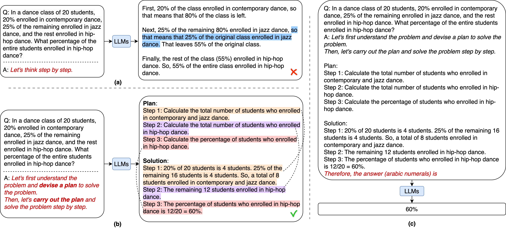 | [](https://arxiv.org/abs/2305.04091) | [](https://github.com/AGI-Edgerunners/Plan-and-Solve-Prompting) |
| 2023 | `HuggingGPT` | HuggingGPT: Solving AI Tasks with ChatGPT and its Friends in Hugging Face | 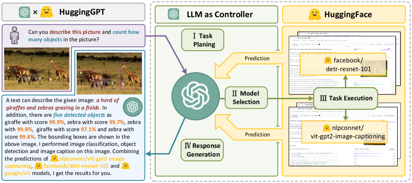 | [](https://arxiv.org/abs/2303.17580) | [](https://github.com/microsoft/JARVIS) |
| 2023 | `LLM-Planner` | LLM-Planner: Few-Shot Grounded Planning for Embodied Agents with Large Language Models | 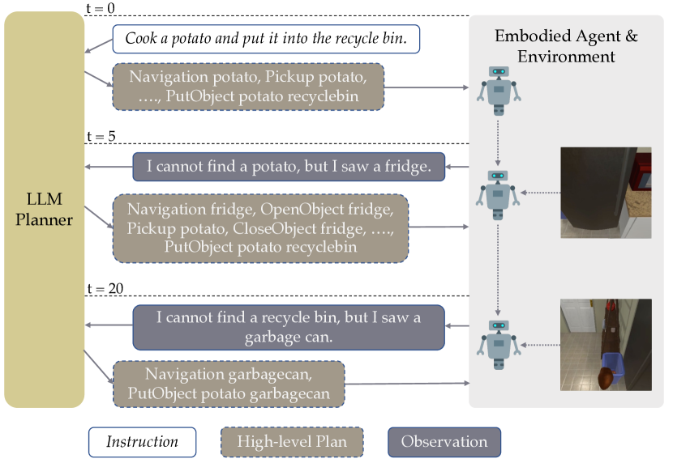 | [](https://arxiv.org/abs/2212.04088) | [](https://github.com/OSU-NLP-Group/LLM-Planner/) |
| 2023 | `LLM+P` | LLM+P: Empowering Large Language Models with Optimal Planning Proficiency | 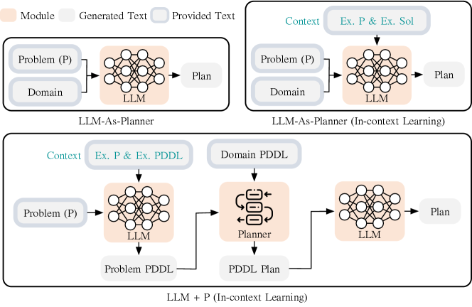 | [](https://arxiv.org/abs/2304.11477) | [](https://github.com/Cranial-XIX/llm-pddl) |
| 2023 | `ReAct` | ReAct: Synergizing reasoning and acting in language models |  | [](https://arxiv.org/abs/2210.03629) | [](https://github.com/ysymyth/ReAct) |
| 2023 | `Reflexion` | Reflexion: Language agents with verbal reinforcement learning |  | [](https://arxiv.org/abs/2303.11366) | [](https://github.com/noahshinn/reflexion) |
| 2023 | `DEPS` | Describe, Explain, Plan and Select: Interactive Planning with Large Language Models Enables Open-World Multi-Task Agents | 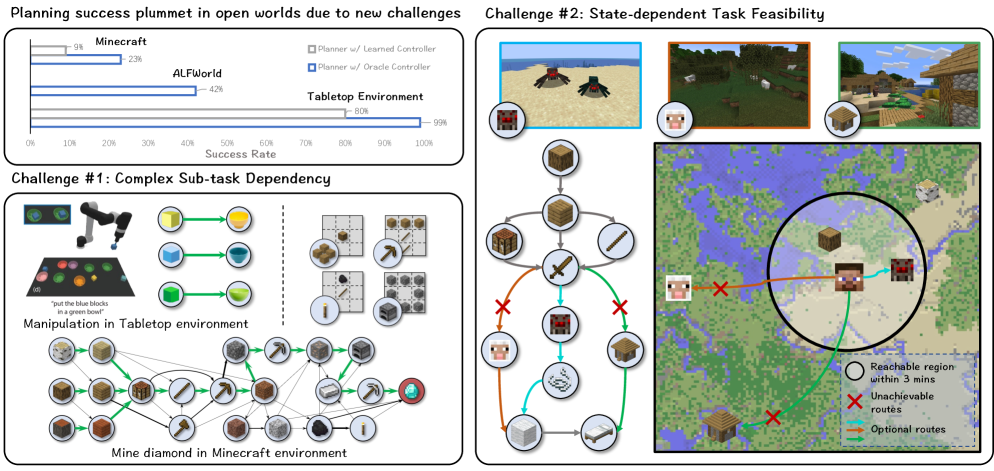 | [](https://arxiv.org/abs/2302.01560) | [](https://github.com/CraftJarvis/MC-Planner) |
| 2024 | `TravelPlanner` | TravelPlanner: A Benchmark for Real-World Planning with Language Agents | 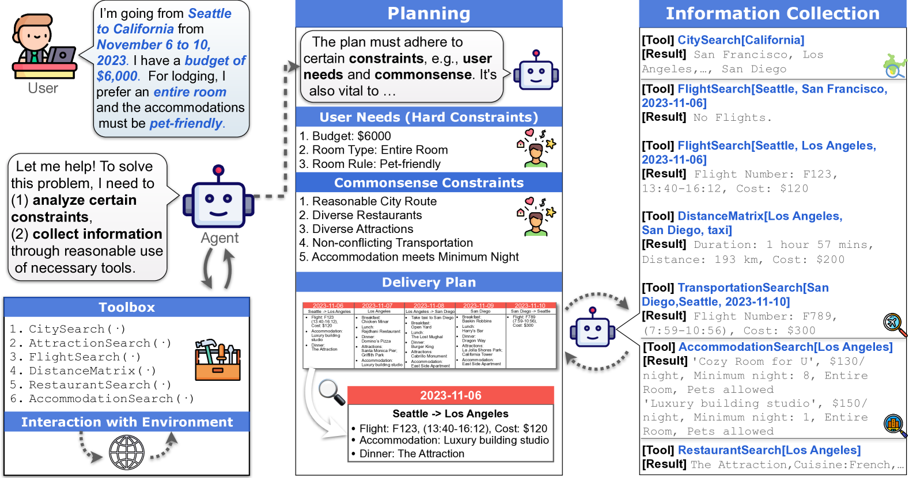 | [](https://arxiv.org/abs/2402.01622) | [](https://github.com/OSU-NLP-Group/TravelPlanner) |
| 2024 | `LLM Compiler` | An LLM Compiler for Parallel Function Calling | 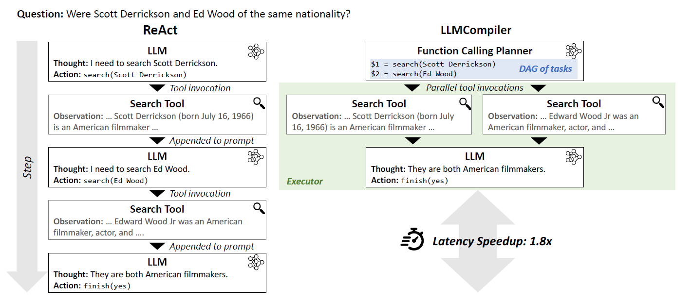 | [](https://arxiv.org/abs/2312.04511) |  |
| 2024 | `SoT` | Skeleton-of-Thought: Prompting LLMs for Efficient Parallel Generation | 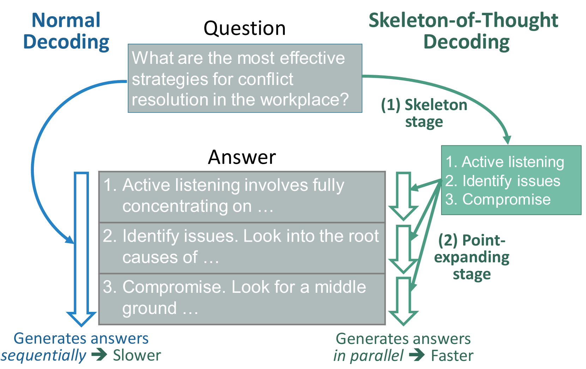 | [](https://arxiv.org/abs/2307.15337) | [](https://github.com/imagination-research/sot) |
| 2024 | `ADaPT` | ADaPT: As-Needed Decomposition and Planning with Language Models | 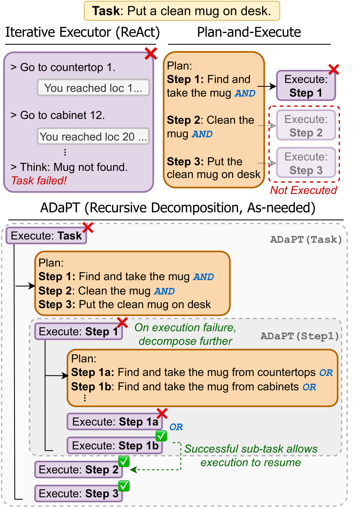 | [](https://arxiv.org/abs/2311.05772) |  |
| 2024 | `Voyager` | Voyager: An Open-Ended Embodied Agent with Large Language Models |  | [](https://arxiv.org/abs/2305.16291) | [](https://github.com/MineDojo/Voyager) |
| 2024 | `Code Act` | Executable Code Actions Elicit Better LLM Agents | 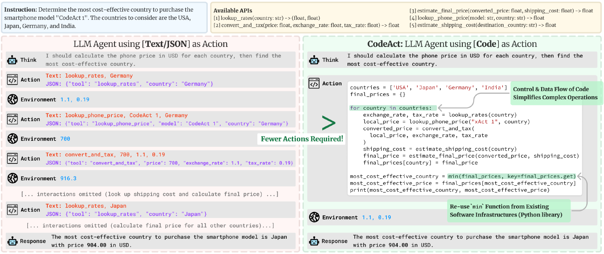 | [](https://arxiv.org/abs/2402.01030) | [](https://github.com/xingyaoww/code-act) |
| 2024 | `KnowAgent` | KnowAgent: Knowledge-Augmented Planning for LLM-Based Agents | 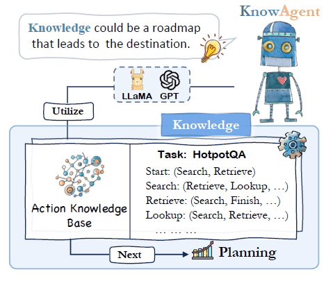 | [](https://arxiv.org/abs/2403.03101) | [](https://github.com/zjunlp/KnowAgent) |
| 2025 | `PlanGenLLMs` | PlanGenLLMs: A modern survey of LLM planning capabilities | 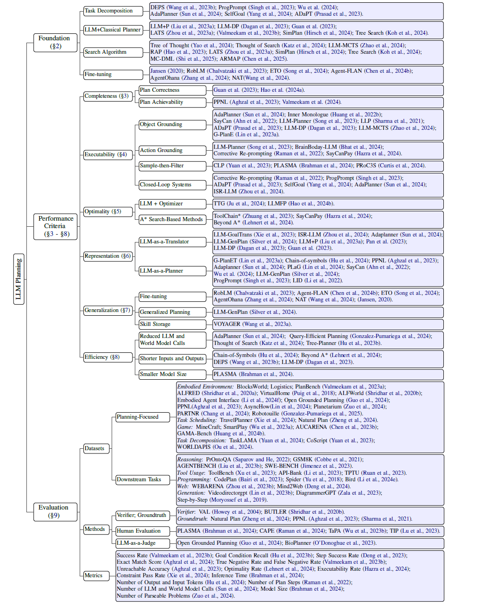 | [](https://arxiv.org/abs/2502.11221) |  |
| 2025 | `Planning` | Planning Anything with Rigor: General-Purpose Zero-Shot Planning with LLM-based Formalized Programming | 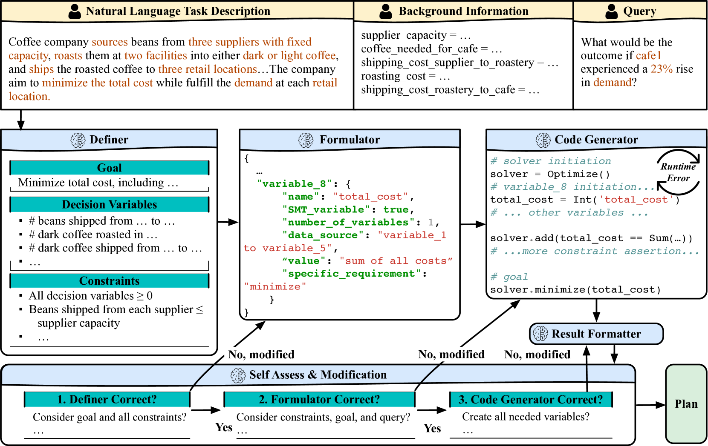 | [](https://arxiv.org/abs/2410.12112) |  |
| 2025 | `Plan-and-Act` | Plan-and-Act: Improving Planning of Agents for Long-Horizon Tasks | 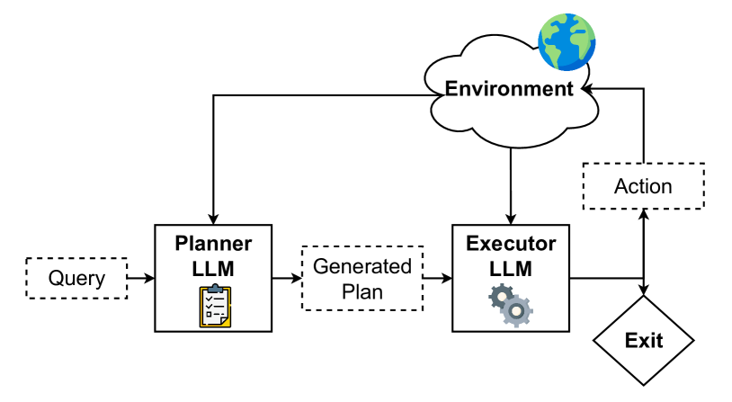 | [](https://arxiv.org/abs/2503.09572) |  |
| 2025 | `SelfGoal` | SelfGoal: Your Language Agents Already Know How to Achieve High-Level Goals | 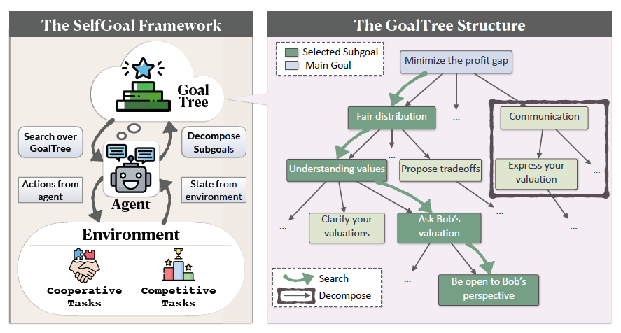 | [](https://arxiv.org/abs/2406.04784) | [](https://github.com/rhyang2021/SELFGOAL) |

##### Search

| Date | Name | Title | Introduction | Paper | Github |
|:-:|:-:|:-|:-:|:-:|:-:|
| 2023 | `ToT` | Tree of Thoughts: Deliberate Problem Solving with Large Language Models |  | [](https://arxiv.org/abs/2305.10601) | [](https://github.com/princeton-nlp/tree-of-thought-llm) |
| 2023 | `LLM-MCTS` | Large Language Models as Commonsense Knowledge for Large-Scale Task Planning | 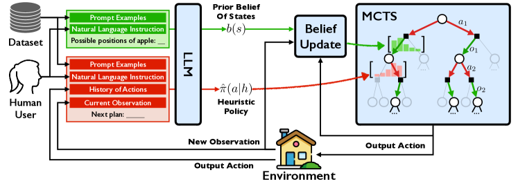 | [](https://arxiv.org/abs/2305.14078) |  |
| 2023 | `RAP` | Reasoning with Language Model is Planning with World Model | 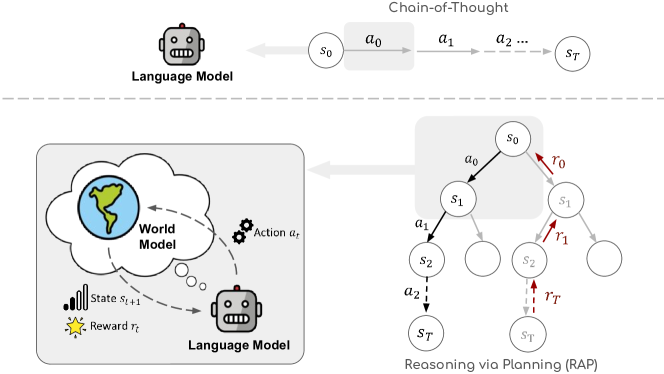 | [](https://arxiv.org/abs/2305.14992) | [](https://github.com/Ber666/RAP) |
| 2023 | `Least-to-Most` | Least-to-Most Prompting Enables Complex Reasoning in Large Language Models |  | [](https://arxiv.org/abs/2205.10625) |  |
| 2023 | `Plan-and-Solve` | Plan-and-Solve Prompting: Improving Zero-Shot Chain-of-Thought Reasoning by Large Language Models |  | [](https://arxiv.org/abs/2305.04091) | [](https://github.com/AGI-Edgerunners/Plan-and-Solve-Prompting) |
| 2023 | `HuggingGPT` | HuggingGPT: Solving AI Tasks with ChatGPT and its Friends in Hugging Face |  | [](https://arxiv.org/abs/2303.17580) | [](https://github.com/microsoft/JARVIS) |
| 2023 | `LLM-Planner` | LLM-Planner: Few-Shot Grounded Planning for Embodied Agents with Large Language Models |  | [](https://arxiv.org/abs/2212.04088) | [](https://github.com/OSU-NLP-Group/LLM-Planner/) |
| 2023 | `LLM+P` | LLM+P: Empowering Large Language Models with Optimal Planning Proficiency |  | [](https://arxiv.org/abs/2304.11477) | [](https://github.com/Cranial-XIX/llm-pddl) |
| 2023 | `ReAct` | ReAct: Synergizing reasoning and acting in language models |  | [](https://arxiv.org/abs/2210.03629) | [](https://github.com/ysymyth/ReAct) |
| 2023 | `DEPS` | Describe, Explain, Plan and Select: Interactive Planning with Large Language Models Enables Open-World Multi-Task Agents |  | [](https://arxiv.org/abs/2302.01560) | [](https://github.com/CraftJarvis/MC-Planner) |
| 2024 | `LATS` | Language agent tree search unifies reasoning, acting, and planning in language models |  | [](https://arxiv.org/abs/2310.04406) |  |
| 2024 | `PromptAgent` | PromptAgent: Strategic Planning with Language Models Enables Expert-Level Prompt Optimization | 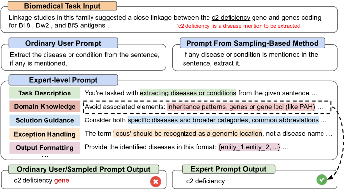 | [](https://arxiv.org/abs/2310.16427) |  |
| 2024 | `REST-MCTS` | REST-MCTS*: LLM Self-Training via Process Reward Guided Tree Search | 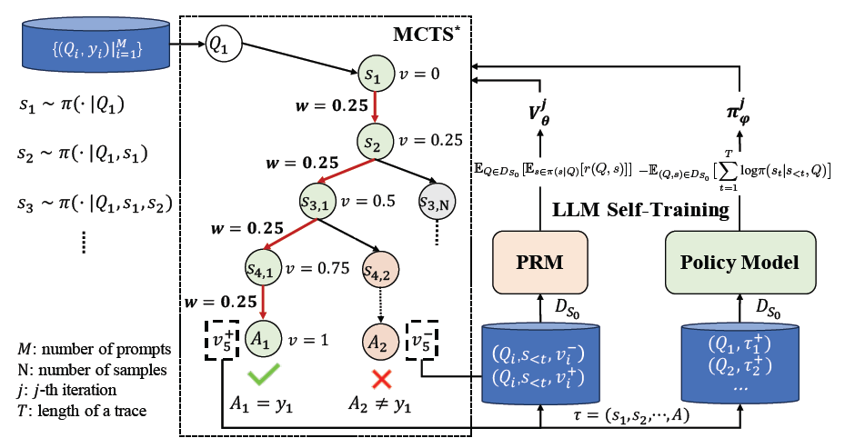 | [](https://arxiv.org/abs/2406.03816) |  |
| 2024 | `ToolChain` | ToolChain*: Efficient Action Space Navigation in Large Language Models with A* Search | 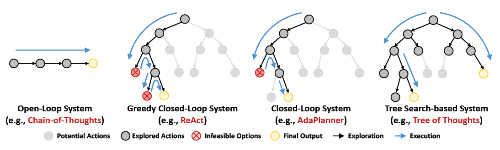 | [](https://arxiv.org/abs/2310.13227) |  |
| 2024 | `Understanding` | Understanding the Planning of LLM Agents: A Survey | 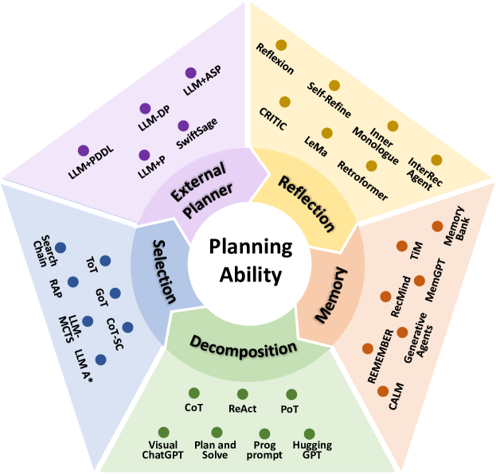 | [](https://arxiv.org/abs/2402.02716) |  |
| 2024 | `PlanRAG` | PlanRAG: A Plan-then-Retrieval Augmented Generation for Generative Large Language Models as Decision Makers | 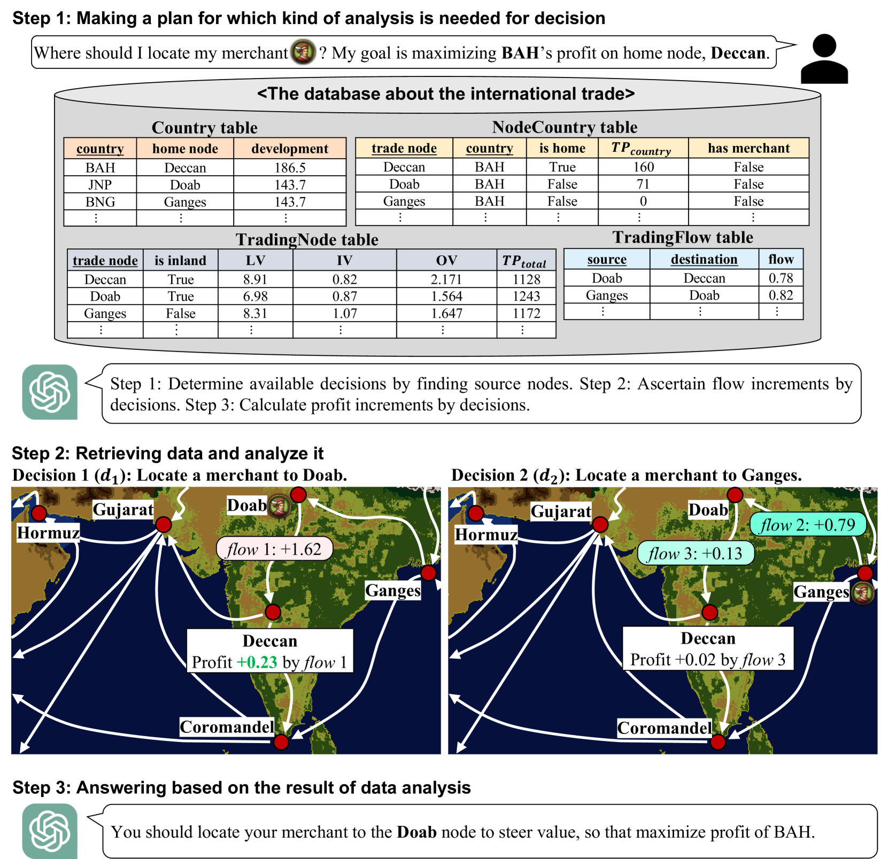 | [](https://arxiv.org/abs/2406.12430) | [](https://github.com/myeon9h/PlanRAG) |
| 2024 | `LLM Compiler` | An LLM Compiler for Parallel Function Calling |  | [](https://arxiv.org/abs/2312.04511) |  |
| 2024 | `SoT` | Skeleton-of-Thought: Prompting LLMs for Efficient Parallel Generation |  | [](https://arxiv.org/abs/2307.15337) | [](https://github.com/imagination-research/sot) |
| 2024 | `Voyager` | Voyager: An Open-Ended Embodied Agent with Large Language Models |  | [](https://arxiv.org/abs/2305.16291) | [](https://github.com/MineDojo/Voyager) |
| 2024 | `ADaPT` | ADaPT: As-Needed Decomposition and Planning with Language Models |  | [](https://arxiv.org/abs/2311.05772) |  |
| 2024 | `Code Act` | Executable Code Actions Elicit Better LLM Agents |  | [](https://arxiv.org/abs/2402.01030) | [](https://github.com/xingyaoww/code-act) |
| 2024 | `KnowAgent` | KnowAgent: Knowledge-Augmented Planning for LLM-Based Agents |  | [](https://arxiv.org/abs/2403.03101) | [](https://github.com/zjunlp/KnowAgent) |
| 2025 | `AFlow` | AFlow: Automating Agentic Workflow Generation | 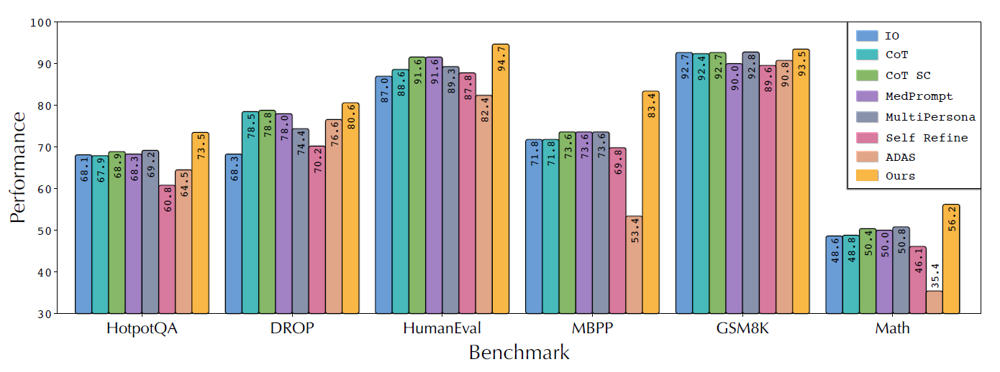 | [](https://arxiv.org/abs/2410.10762) |  |
| 2025 | `Diffusion Search` | Implicit Search via Discrete Diffusion: A Study on Chess | 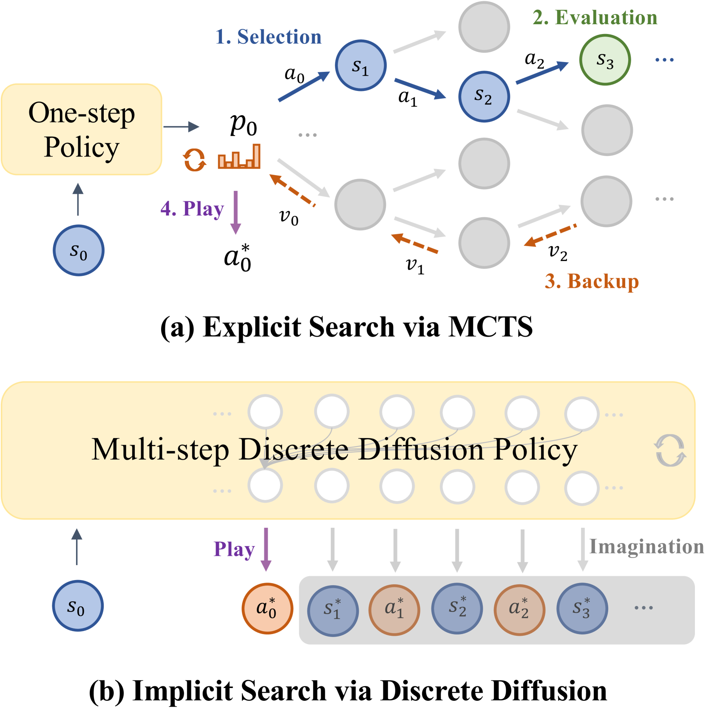 | [](https://arxiv.org/abs/2502.19805) |  |
| 2025 | `Agent S` | Agent S: An Open Agentic Framework that Uses Computers Like a Human |  | [](https://arxiv.org/abs/2410.08164) | [](https://github.com/simular-ai/Agent-S) |
| 2025 | `Planning` | Planning Anything with Rigor: General-Purpose Zero-Shot Planning with LLM-based Formalized Programming |  | [](https://arxiv.org/abs/2410.12112) |  |
| 2025 | `Plan-and-Act` | Plan-and-Act: Improving Planning of Agents for Long-Horizon Tasks |  | [](https://arxiv.org/abs/2503.09572) |  |
| 2025 | `SelfGoal` | SelfGoal: Your Language Agents Already Know How to Achieve High-Level Goals |  | [](https://arxiv.org/abs/2406.04784) | [](https://github.com/rhyang2021/SELFGOAL) |

#### Tool Use

##### Acquisition

| Date | Name | Title | Introduction | Paper | Github |
|:-:|:-:|:-|:-:|:-:|:-:|
| 2023 | `Toolformer` | Toolformer: Language Models Can Teach Themselves to Use Tools | 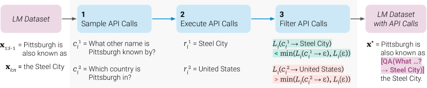 | [](https://arxiv.org/abs/2302.04761) |  |
| 2023 | `GPT4Tools` | GPT4Tools: Teaching Large Language Model to Use Tools via Self-instruction | 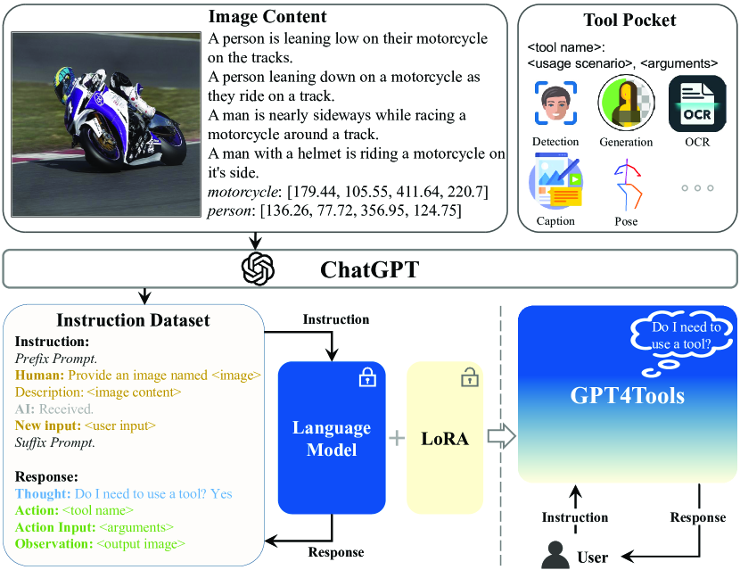 | [](https://arxiv.org/pdf/2305.18752) | [](https://github.com/AILab-CVC/GPT4Tools) |
| 2023 | `ToolkenGPT` | ToolkenGPT: Augmenting Frozen Language Models with Massive Tools via Tool Embeddings | 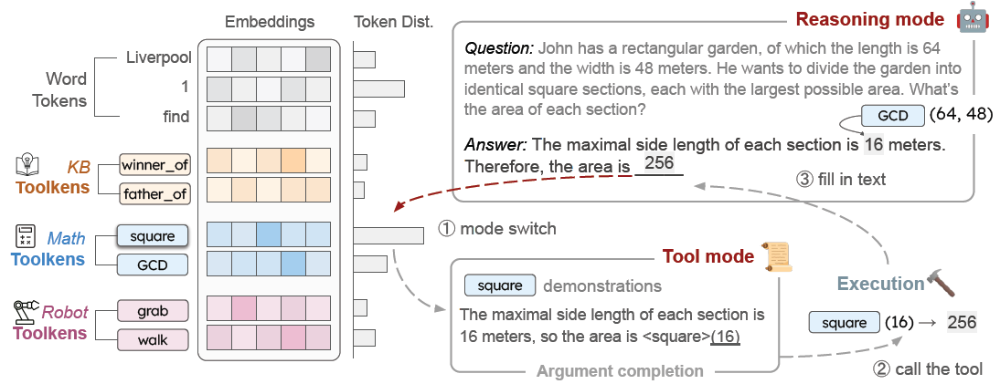 | [](https://arxiv.org/abs/2305.11554) | [](https://github.com/Ber666/ToolkenGPT) |
| 2024 | `Code Act` | Executable Code Actions Elicit Better LLM Agents |  | [](https://arxiv.org/abs/2402.01030) | [](https://github.com/xingyaoww/code-act) |
| 2024 | `ToolLLM` | ToolLLM: Facilitating Large Language Models to Master 16000+ Real-world APIs | 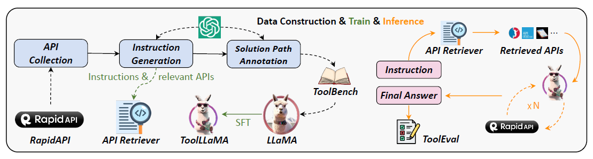 | [](https://arxiv.org/abs/2307.16789) | [](https://github.com/OpenBMB/ToolBench) |
| 2024 | `APIGen` | APIGen: Automated Pipeline for Generating Verifiable and Diverse Function-Calling Datasets | 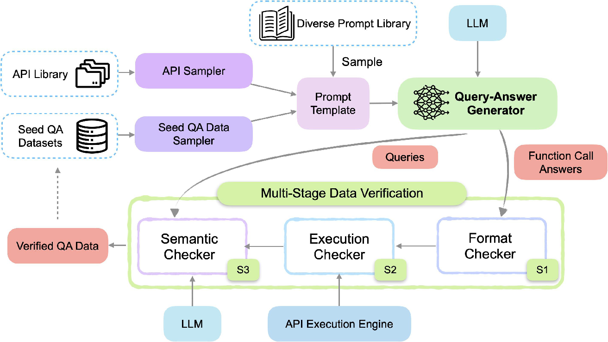 | [](https://arxiv.org/abs/2406.18518) |  |
| 2024 | `ToolPlanner` | ToolPlanner: A Tool Augmented LLM for Multi Granularity Instructions with Path Planning and Feedback | 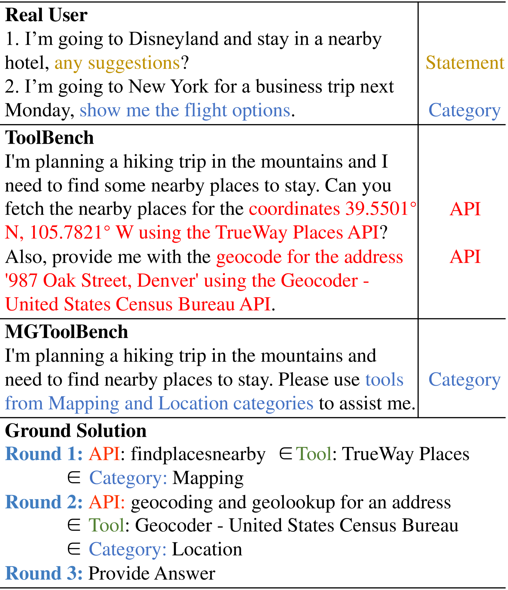 | [](https://arxiv.org/abs/2409.14826) |  |
| 2024 | `Gorilla` | Gorilla: Large Language Model Connected with Massive APIs | 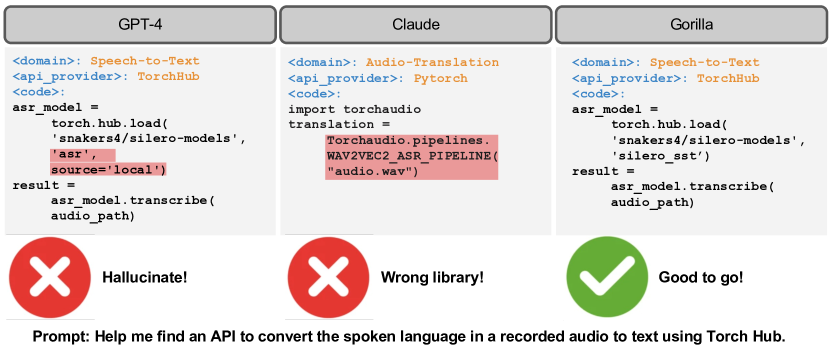 | [](https://arxiv.org/abs/2305.15334) | [](https://github.com/ShishirPatil/gorilla) |
| 2025 | `ToolACE` | ToolACE: Winning the Points of LLM Function Calling | 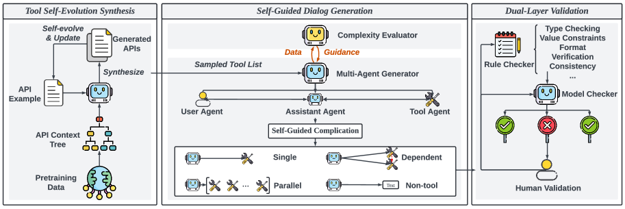 | [](https://arxiv.org/abs/2409.00920) |  |
| 2025 | `WebRL` | WebRL: Training LLM Web Agents via Self-Evolving Online Curriculum Reinforcement Learning | 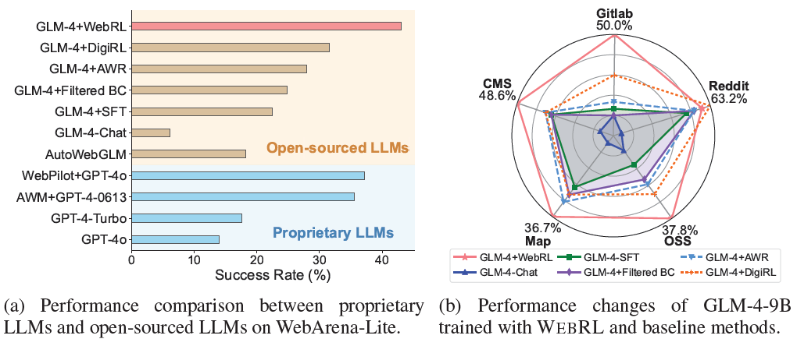 | [](https://arxiv.org/abs/2411.02337) |  |
| 2025 | `EasyTool` | EasyTool: Enhancing LLM-based Agents with Concise Tool Instruction | 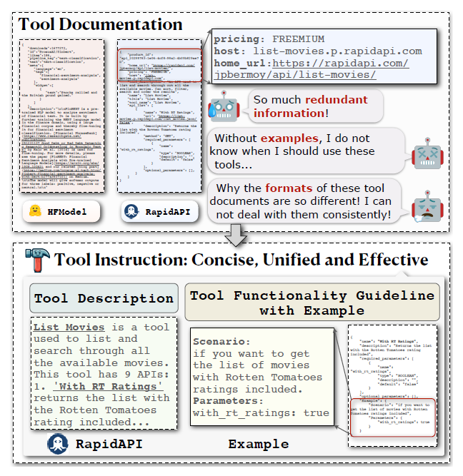 | [](https://arxiv.org/abs/2401.06201) |  |

##### Invocation

| Date | Name | Title | Introduction | Paper | Github |
|:-:|:-:|:-|:-:|:-:|:-:|
| 2023 | `Toolformer` | Toolformer: Language Models Can Teach Themselves to Use Tools |  | [](https://arxiv.org/abs/2302.04761) |  |
| 2023 | `ReAct` | ReAct: Synergizing reasoning and acting in language models |  | [](https://arxiv.org/abs/2210.03629) | [](https://github.com/ysymyth/ReAct) |
| 2024 | ` Gorilla` | Gorilla: Large Language Model Connected with Massive APIs |  | [](https://arxiv.org/abs/2305.15334) |  |
| 2024 | `CRITIC` | CRITIC: Large language models can self-correct with tool-interactive critiquing |  | [](https://arxiv.org/abs/2305.11738) | [](https://github.com/microsoft/ProphetNet/tree/master/CRITIC) |
| 2024 | `AnyTool` | AnyTool: Self-reflective, hierarchical agents for large-scale API calls |  | [](https://arxiv.org/abs/2402.04253) |  |
| 2024 | `LLM Compiler` | An LLM Compiler for Parallel Function Calling |  | [](https://arxiv.org/abs/2312.04511) |  |
| 2024 | `Gptswarm` | Gptswarm: Language agents as optimizable graphs | 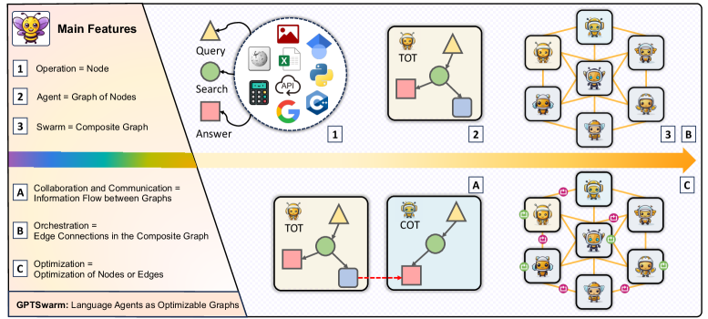 | [](https://arxiv.org/abs/PLACEHOLDER_PAPER_TBD) | [](https://github.com/metauto-ai/GPTSwarm) |
| 2025 | `BFCL` | The Berkeley Function Calling Leaderboard (BFCL): From Tool Use to Agentic Evaluation of Large Language Models | 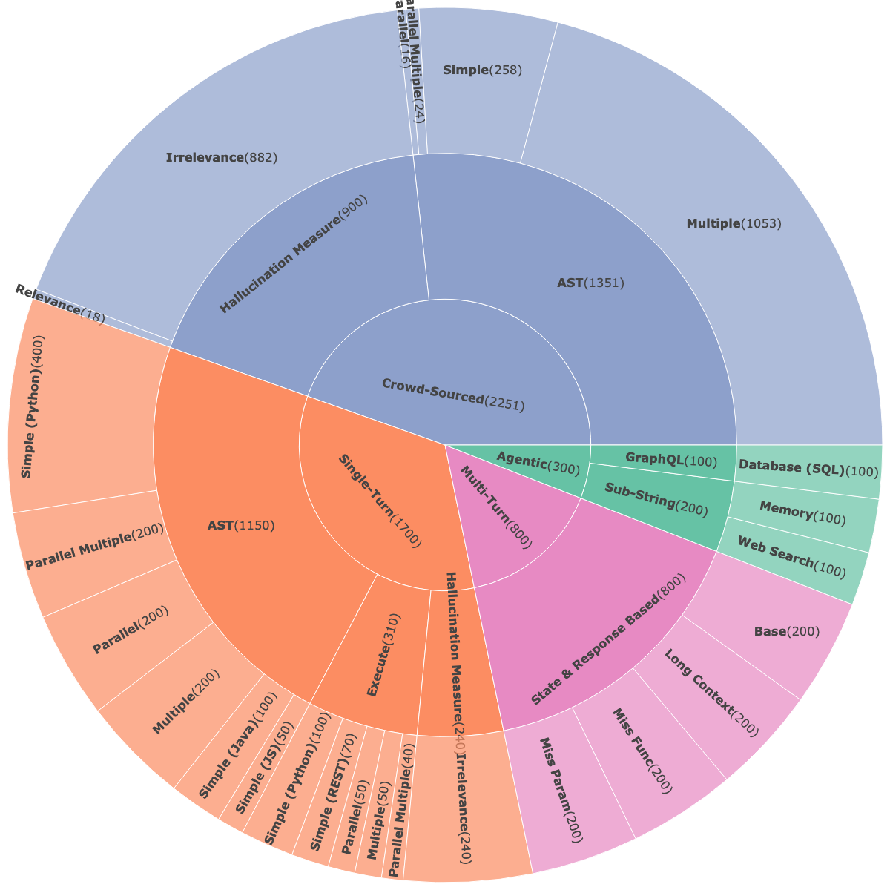 | [](https://arxiv.org/abs/PLACEHOLDER_PAPER_TBD) |  |
| 2025 | `WorkflowLLM` | WorkflowLLM: Enhancing Workflow Orchestration Capability of Large Language Models | 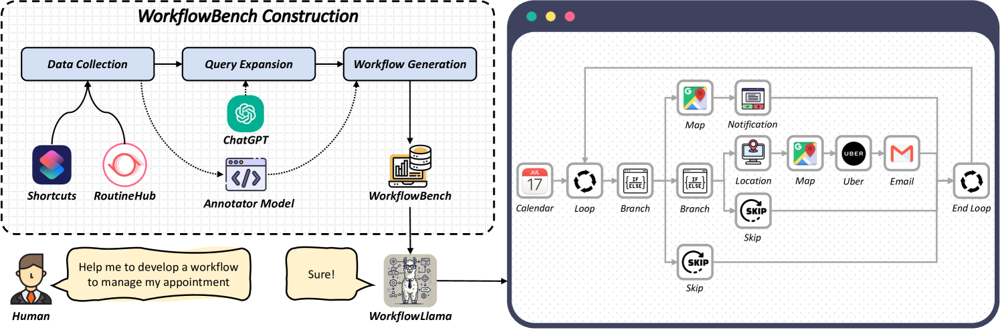 | [](https://arxiv.org/abs/2411.05451) | [](https://github.com/OpenBMB/WorkflowLLM) |
| 2025 | `Aflow` | Aflow: Automating agentic workflow generation, 2024 |  | [](https://arxiv.org/abs/2410.10762) |  |

##### Generalization

| Date | Name | Title | Introduction | Paper | Github |
|:-:|:-:|:-|:-:|:-:|:-:|
| 2023 | `Toolformer` | Toolformer: Language Models Can Teach Themselves to Use Tools |  | [](https://arxiv.org/abs/2302.04761) |  |
| 2023 | `ToolkenGPT` | ToolkenGPT: Augmenting Frozen Language Models with Massive Tools via Tool Embeddings |  | [](https://arxiv.org/abs/2305.11554) | [](https://github.com/Ber666/ToolkenGPT) |
| 2023 | `GPT4Tools` | GPT4Tools: Teaching Large Language Model to Use Tools via Self-instruction |  | [](https://arxiv.org/pdf/2305.18752) | [](https://github.com/AILab-CVC/GPT4Tools) |
| 2024 | `TOOLVERIFIER` | TOOLVERIFIER: Generalization to New Tools via Self-Verification | 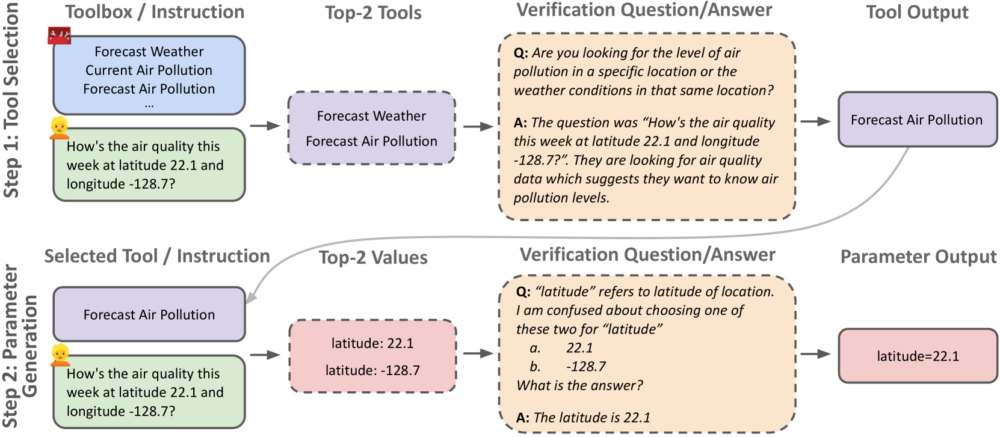 | [](https://arxiv.org/abs/2402.14158v2) |  |
| 2024 | `Gorilla` | Gorilla: Large Language Model Connected with Massive APIs |  | [](https://arxiv.org/abs/2305.15334) | [](https://github.com/ShishirPatil/gorilla) |
| 2024 | `ToolLLM` | ToolLLM: Facilitating Large Language Models to Master 16000+ Real-world APIs |  | [](https://arxiv.org/abs/2307.16789) | [](https://github.com/OpenBMB/ToolBench) |
| 2024 | `Re-Invoke` | Re-Invoke: Tool Invocation Rewriting for Zero-Shot Tool Retrieval | 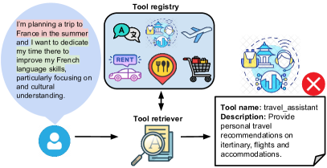 | [](https://arxiv.org/abs/2408.01875) |  |
| 2024 | `MetaTool` | MetaTool Benchmark for Large Language Models: Deciding Whether to Use Tools and Which to Use | 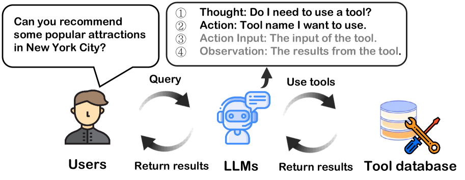 | [](https://arxiv.org/abs/2310.03128) | [](https://github.com/HowieHwong/MetaTool) |
| 2024 | `CRITIC` | CRITIC: Large language models can self-correct with tool-interactive critiquing |  | [](https://arxiv.org/abs/2305.11738) | [](https://github.com/microsoft/ProphetNet/tree/master/CRITIC) |
| 2024 | `AnyTool` | AnyTool: Self-reflective, hierarchical agents for large-scale API calls |  | [](https://arxiv.org/abs/2402.04253) |  |
| 2024 | `APIGen` | APIGen: Automated Pipeline for Generating Verifiable and Diverse Function-Calling Datasets |  | [](https://arxiv.org/abs/2406.18518) |  |
| 2024 | `ToolPlanner` | ToolPlanner: A Tool Augmented LLM for Multi Granularity Instructions with Path Planning and Feedback |  | [](https://arxiv.org/abs/2409.14826) |  |
| 2025 | `GenTool` | GenTool: Enhancing Tool Generalization in Language Models | 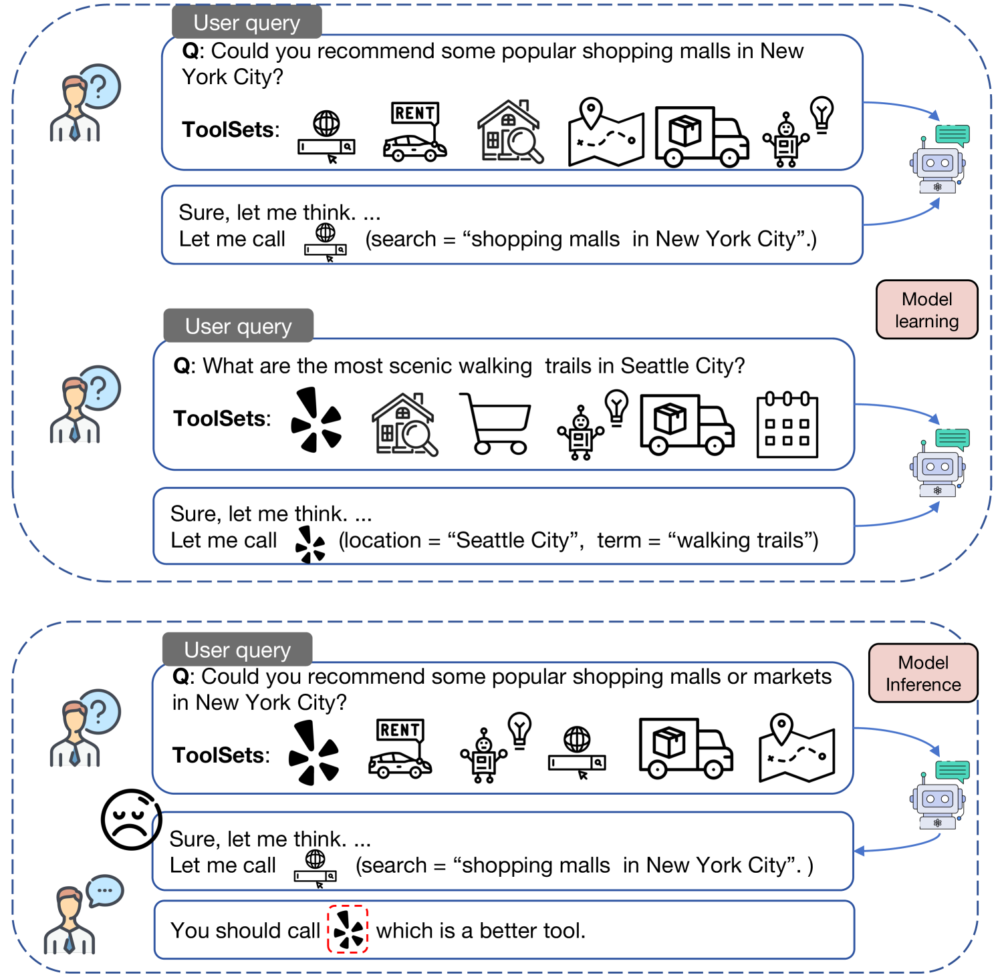 | [](https://arxiv.org/abs/2502.18990) |  |
| 2025 | `Tool Ret` | Retrieval Models Aren't Tool-Savvy: Benchmarking Tool Retrieval for Large Language Models | 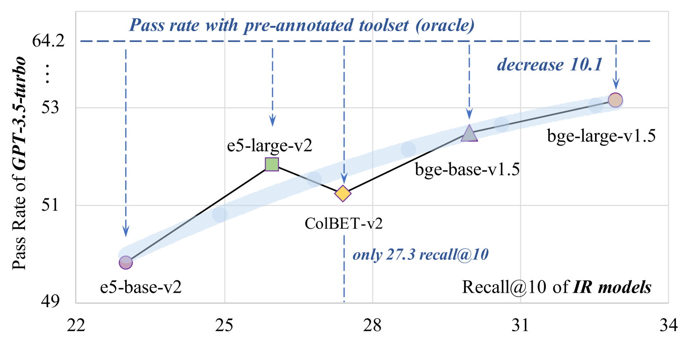 | [](https://arxiv.org/abs/2503.01763) |  |
| 2025 | `SkillWeaver` | SkillWeaver: Web Agents can Self-Improve by Discovering and Honing Skills | 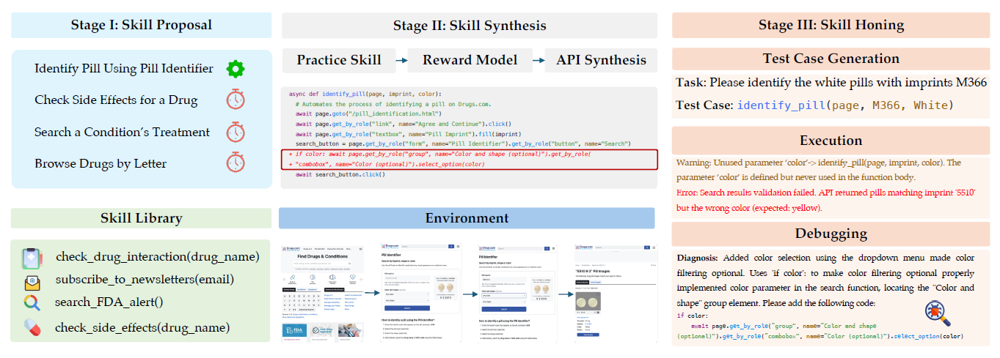 | [](https://arxiv.org/abs/2504.07079) | [](https://github.com/OSU-NLP-Group/SkillWeaver) |
| 2025 | `RL` | Reinforcement Learning for Self-Improving Agent with Skill Library | 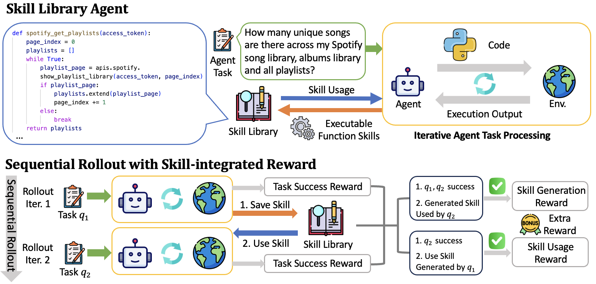 | [](https://arxiv.org/abs/2512.17102) |  |
| 2025 | `ToolACE` | ToolACE: Winning the Points of LLM Function Calling |  | [](https://arxiv.org/abs/2409.00920) |  |
| 2025 | `EASYTOOL` | EASYTOOL: Enhancing LLM-based Agents with Concise Tool Instruction |  | [](https://arxiv.org/abs/2401.06201) |  |
| 2025 | `WebRL` | WebRL: Training LLM Web Agents via Self-Evolving Online Curriculum Reinforcement Learning |  | [](https://arxiv.org/abs/2411.02337) |  |
| 2025 | `WorkflowLLM` | WorkflowLLM: Enhancing Workflow Orchestration Capability of Large Language Models |  | [](https://arxiv.org/abs/2411.05451) | [](https://github.com/OpenBMB/WorkflowLLM) |
| 2025 | `BFCL` | The Berkeley Function Calling Leaderboard (BFCL): From Tool Use to Agentic Evaluation of Large Language Models |  | [](https://arxiv.org/abs/PLACEHOLDER_PAPER_TBD) |  |

---

### Collaboration

#### Role

| Date | Name | Title | Introduction | Paper | Github |
|:-:|:-:|:-|:-:|:-:|:-:|
| 2017 | `Multi-agent` | Multi-agent actor-critic for mixed cooperative-competitive environments | 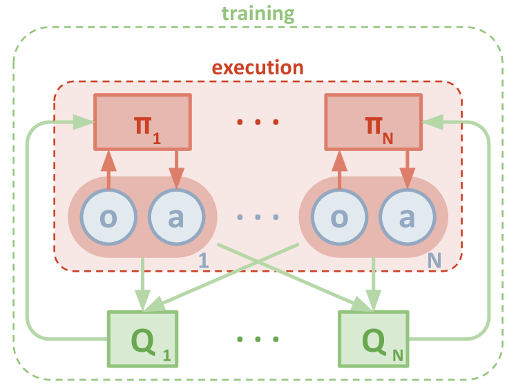 | [](https://arxiv.org/abs/1706.02275) |  |
| 2017 | `Value` | Value-decomposition networks for cooperative multi-agent learning | 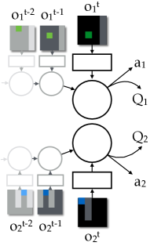 | [](https://arxiv.org/abs/1706.05296) |  |
| 2020 | `ROMA` | ROMA: multi-agent reinforcement learning with emergent roles | 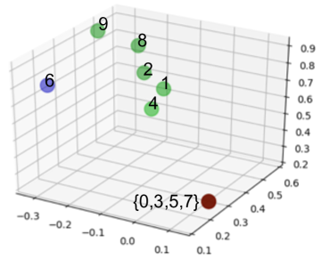 | [](https://arxiv.org/abs/2003.08039) | [](https://github.com/TonghanWang/ROMA) |
| 2020 | `Monotonic` | Monotonic value function factorisation for deep multi-agent reinforcement learning | 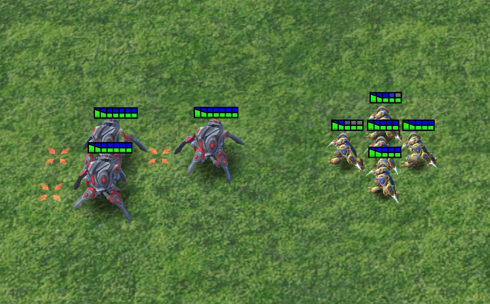 | [](https://arxiv.org/abs/2003.08839) |  |
| 2023 | `Camel` | Camel: Communicative agents for" mind" exploration of large language model society | 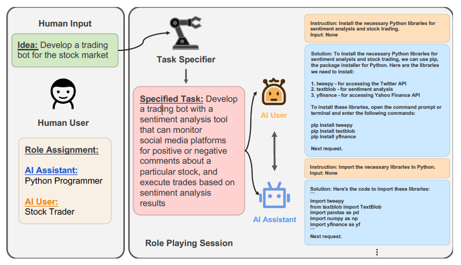 | [](https://arxiv.org/abs/2303.17760) | [](https://github.com/camel-ai/camel) |
| 2023 | `Generative` | Generative agents: Interactive simulacra of human behavior |  | [](https://arxiv.org/abs/2304.03442) | [](https://github.com/joonspk-research/generative_agents) |
| 2023 | `Cgmi` | Cgmi: Configurable general multi-agent interaction framework | 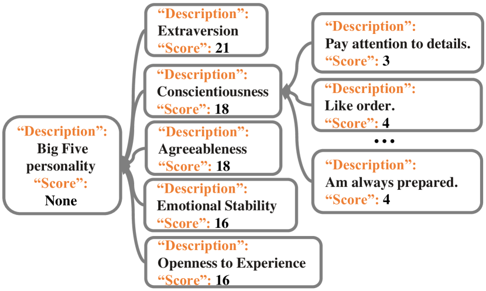 | [](https://arxiv.org/abs/2308.12503) |  |
| 2024 | `Villageragent` | Villageragent: A graph-based multi-agent framework for coordinating complex task dependencies in minecraft | 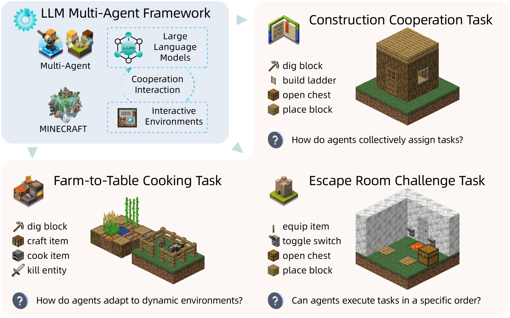 | [](https://arxiv.org/abs/2406.05720) | [](https://github.com/cnsdqd-dyb/VillagerAgent-Minecraft-multiagent-framework) |
| 2024 | `ChatEval` | ChatEval: Towards Better LLM-based Evaluators through Multi-Agent Debate | 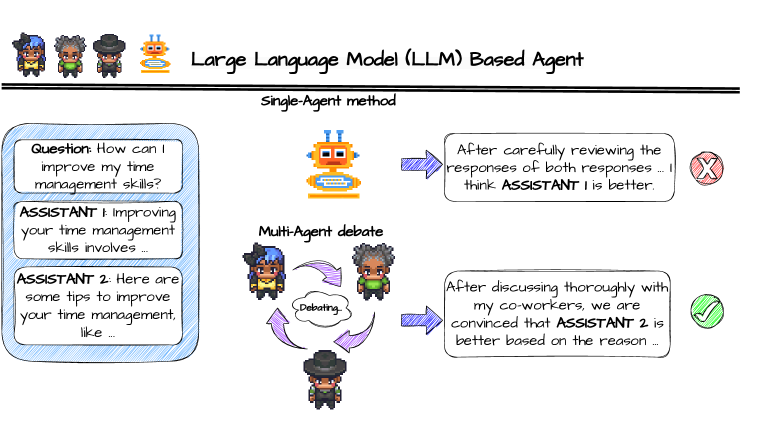 | [](https://arxiv.org/abs/2308.07201) | [](https://github.com/thunlp/ChatEval) |
| 2024 | `Heterogeneous` | Heterogeneous-agent reinforcement learning | 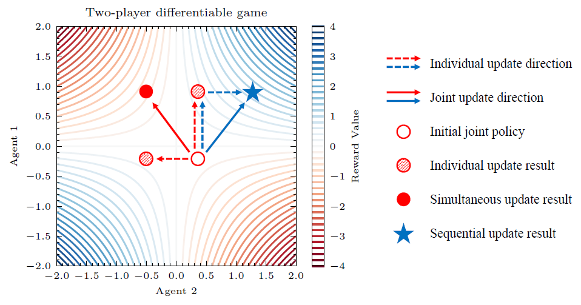 | [](https://arxiv.org/abs/2304.09870) |  |
| 2024 | `Mdagents` | Mdagents: An adaptive collaboration of llms for medical decision-making | 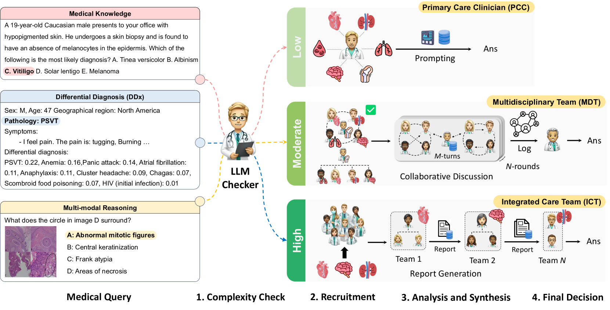 | [](https://arxiv.org/abs/2404.15155) | [](https://github.com/mitmedialab/MDAgents) |
| 2024 | `Collaborative` | Collaborative problem-solving with LLM: a multi-agent system approach to solve complex tasks using autogen | 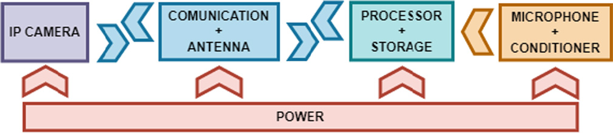 | [](https://arxiv.org/abs/PLACEHOLDER_PAPER_TBD) |  |
| 2024 | `ChatDev` | ChatDev: Communicative agents for software development | 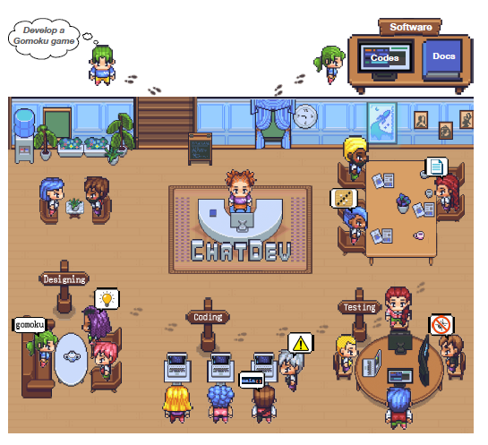 | [](https://arxiv.org/abs/2307.07924) | [](https://github.com/OpenBMB/ChatDev) |
| 2024 | `Sheetagent` | Sheetagent: A generalist agent for spreadsheet reasoning and manipulation via large language models | 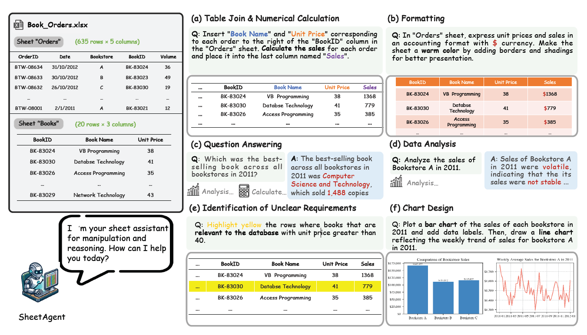 | [](https://arxiv.org/abs/2403.03636) | [](https://github.com/cybisolated/SheetAgent) |
| 2024 | `Mare` | Mare: Multi-agents collaboration framework for requirements engineering | 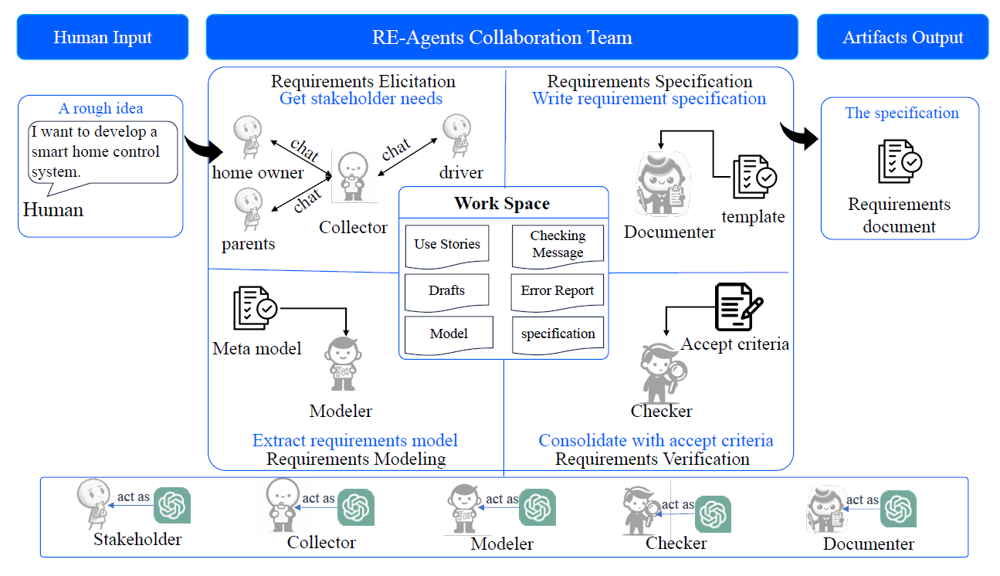 | [](https://arxiv.org/abs/2405.03256) |  |
| 2024 | `Medco` | Medco: Medical education copilots based on a multi-agent framework | 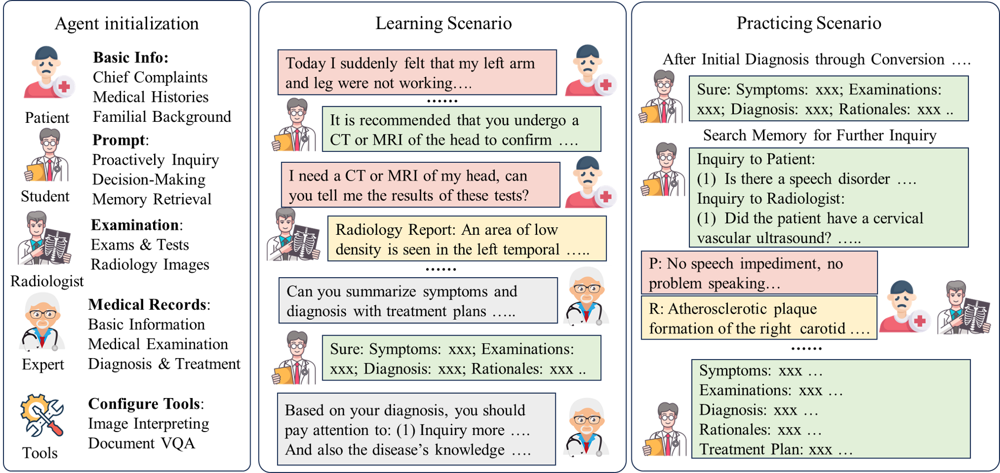 | [](https://arxiv.org/abs/2408.12496) |  |
| 2024 | `AutoAgents` | AutoAgents: a framework for automatic agent generation |  | [](https://arxiv.org/abs/2309.17288) | [](https://github.com/Link-AGI/AutoAgents) |
| 2024 | `Agent` | Agent hospital: A simulacrum of hospital with evolvable medical agents |  | [](https://arxiv.org/abs/2405.02957) |  |
| 2024 | `Agentverse` | Agentverse: Facilitating multi-agent collaboration and exploring emergent behaviors | 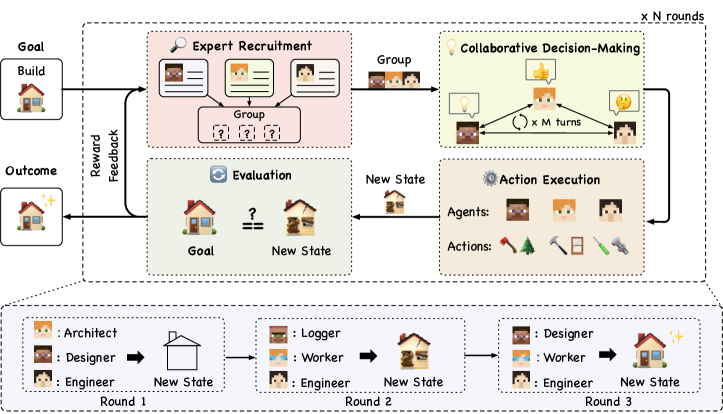 | [](https://arxiv.org/abs/PLACEHOLDER_PAPER_TBD) | [](https://github.com/OpenBMB/AgentVerse) |
| 2025 | `Advances` | Advances and challenges in foundation agents: From brain-inspired intelligence to evolutionary, collaborative, and safe systems | 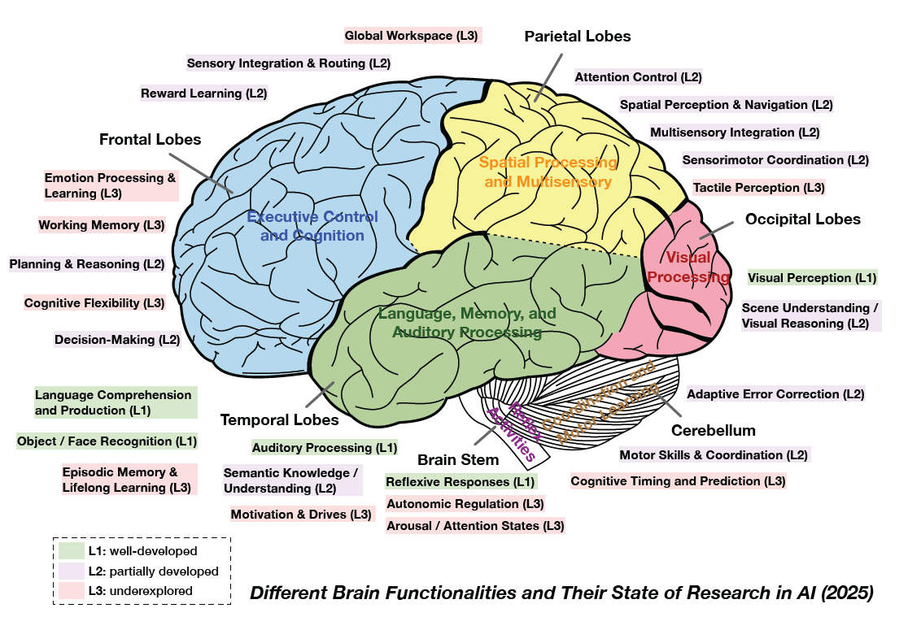 | [](https://arxiv.org/abs/2504.01990) |  |
| 2025 | `Role play` | Role play: Learning adaptive role-specific strategies in multi-agent interactions | 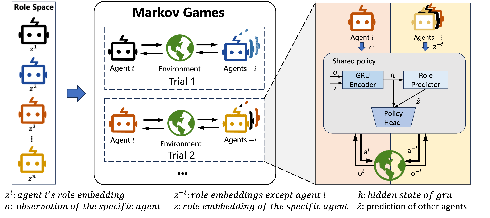 | [](https://arxiv.org/abs/2411.01166) |  |
| 2025 | `X-mas` | X-mas: Towards building multi-agent systems with heterogeneous llms | 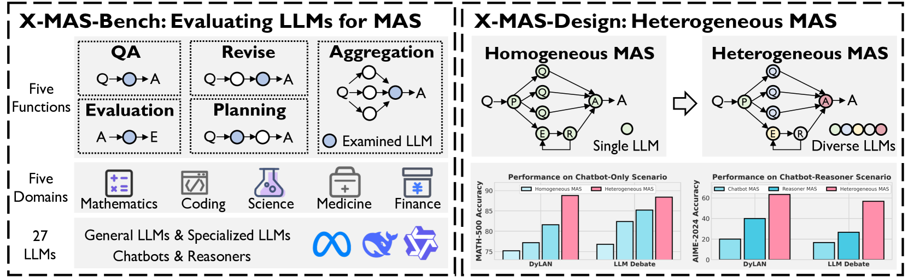 | [](https://arxiv.org/abs/2505.16997) |  |
| 2024 | `Heterogeneous` | Heterogeneous-agent reinforcement learning |  | [](https://arxiv.org/abs/2304.09870) |  |
| 2025 | `Adaptive` | Adaptive heterogeneous multi-agent debate for enhanced educational and factual reasoning in large language models | 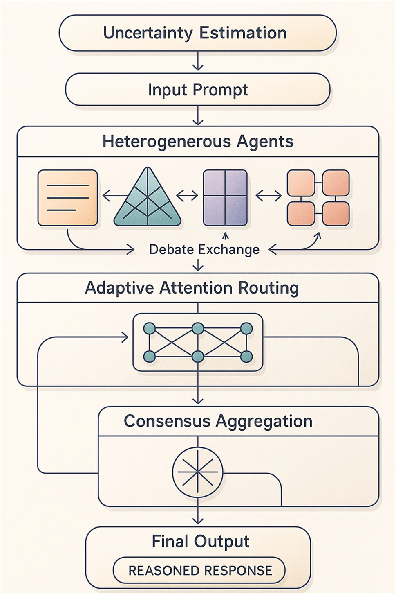 | [](https://arxiv.org/abs/PLACEHOLDER_PAPER_TBD) |  |
| 2025 | `MAPoRL` | MAPoRL: Multi-agent post-co-training for collaborative large language models with reinforcement learning | 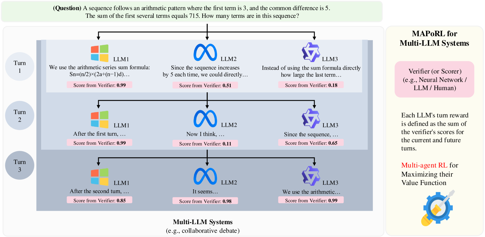 | [](https://arxiv.org/abs/2502.18439) |  |
| 2025 | `Multi-Agentic` | Multi-Agentic LLMs for personalizing STEM texts | 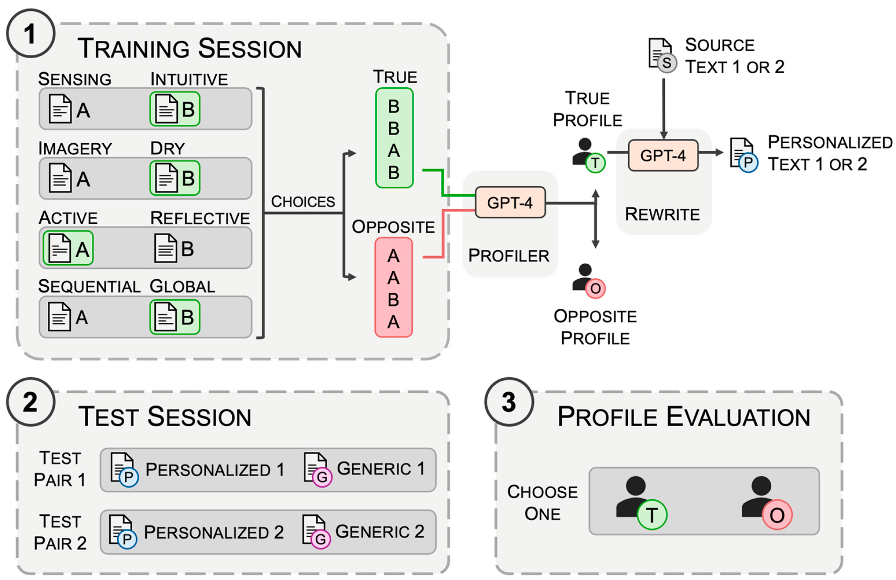 | [](https://arxiv.org/abs/PLACEHOLDER_PAPER_TBD) |  |
| 2025 | `OptDisPro` | OptDisPro: LLM-based Multi-agent Framework for Flexibly Adapting Heuristic Optimal DisFlow | 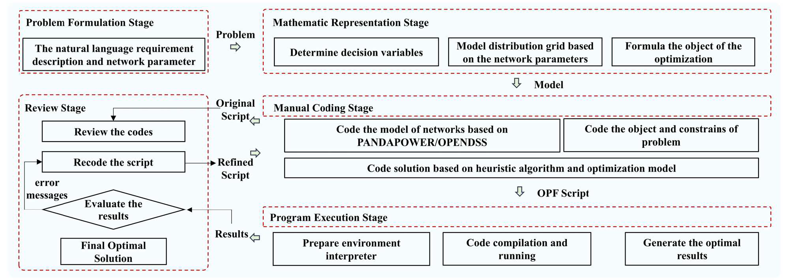 | [](https://arxiv.org/abs/PLACEHOLDER_PAPER_TBD) | [](https://github.com/zizaijiyigong/OptDisPro) |
| 2025 | `Self-resource` | Self-resource allocation in multi-agent llm systems | 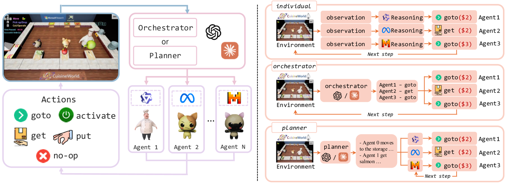 | [](https://arxiv.org/abs/2504.02051) |  |
| 2025 | `organizational` | An organizational theory for multi-agent interactions integrating human agents, LLMs, and specialized AI | 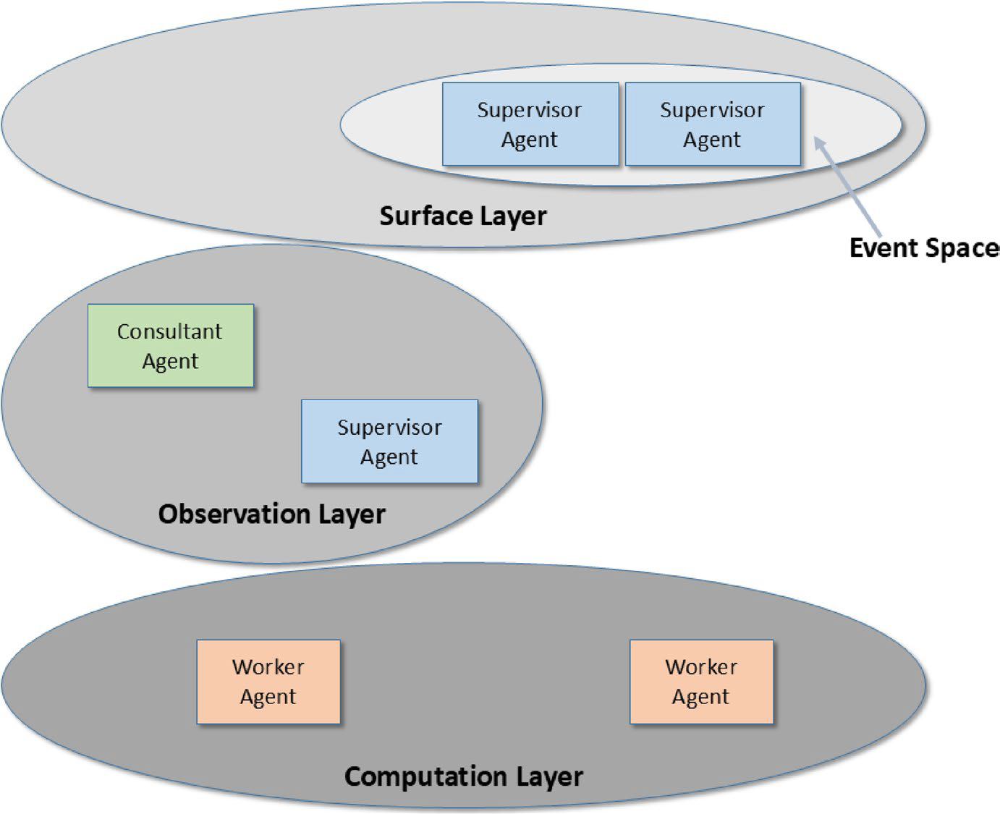 | [](https://arxiv.org/abs/PLACEHOLDER_PAPER_TBD) |  |
| 2025 | `Masrouter` | Masrouter: Learning to route llms for multi-agent systems | 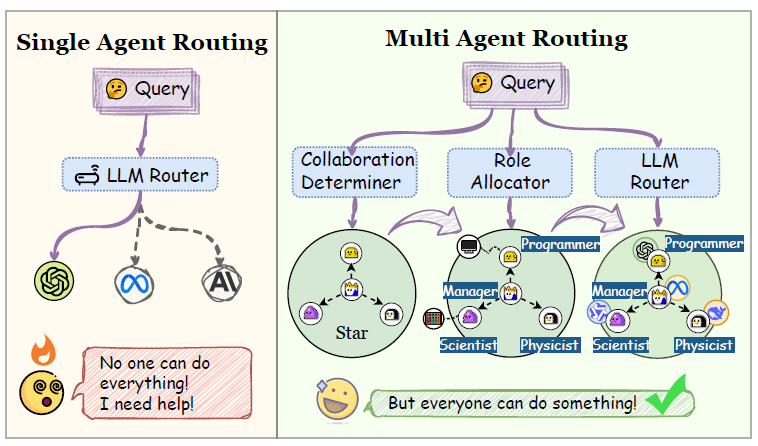 | [](https://arxiv.org/abs/2502.11133) | [](https://github.com/yanweiyue/masrouter) |
| 2025 | `Decentralized` | Decentralized adaptive task allocation for dynamic multi-agent systems | 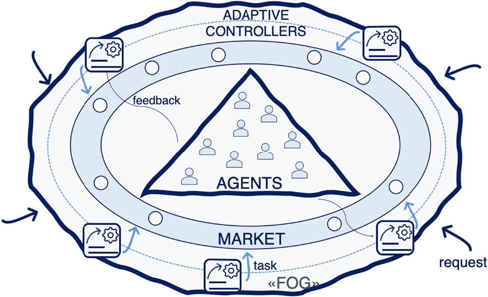 | [](https://arxiv.org/abs/PLACEHOLDER_PAPER_TBD) |  |
| 2025 | `R3DM` | R3DM: Enabling Role Discovery and Diversity Through Dynamics Models in Multi-agent Reinforcement Learning | 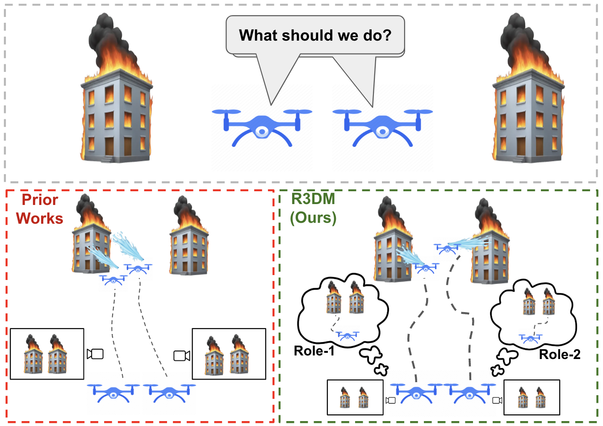 | [](https://arxiv.org/abs/2505.24265) | [](https://github.com/UTAustin-SwarmLab/R3DM) |
| 2025 | `Comal` | Comal: Collaborative multi-agent large language models for mixed-autonomy traffic | 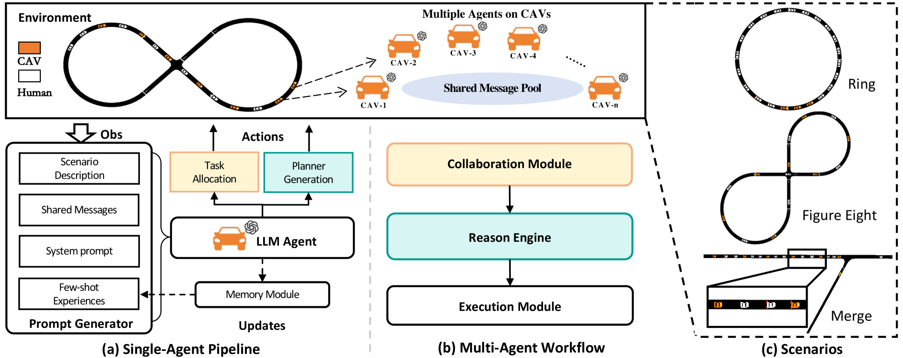 | [](https://arxiv.org/abs/2410.14368) | [](https://github.com/Hyan-Yao/CoMAL) |
| 2025 | `Colacare` | Colacare: Enhancing electronic health record modeling through large language model-driven multi-agent collaboration | 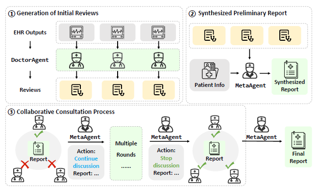 | [](https://arxiv.org/abs/2410.02551) | [](https://github.com/PKU-AICare/ColaCare) |
| 2025 | `Multiagentesc` | Multiagentesc: A llm-based multi-agent collaboration framework for emotional support conversation | 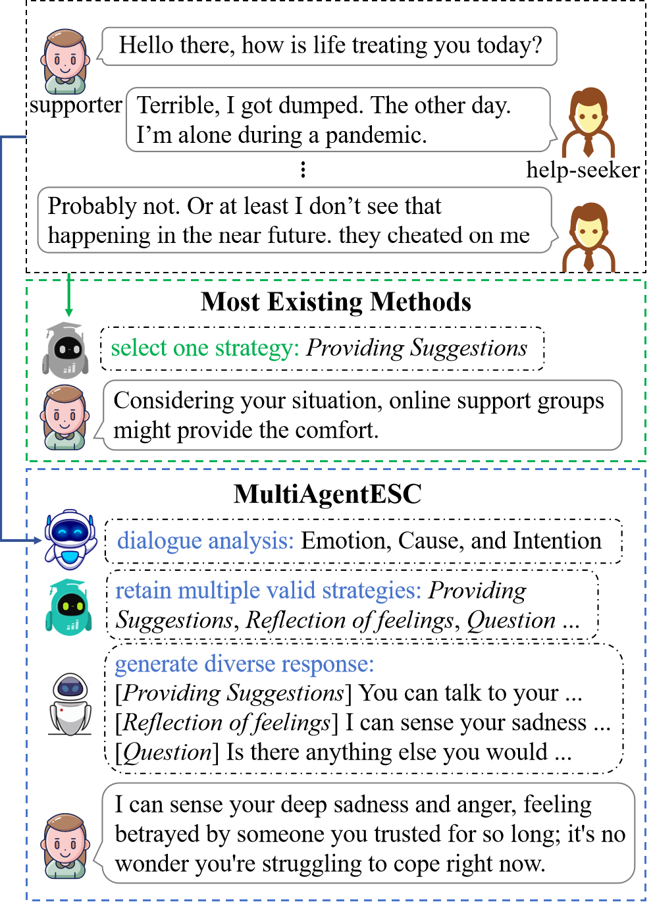 | [](https://arxiv.org/abs/PLACEHOLDER_PAPER_TBD) |  |
| 2025 | `MedAide` | MedAide: information fusion and anatomy of medical intents via LLM-based agent collaboration | 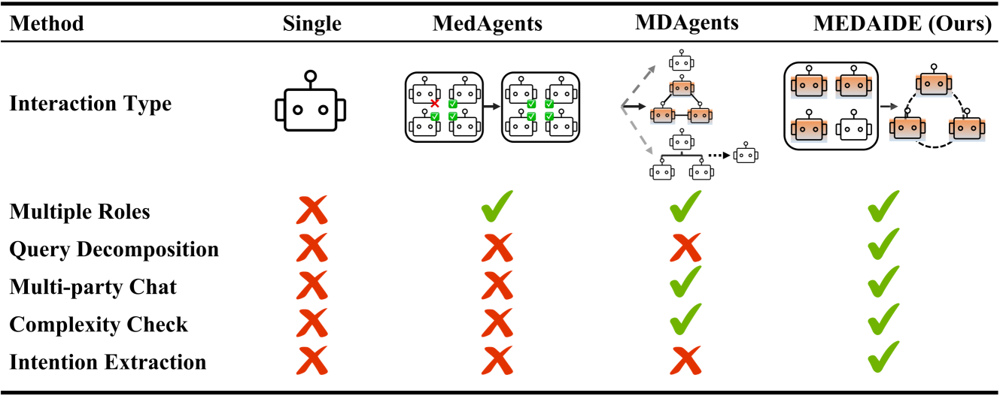 | [](https://arxiv.org/abs/2410.12532) | [](https://github.com/ydk122024/MedAIDE) |
| 2025 | `Auto-scaling` | Auto-scaling LLM-based multi-agent systems through dynamic integration of agents | 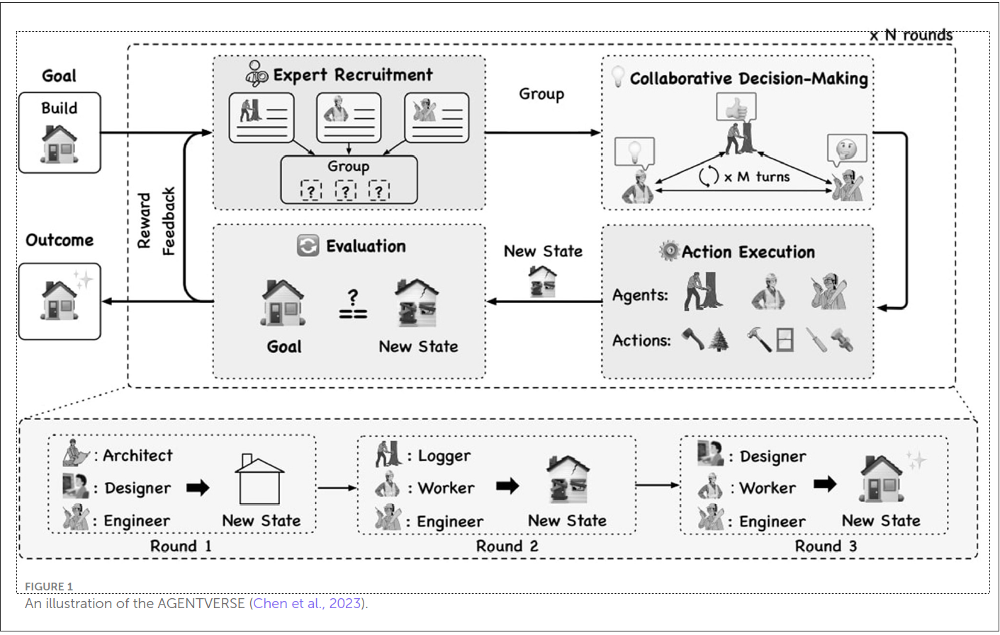 | [](https://arxiv.org/abs/PLACEHOLDER_PAPER_TBD) |  |
| 2025 | `Adaptive` | Adaptive heterogeneous multi-agent debate for enhanced educational and factual reasoning in large language models |  | [](https://arxiv.org/abs/PLACEHOLDER_PAPER_TBD) |  |
| 2026 | `HieraMAS` | HieraMAS: Optimizing Intra-Node LLM Mixtures and Inter-Node Topology for Multi-Agent Systems | 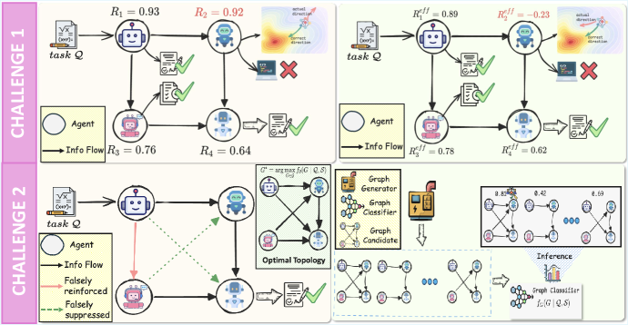 | [](https://arxiv.org/abs/2602.20229) |  |
| 2026 | `Automated` | Automated summarization of software documents: an LLM-based multi-agent approach | 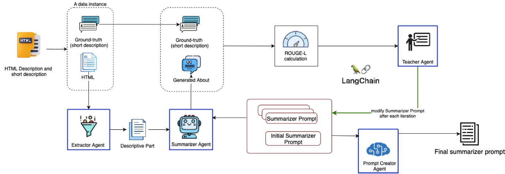 | [](https://arxiv.org/abs/PLACEHOLDER_PAPER_TBD) |  |
| 2026 | `LLM` | Large language model-based multi-agent systems for automated foundation design: router-driven task classification and expert selection framework | 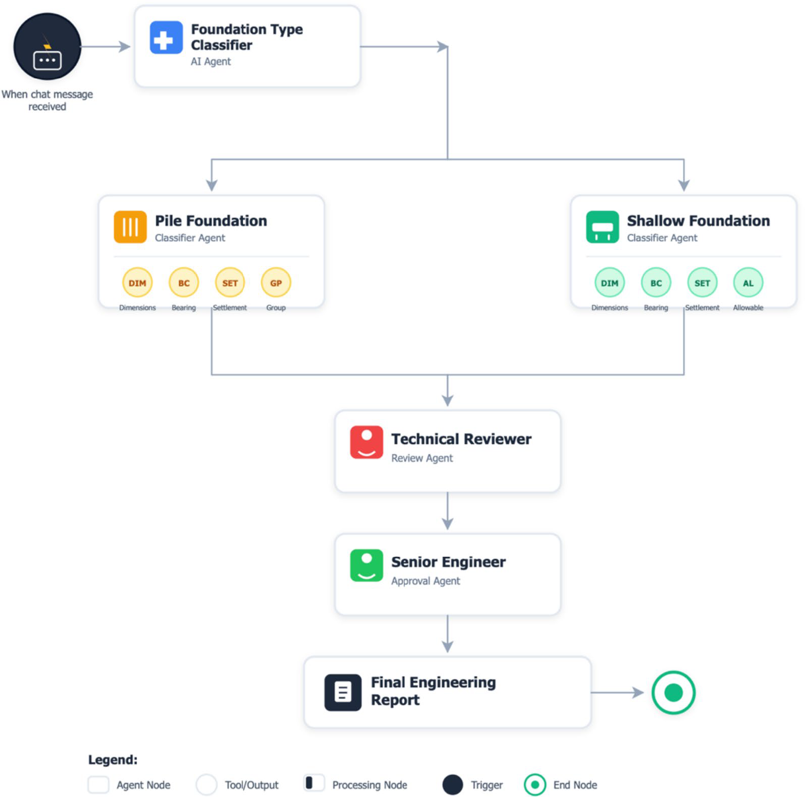 | [](https://arxiv.org/abs/PLACEHOLDER_PAPER_TBD) |  |
| 2026 | `CodeDelegator` | CodeDelegator: Mitigating Context Pollution via Role Separation in Code-as-Action Agents | 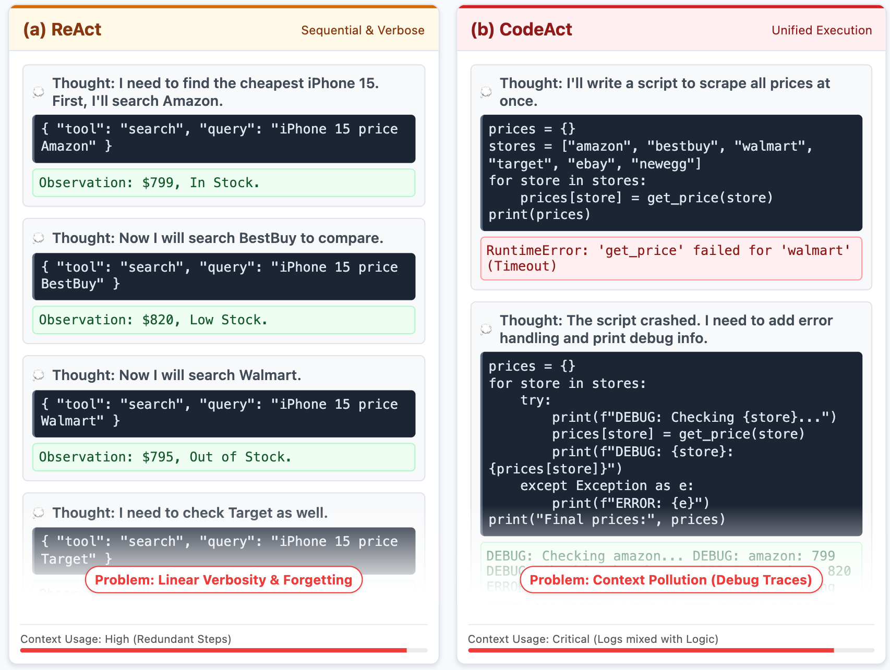 | [](https://arxiv.org/abs/2601.14914) |  |
| 2026 | `Atomizer` | Atomizer: An LLM-based Collaborative Multi-Agent Framework for Intent-Driven Commit Untangling | 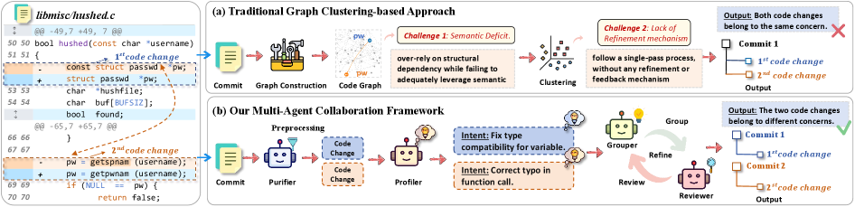 | [](https://arxiv.org/abs/2601.01233) |  |
| 2026 | `ResMAS` | ResMAS: Resilience Optimization in LLM-based Multi-agent Systems | 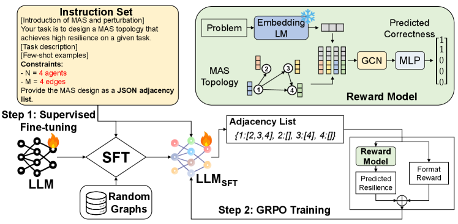 | [](https://arxiv.org/abs/2601.04694) |  |

#### Communication

| Date | Name | Title | Introduction | Paper | Github |
|:-:|:-:|:-|:-:|:-:|:-:|
| 2022 | `Formic` | Formic: Foraging via multiagent rl with implicit communication | 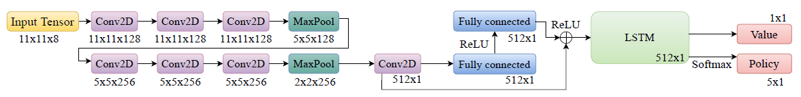 | [](https://arxiv.org/abs/2006.08152) |  |
| 2022 | `ToM2C` | ToM2C: Target-oriented Multi-agent Communication and Cooperation with Theory of Mind | 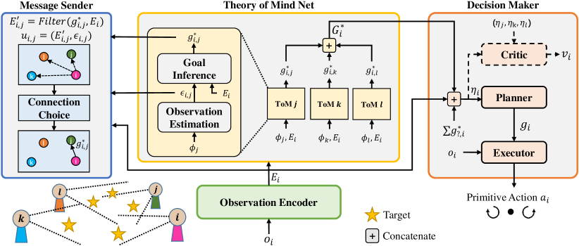 | [](https://arxiv.org/abs/2111.09189) | [](https://github.com/UnrealTracking/ToM2C) |
| 2023 | `MetaGPT` | MetaGPT: Meta programming for a multi-agent collaborative framework | 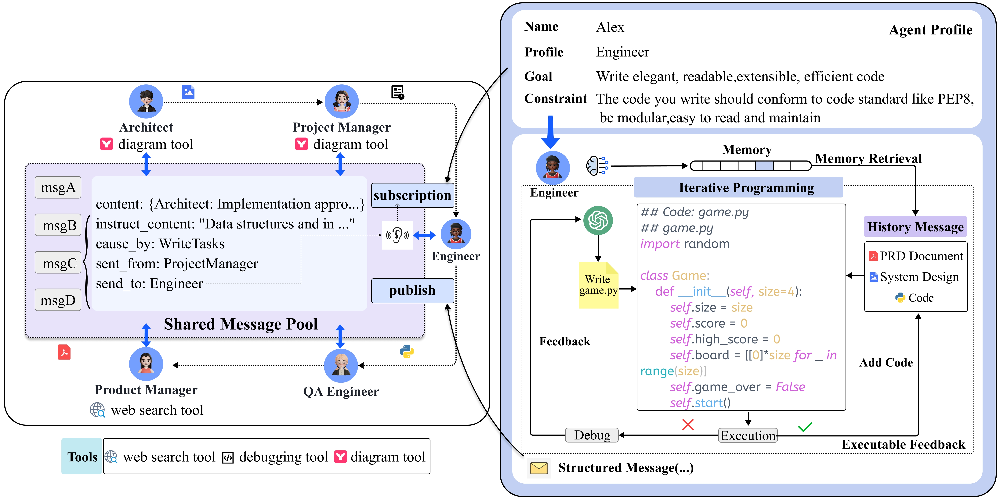 | [](https://arxiv.org/abs/2308.00352) | [](https://github.com/FoundationAgents/MetaGPT) |
| 2023 | `Generative` | Generative agents: Interactive simulacra of human behavior |  | [](https://arxiv.org/abs/2304.03442) | [](https://github.com/joonspk-research/generative_agents) |
| 2024 | `Magis` | Magis: Llm-based multi-agent framework for github issue resolution | 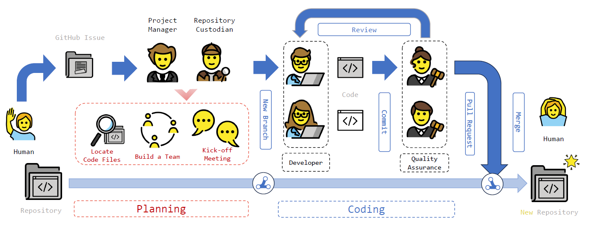 | [](https://arxiv.org/abs/2403.17927) | [](https://github.com/co-evolve-lab/magis) |
| 2024 | `Reconcile` | Reconcile: Round-table conference improves reasoning via consensus among diverse llms | 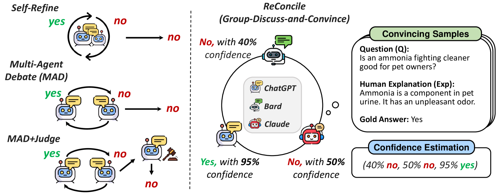 | [](https://arxiv.org/abs/2309.13007) | [](https://github.com/dinobby/ReConcile) |
| 2026 | `LLM` | Large language model-based multi-agent systems for automated foundation design: router-driven task classification and expert selection framework |  | [](https://arxiv.org/abs/PLACEHOLDER_PAPER_TBD) |  |
| 2024 | `Scalable` | A scalable communication protocol for networks of large language models | 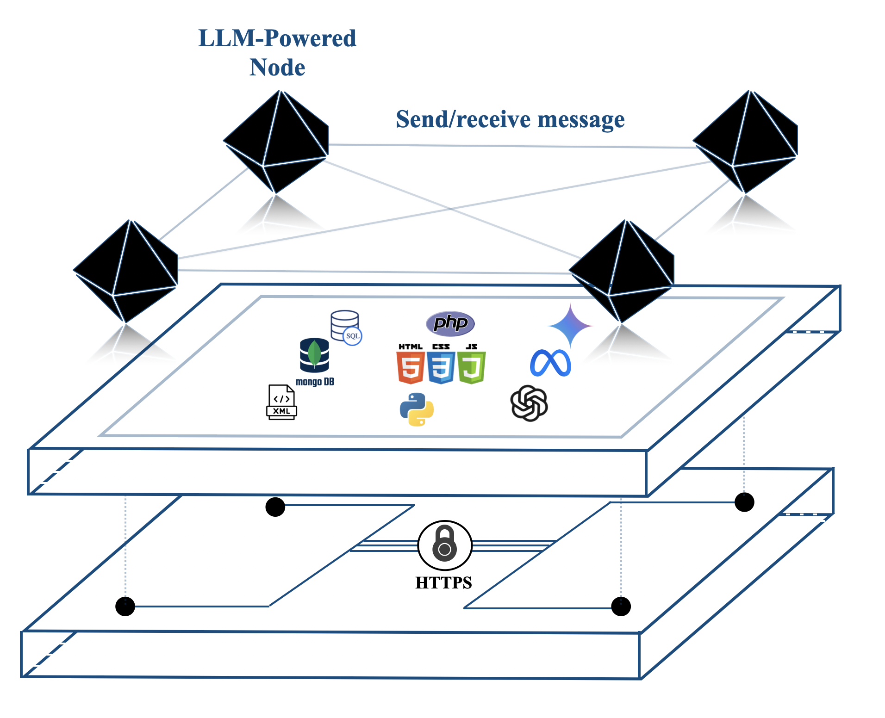 | [](https://arxiv.org/abs/2410.11905) | [](https://github.com/agora-protocol/paper-demo) |
| 2025 | `Beyond` | Beyond self-talk: A communication-centric survey of llm-based multi-agent systems | 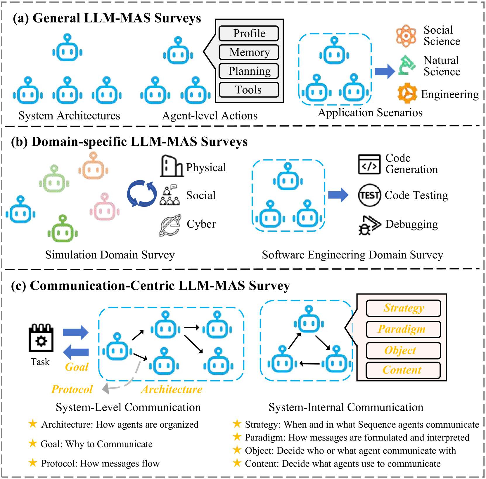 | [](https://arxiv.org/abs/2502.14321) |  |
| 2025 | `Talk` | Talk structurally, act hierarchically: A collaborative framework for llm multi-agent systems | 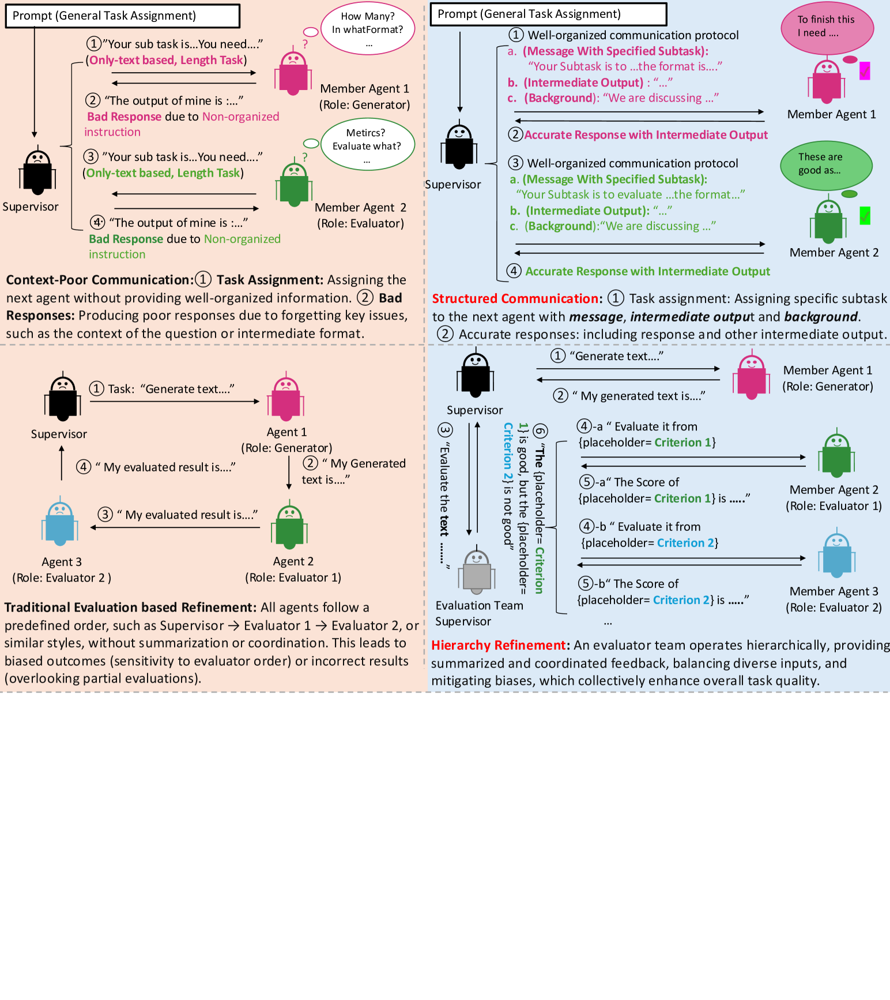 | [](https://arxiv.org/abs/2502.11098) | [](https://github.com/sony/talkhier) |
| 2025 | `AutoData` | AutoData: A Multi-Agent System for Open Web Data Collection | 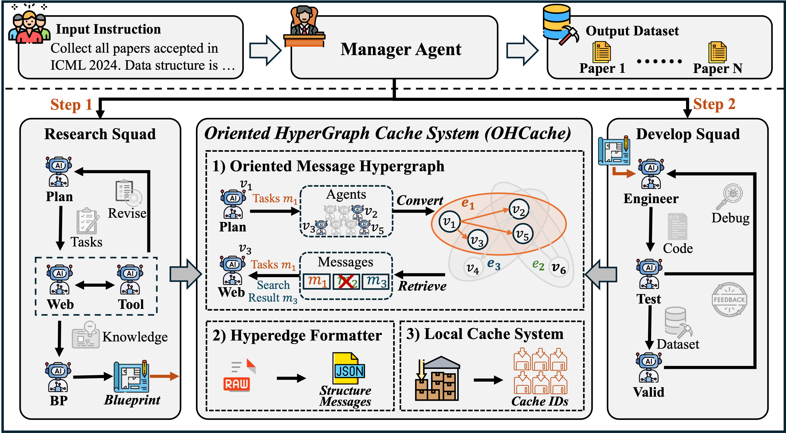 | [](https://arxiv.org/abs/2505.15859) | [](https://github.com/Tianyi-Billy-Ma/AutoData) |
| 2025 | `EcoLANG` | EcoLANG: Efficient and Effective Agent Communication Language Induction for Social Simulation | 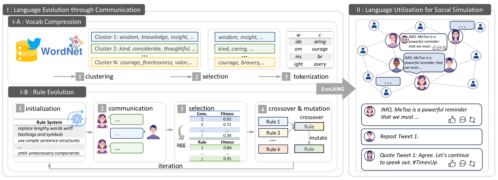 | [](https://arxiv.org/abs/2505.06904) |  |
| 2025 | `MegaAgent` | MegaAgent: A large-scale autonomous LLM-based multi-agent system without predefined SOPs | 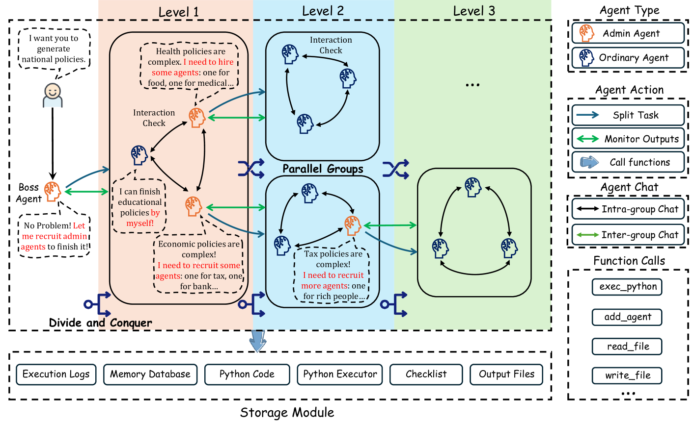 | [](https://arxiv.org/abs/2408.09955) | [](https://github.com/Xtra-Computing/MegaAgent) |
| 2025 | `Eco Pipeline` | Cut the Crap: An Economical Communication Pipeline for LLM-based Multi-Agent Systems | 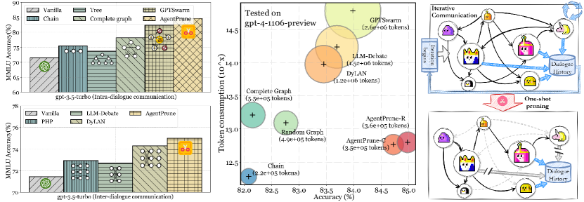 | [](https://arxiv.org/abs/2410.02506) |  |
| 2025 | ` Agentcoord` | Agentcoord: Visually exploring coordination strategy for llm-based multi-agent collaboration | 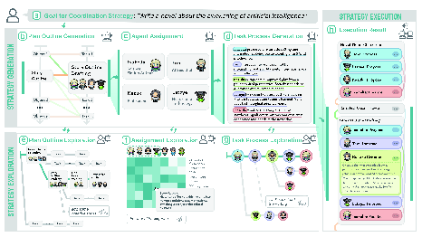 | [](https://arxiv.org/abs/2404.11943) |  |
| 2025 | `Efficient` | Efficient training in multi-agent reinforcement learning: A communication-free framework for the box-pushing problem | 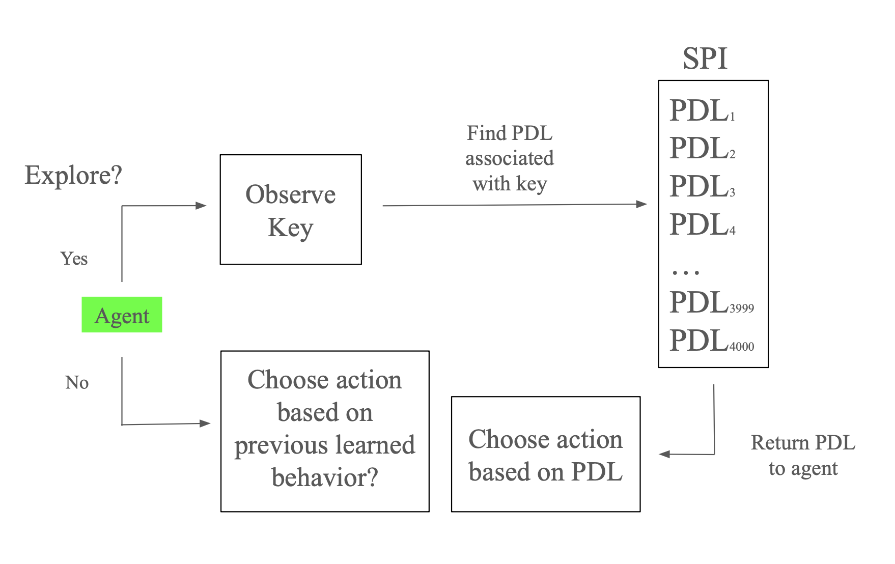 | [](https://arxiv.org/abs/2411.12246) |  |
| 2025 | `Latent` | Latent collaboration in multi-agent systems | 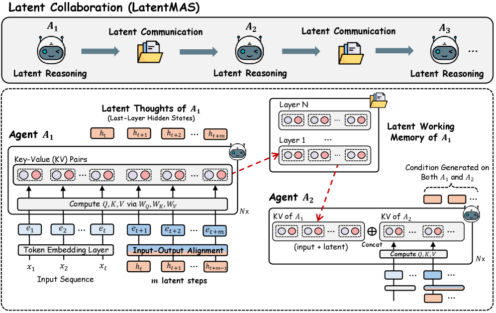 | [](https://arxiv.org/abs/2511.20639) | [](https://github.com/Gen-Verse/LatentMAS) |
| 2025 | `Interconnected` | Interconnected Autonomous Systems |  | [](https://arxiv.org/abs/PLACEHOLDER_PAPER_TBD) |  |
| 2025 | `IoA` | Internet of Agents: Weaving a Web of Heterogeneous Agents for Collaborative Intelligence | 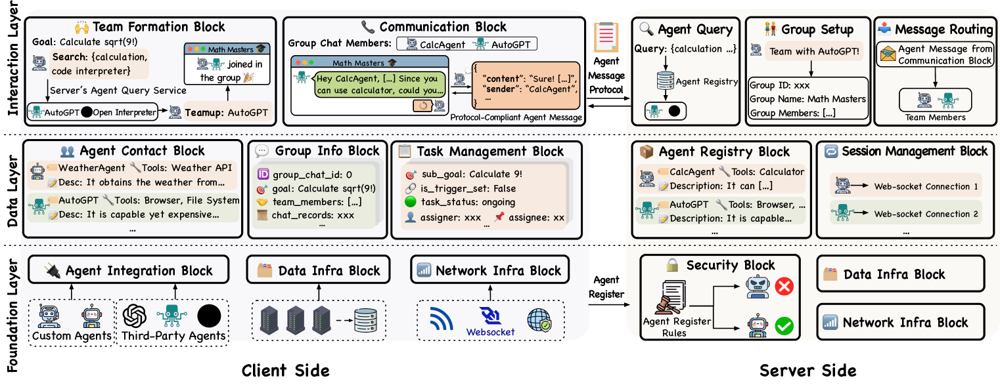 | [](https://arxiv.org/abs/2407.07061) | [](https://github.com/OpenBMB/IoA) |
| 2025 | `Cp-agentnet` | Cp-agentnet: Autonomous and explainable communication protocol design using generative agents | 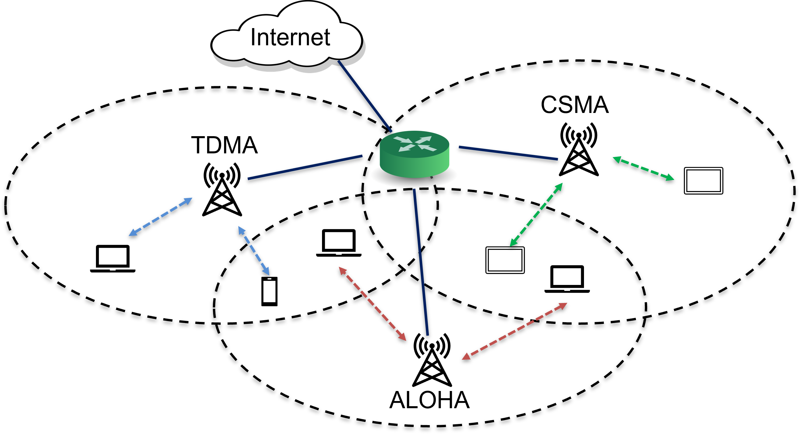 | [](https://arxiv.org/abs/2503.17850) |  |
| 2026 | `TodyComm` | TodyComm: Task-Oriented Dynamic Communication for Multi-Round LLM-based Multi-Agent System | 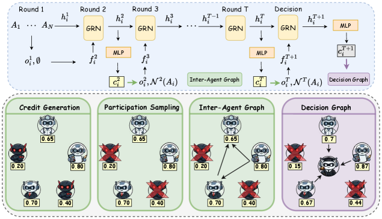 | [](https://arxiv.org/abs/2602.03688) |  |
| 2026 | `Dynamic` | Dynamic Consensus Communication Mechanism for Large Language Model-Based Multi-Agent Systems | 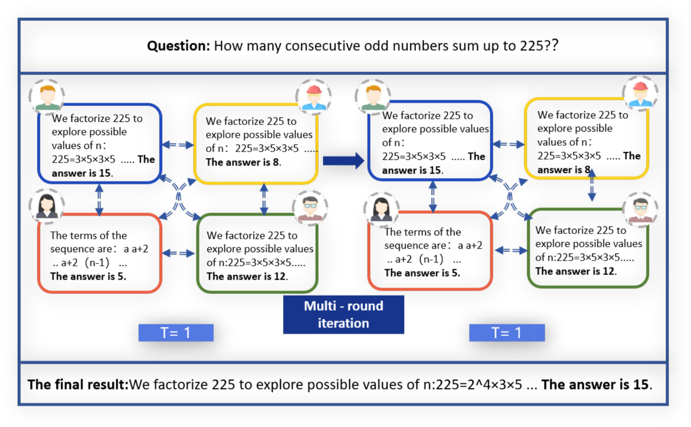 | [](https://arxiv.org/abs/PLACEHOLDER_PAPER_TBD) |  |
| 2026 | `Agents` | When Numbers Start Talking: Implicit Numerical Coordination Among LLM-Based Agents | 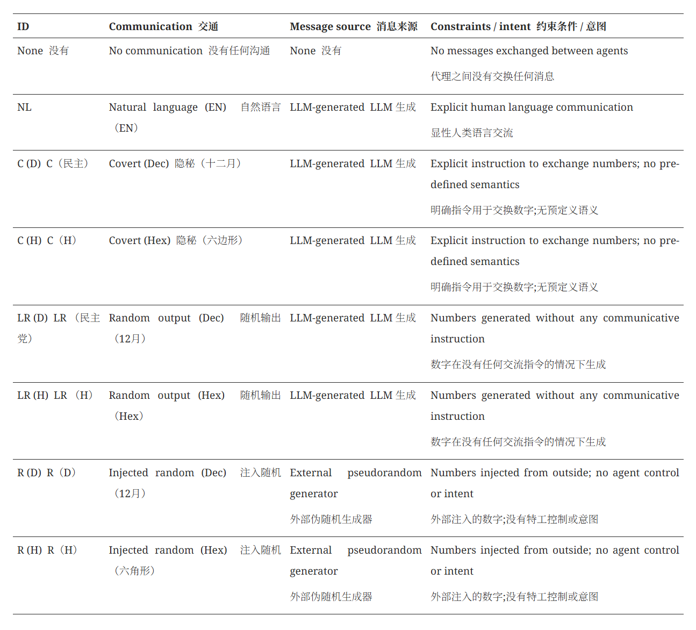 | [](https://arxiv.org/abs/2601.03846) |  |
#### Orchestration

| Date | Name | Title | Introduction | Paper | Github |
|:-:|:-:|:-|:-:|:-:|:-:|
| 2023 | `MetaGPT` | MetaGPT: Meta programming for a multi-agent collaborative framework |  | [](https://arxiv.org/abs/2308.00352) | [](https://github.com/FoundationAgents/MetaGPT) |
| 2023 | `Plan-and-solve` | Plan-and-solve prompting: Improving zero-shot chain-of-thought reasoning by large language models |  | [](https://arxiv.org/abs/2305.04091) |  |
| 2025 | `Efficient` | Efficient training in multi-agent reinforcement learning: A communication-free framework for the box-pushing problem |  | [](https://arxiv.org/abs/2411.12246) |  |
| 2024 | `ChatDev` | ChatDev: Communicative agents for software development |  | [](https://arxiv.org/abs/2307.07924) | [](https://github.com/OpenBMB/ChatDev) |
| 2025 | `Masrouter` | Masrouter: Learning to route llms for multi-agent systems |  | [](https://arxiv.org/abs/2502.11133) | [](https://github.com/yanweiyue/masrouter) |
| 2025 | `Rcr-router` | Rcr-router: Efficient role-aware context routing for multi-agent llm systems with structured memory | 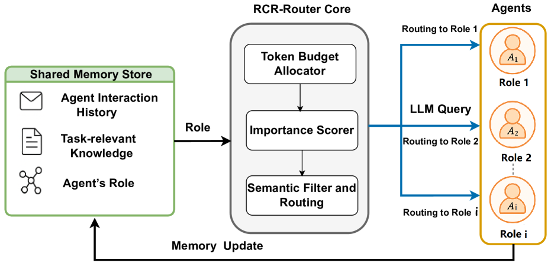 | [](https://arxiv.org/abs/2508.04903) |  |
| 2025 | `Agentnet` | Agentnet: Decentralized evolutionary coordination for llm-based multi-agent systems, 2025 | 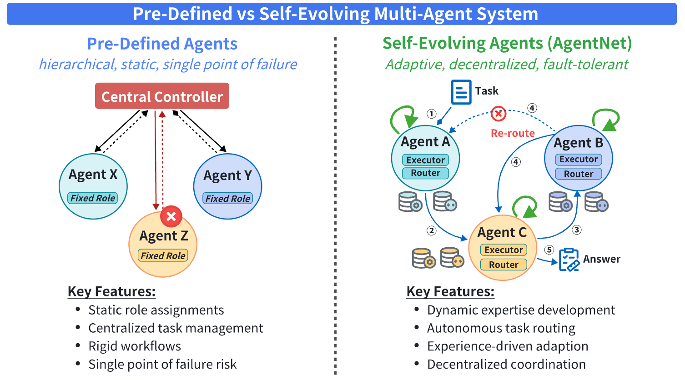 | [](https://arxiv.org/abs/2504.00587) |  |
| 2024 | `Agent` | Agent hospital: A simulacrum of hospital with evolvable medical agents |  | [](https://arxiv.org/abs/2405.02957) |  |
| 2017 | `Multi-agent` | Multi-agent actor-critic for mixed cooperative-competitive environments |  | [](https://arxiv.org/abs/1706.02275) |  |
| 2025 | `Controlling` | Controlling Performance and Budget of a Centralized Multi-agent LLM System with Reinforcement Learning | 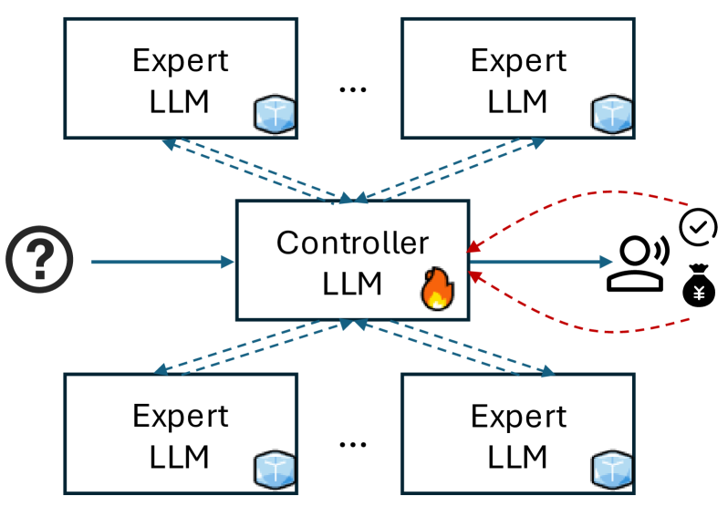 | [](https://arxiv.org/abs/2511.02755) |  |
| 2025 | `Centrally` | Centrally coordinated multi-agent reinforcement learning for power grid topology control | 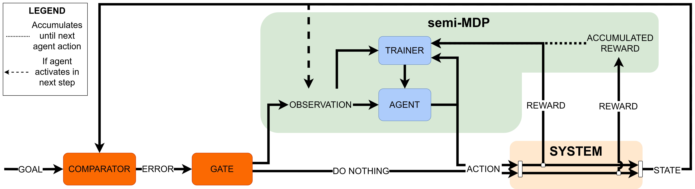 | [](https://arxiv.org/abs/2502.08681) |  |
| 2025 | `Symphony` | Symphony: A Decentralized Multi-Agent Framework for Scalable Collective Intelligence | 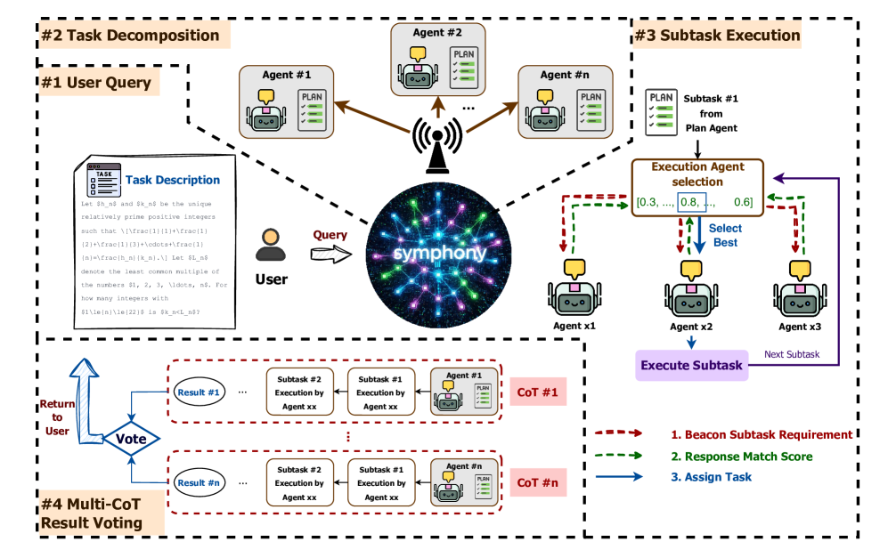 | [](https://arxiv.org/abs/2508.20019) | [](https://github.com/GradientHQ/symphony) |
| 2025 | `Hippo-mat` | Hippo-mat: Decentralized task allocation using graphsage and multi-agent deep reinforcement learning | 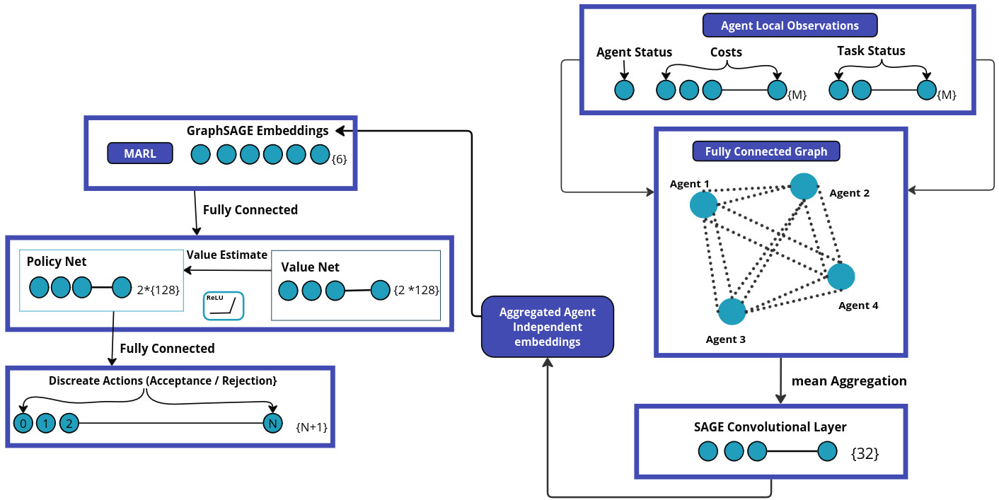 | [](https://arxiv.org/abs/2503.07662) |  |
| 2025 | `Agentflow` | Agentflow: Resilient adaptive cloud-edge framework for multi-agent coordination | 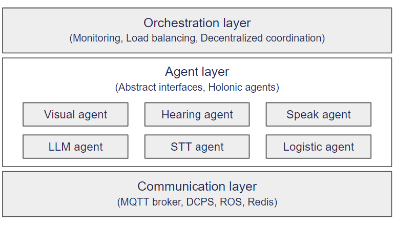 | [](https://arxiv.org/abs/2505.07603) |  |
| 2025 | `Agentorchestra` | Agentorchestra: A hierarchical multi-agent framework for general-purpose task solving | 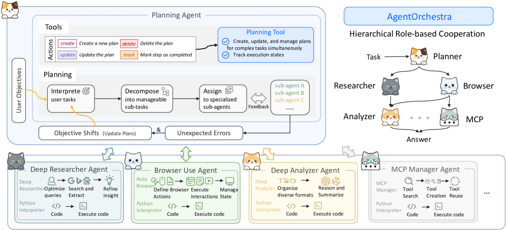 | [](https://arxiv.org/abs/2506.12508) |  |
| 2026 | `TCAndon-Router` | TCAndon-Router: Adaptive Reasoning Router for Multi-Agent Collaboration | 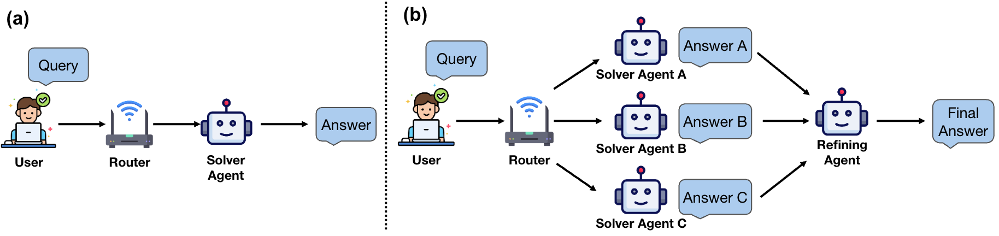 | [](https://arxiv.org/abs/2601.04544) | [](https://github.com/Tencent/TCAndon-Router) |
| 2026 | `StackPlanner` | StackPlanner: A Centralized Hierarchical Multi-Agent System with Task-Experience Memory Management | 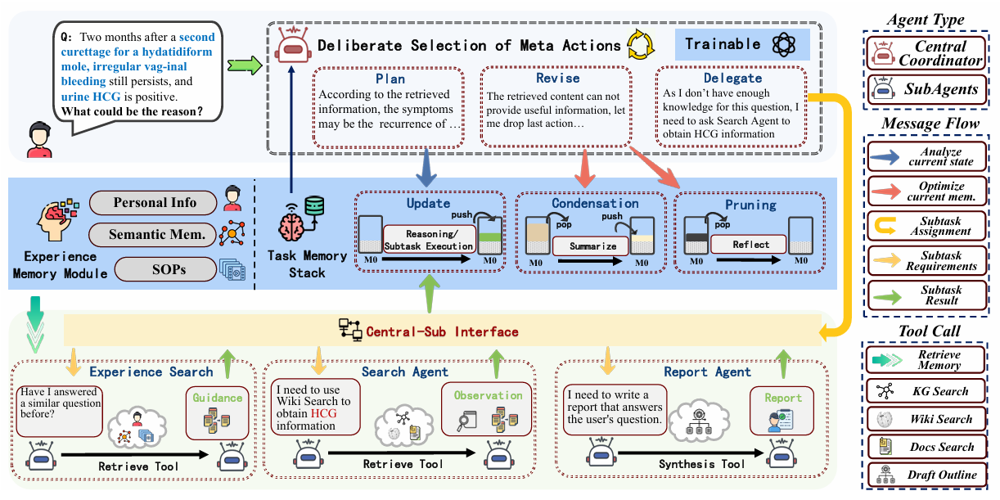 | [](https://arxiv.org/abs/2601.05890) |  |
| 2026 | `Decentralized LLM` | Learning Decentralized LLM Collaboration with Multi-Agent Actor Critic | 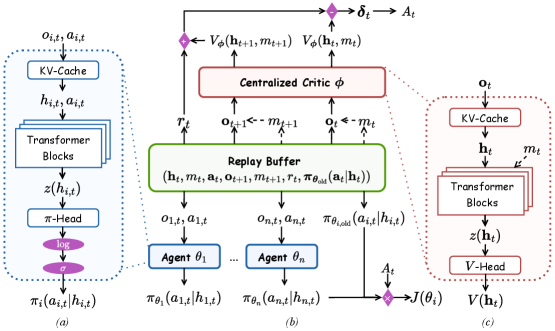 | [](https://arxiv.org/abs/2601.21972) |  |
| 2026 | `Graph-of-Agents` | Graph-of-Agents: A Graph-based Framework for Multi-Agent LLM Collaboration | 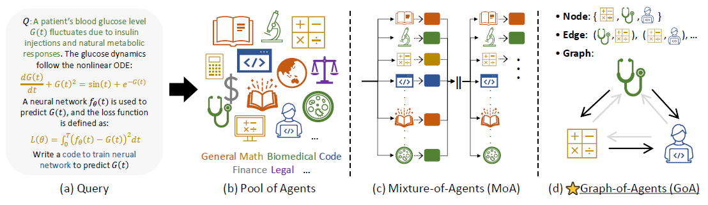 | [](https://arxiv.org/abs/2604.17148) | [](https://github.com/UNITES-Lab/GoA) |
| 2026 | `AdaptOrch` | AdaptOrch: Task-Adaptive Multi-Agent Orchestration in the Era of LLM Performance Convergence | 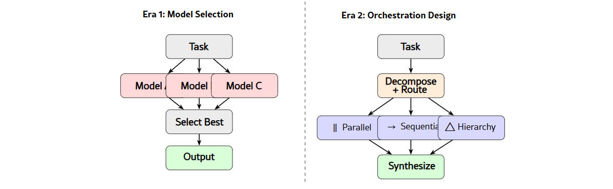 | [](https://arxiv.org/abs/2602.16873) |  |
| 2026 | `LLM` | Large language model-based multi-agent systems for automated foundation design: router-driven task classification and expert selection framework |  | [](https://arxiv.org/abs/PLACEHOLDER_PAPER_TBD) |  |
| TBD | `Tree of Agents` | Tree of Agents: Improving Long-Context Capabilities of Large Language Models through Multi-Perspective Reasoning | 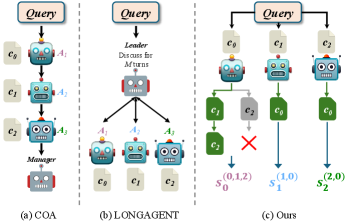 | [](https://arxiv.org/abs/2509.06436) | [](https://github.com/Aireduce952/Tree-of-Agents) |

#### Interaction

| Date | Name | Title | Introduction | Paper | Github |
|:-:|:-:|:-|:-:|:-:|:-:|
| 2023 | `HuggingGPT` | HuggingGPT: Solving AI Tasks with ChatGPT and its Friends in Hugging Face |  | [](https://arxiv.org/abs/2303.17580) | [](https://github.com/microsoft/JARVIS) |
| 2023 | `Generative` | Generative agents: Interactive simulacra of human behavior |  | [](https://arxiv.org/abs/2304.03442) | [](https://github.com/joonspk-research/generative_agents) |
| 2023 | `MetaGPT` | MetaGPT: Meta programming for a multi-agent collaborative framework |  | [](https://arxiv.org/abs/2308.00352) | [](https://github.com/FoundationAgents/MetaGPT) |
| 2023 | `Improving` | Improving language model negotiation with self-play and in-context learning from ai feedback | 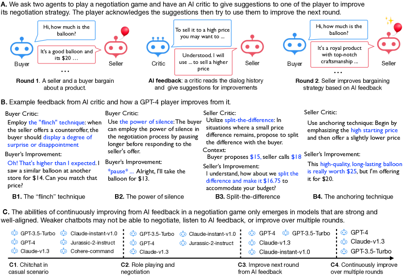 | [](https://arxiv.org/abs/2305.10142) |  |
| 2024 | `Chain of agents` | Chain of agents: Large language models collaborating on long-context tasks | 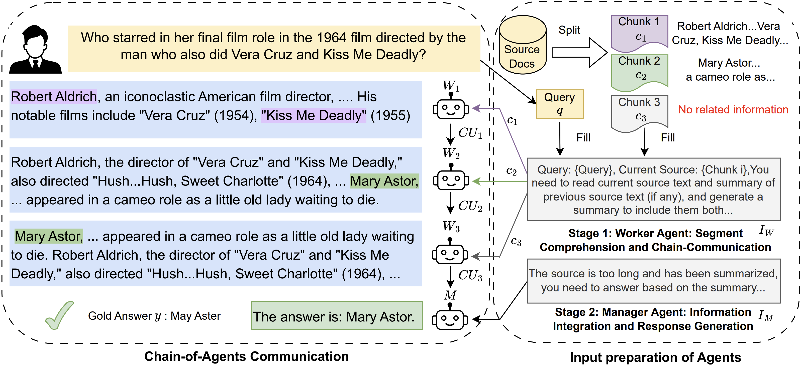 | [](https://arxiv.org/abs/2406.02818) |  |
| 2024 | `Macrec` | Macrec: A multi-agent collaboration framework for recommendation | 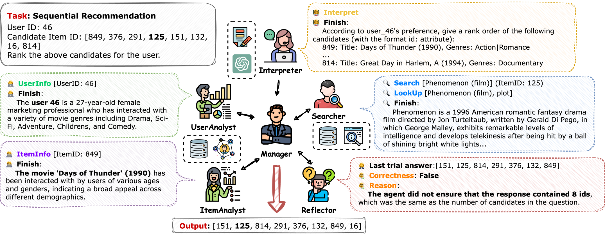 | [](https://arxiv.org/abs/2402.15235) | [](https://github.com/wzf2000/MACRec) |
| 2024 | `Magic` | Magic: Investigation of large language model powered multi-agent in cognition, adaptability, rationality and collaboration | 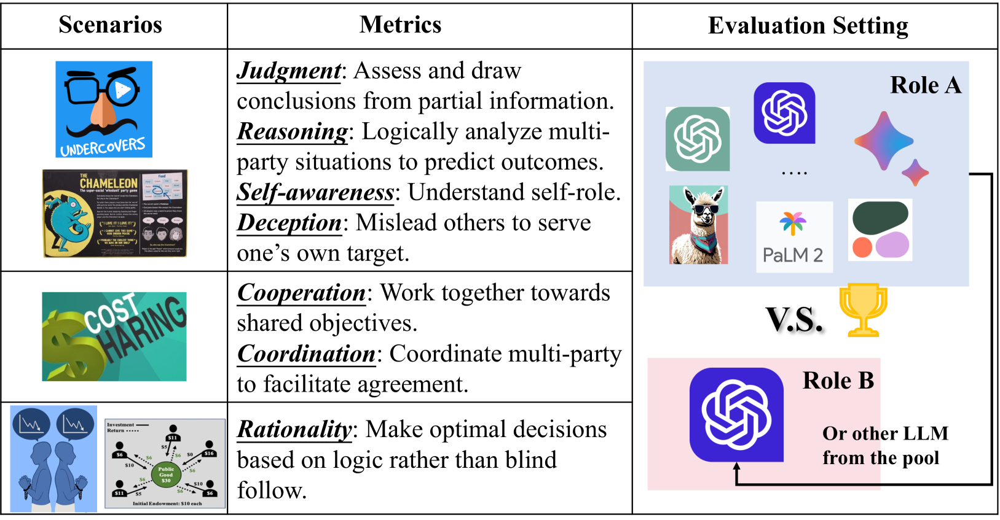 | [](https://arxiv.org/abs/2311.08562) |  |
| 2023 | `Improving` | Improving language model negotiation with self-play and in-context learning from ai feedback |  | [](https://arxiv.org/abs/2305.10142) |  |
| 2024 | `DrugAgent` | DrugAgent: Automating AI-aided Drug Discovery Programming through LLM Multi-Agent Collaboration | 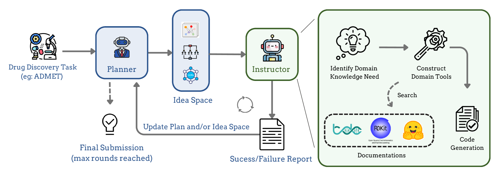 | [](https://arxiv.org/abs/2411.15692) |  |
| 2024 | `ProAgent` | ProAgent: Building Proactive Cooperative Agents with Large Language Models | 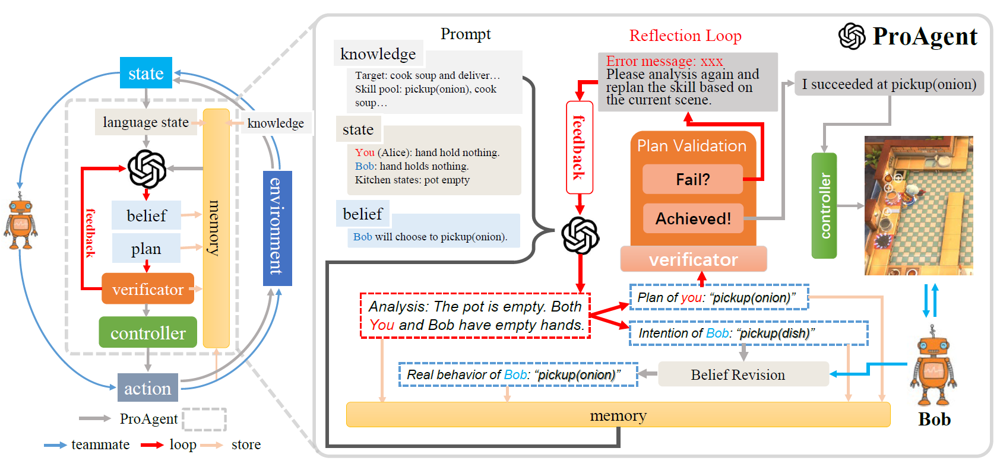 | [](https://arxiv.org/abs/2308.11339) | [](https://github.com/PKU-Alignment/ProAgent) |
| 2024 | `Exploring` | Exploring Collaboration Mechanisms for LLM Agents: A Social Psychology View | 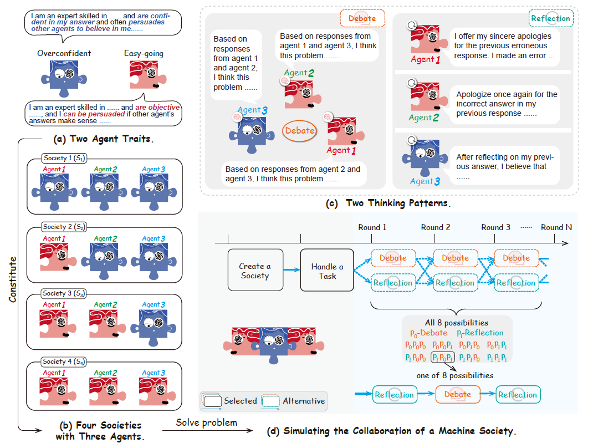 | [](https://arxiv.org/abs/2310.02124) | [](https://github.com/zjunlp/MachineSoM) |
| 2024 | `Reflective` | Reflective Multi-Agent Collaboration based on Large Language Models | 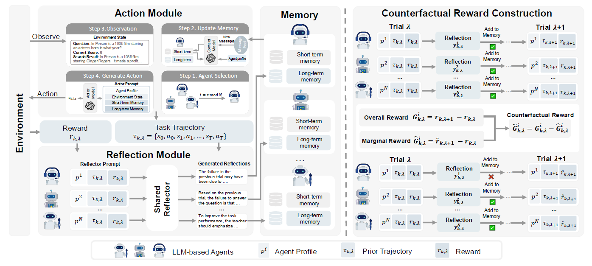 | [](https://arxiv.org/abs/PLACEHOLDER_PAPER_TBD) |  |
| 2024 | `Electoral` | An Electoral Approach to Diversify LLM-based Multi-Agent Collective Decision-Making | 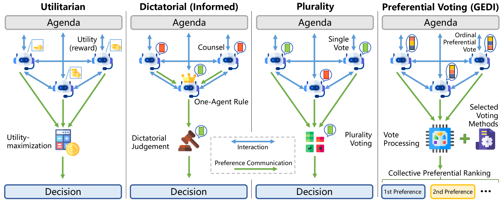 | [](https://arxiv.org/abs/2410.15168) | [](https://github.com/xiutian/GEDI) |
| 2024 | `Beat` | Can LLMs Beat Humans in Debating? A Dynamic Multi-agent Framework for Competitive Debate | 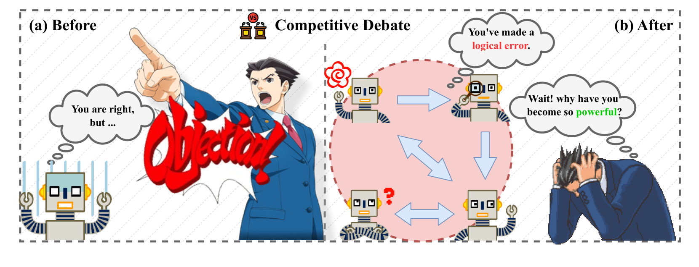 | [](https://arxiv.org/abs/2408.04472) |  |
| 2024 | `Encouraging` | Encouraging divergent thinking in large language models through multi-agent debate | 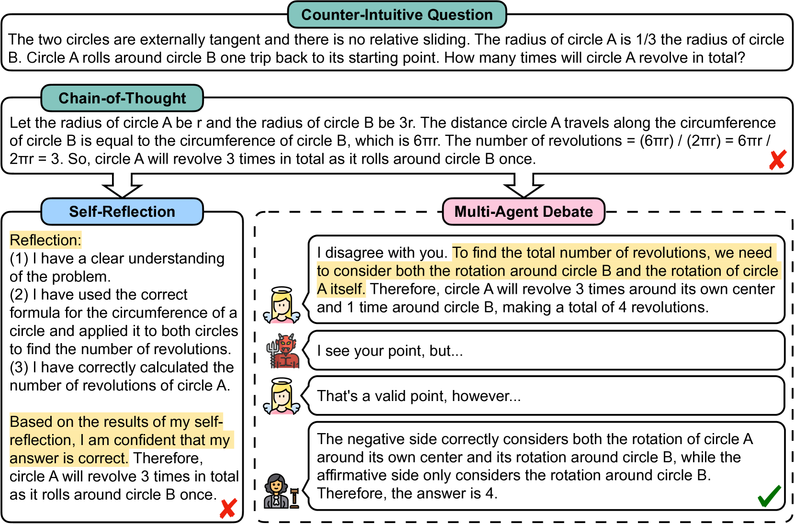 | [](https://arxiv.org/abs/2305.19118) | [](https://github.com/Skytliang/Multi-Agents-Debate) |
| 2025 | `Explain-analyze-generate` | Explain-analyze-generate: A sequential multi-agent collaboration method for complex reasoning | 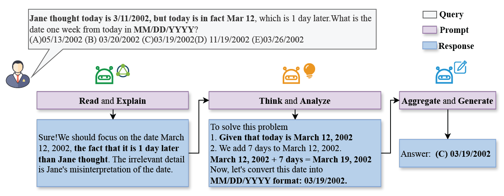 | [](https://arxiv.org/abs/PLACEHOLDER_PAPER_TBD) |  |
| 2025 | `Anymac` | Anymac: Cascading flexible multi-agent collaboration via next-agent prediction | 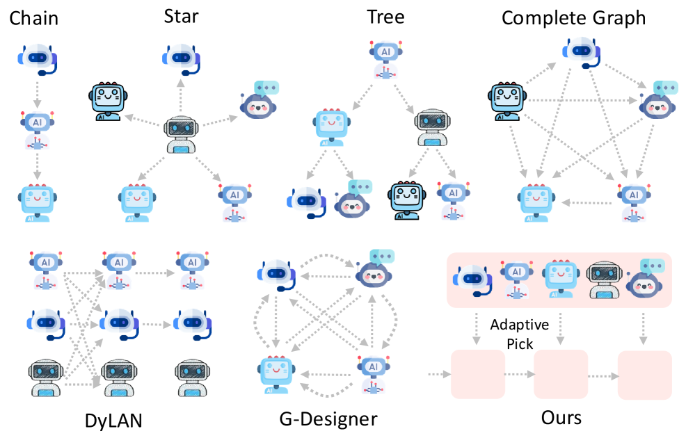 | [](https://arxiv.org/abs/2506.17784) |  |
| 2025 | `Traceability` | Traceability and Accountability in Role-Specialized Multi-Agent LLM Pipelines | 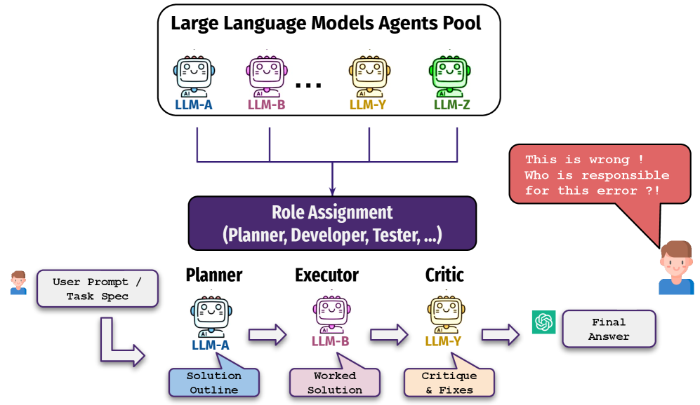 | [](https://arxiv.org/abs/2510.07614) |  |
| 2025 | `Mixture-of-Agents` | Mixture-of-Agents Enhances Large Language Model Capabilities | 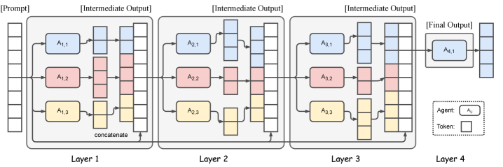 | [](https://arxiv.org/abs/2406.04692) | [](https://github.com/togethercomputer/MoA) |
| 2025 | `Optimizing` | Optimizing sequential multi-step tasks with parallel llm agents | 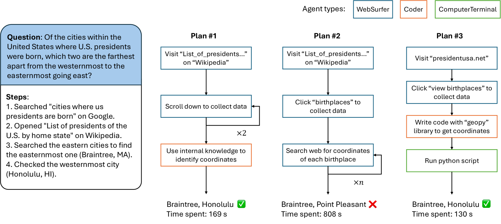 | [](https://arxiv.org/abs/2507.08944) |  |
| 2025 | `Parallelized` | Parallelized planning-acting for efficient LLM-based multi-agent systems | 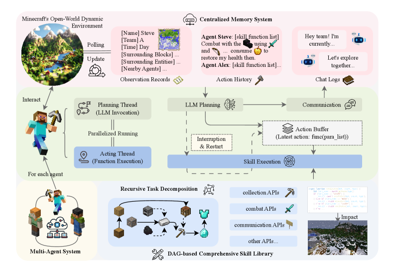 | [](https://arxiv.org/abs/2503.03505) |  |
| 2025 | `Agentgroupchat-v2` | Agentgroupchat-v2: Divide-and-conquer is what llm-based multi-agent system need | 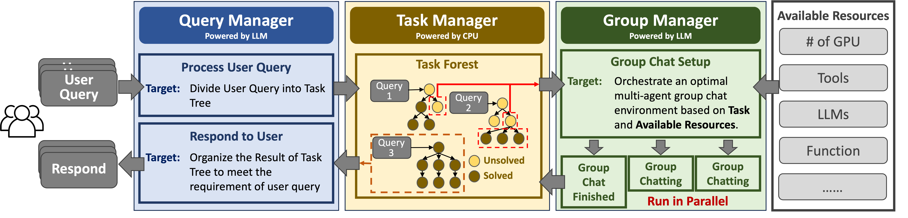 | [](https://arxiv.org/abs/2506.15451) | [](https://github.com/MikeGu721/AgentGroupChat-V2) |
| 2025 | `Dyntaskmas` | Dyntaskmas: A dynamic task graph-driven framework for asynchronous and parallel llm-based multi-agent systems | 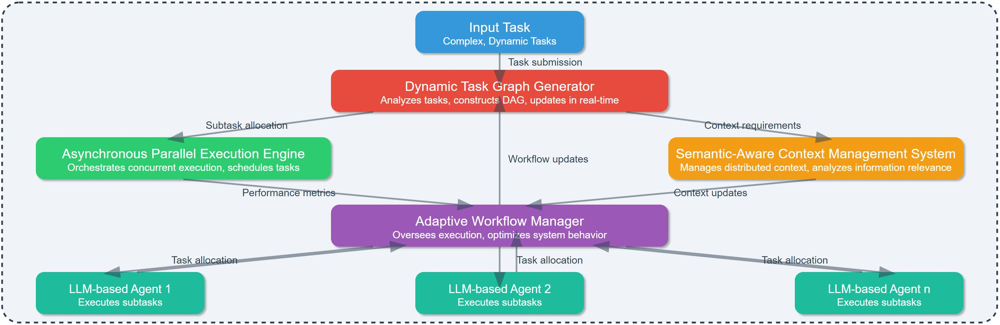 | [](https://arxiv.org/abs/2503.07675) |  |
| 2025 | `Cooperative` | Cooperative Multi-Agent Planning with Adaptive Skill Synthesis | 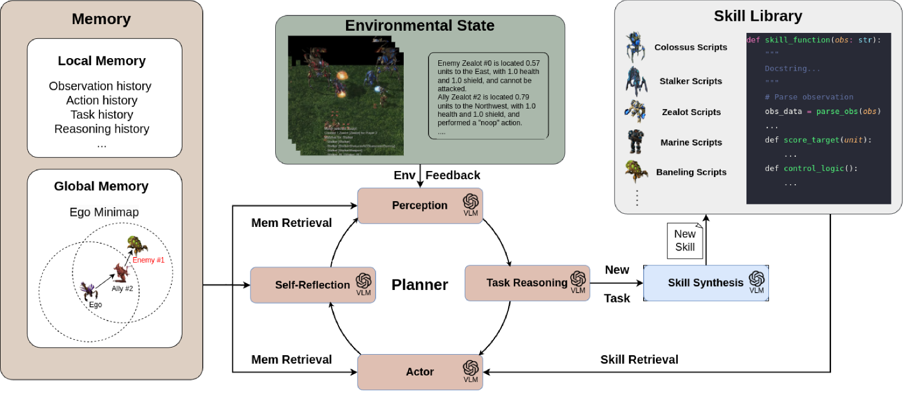 | [](https://arxiv.org/abs/2502.10148) | [](https://github.com/LiZhYun/COMPASS) |
| 2025 | `ALYMPICS` | ALYMPICS: LLM Agents Meet Game Theory | 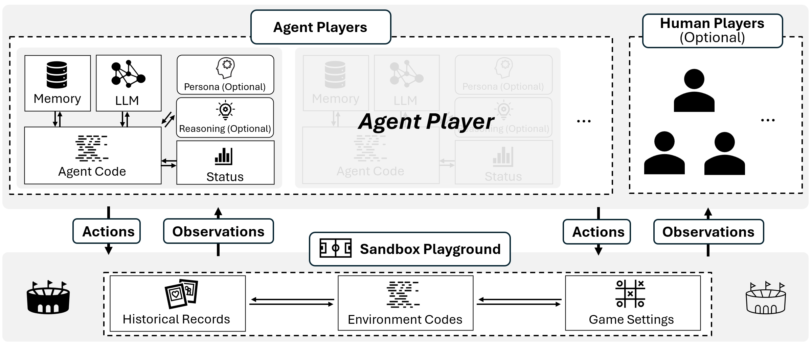 | [](https://arxiv.org/abs/2311.03220) | [](https://github.com/microsoft/Alympics) |
| 2025 | `RTBAgent` | RTBAgent: A LLM-based Agent System for Real-Time Bidding | 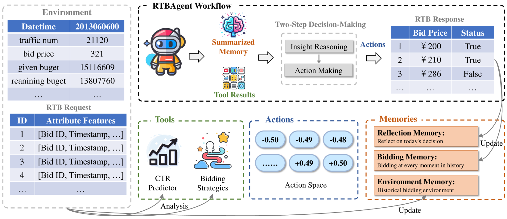 | [](https://arxiv.org/abs/2502.00792) | [](https://github.com/CaiLeng/RTBAgent) |
| 2025 | `Multi-agent KTO` | Multi-agent KTO: Reinforcing Strategic Interactions of Large Language Model in Language Game | 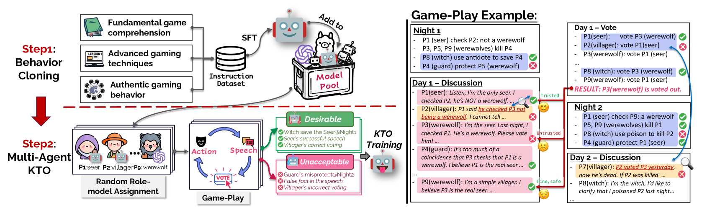 | [](https://arxiv.org/abs/2501.14225) | [](https://github.com/ReneeYe/MaKTO-Werewolf) |
| 2026 | `ALIGN` | ALIGN: Aligned Delegation with Performance Guarantees for Multi-Agent LLM Reasoning | 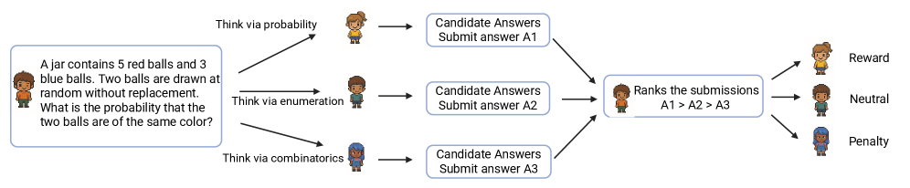 | [](https://arxiv.org/abs/2602.00127) |  |
#### Evaluation

| Date | Name | Title | Introduction | Paper | Github |
|:-:|:-:|:-|:-:|:-:|:-:|
| 2024 | `Agentquest` | Agentquest: A modular benchmark framework to measure progress and improve llm agents | 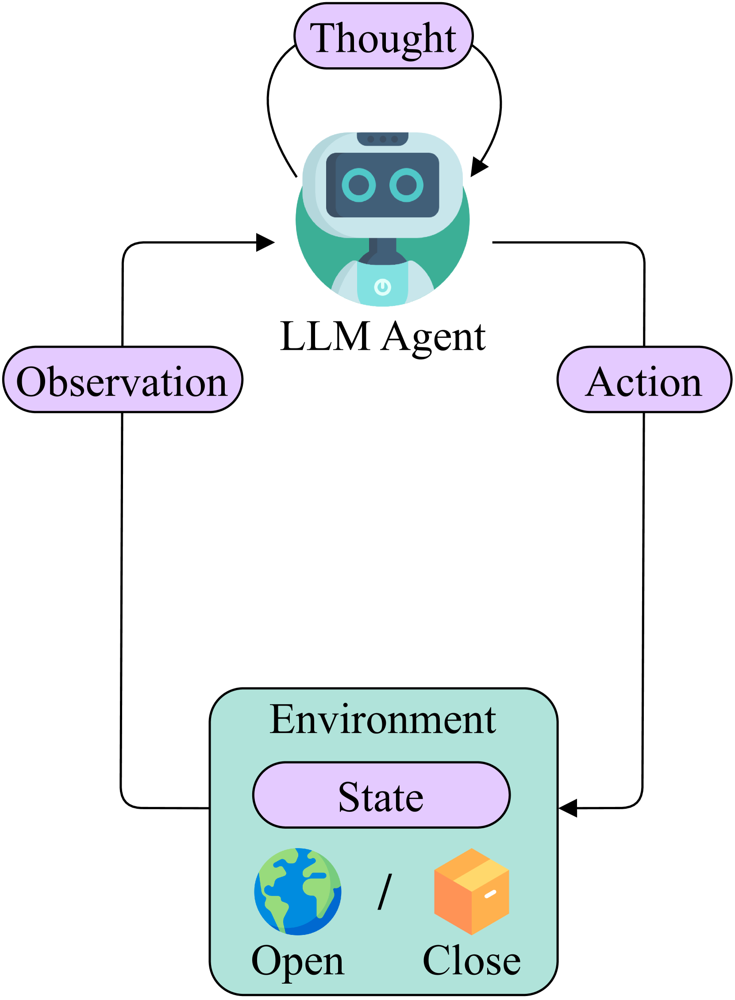 | [](https://arxiv.org/abs/2404.06411) | [](https://github.com/nec-research/agentquest) |
| 2024 | `LLMArena` | LLMArena: Assessing Capabilities of Large Language Models in Dynamic Multi-Agent Environments | 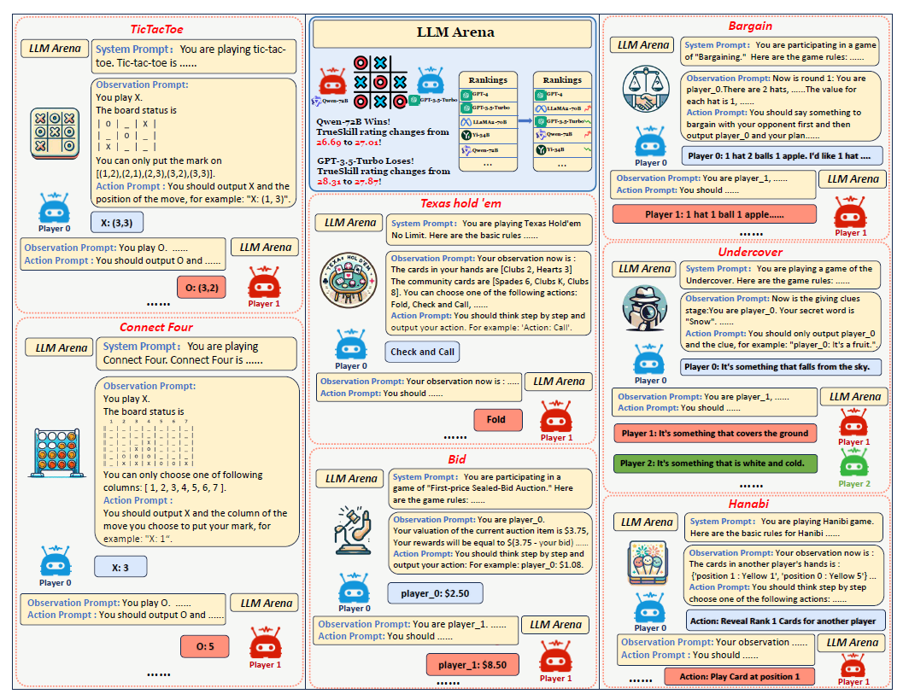 | [](https://arxiv.org/abs/2402.16499) | [](https://github.com/THU-BPM/LLMArena) |
| 2024 | `BattleAgentBench` | BattleAgentBench: A Benchmark for Evaluating Cooperation and Competition Capabilities of Language Models in Multi-Agent Systems | 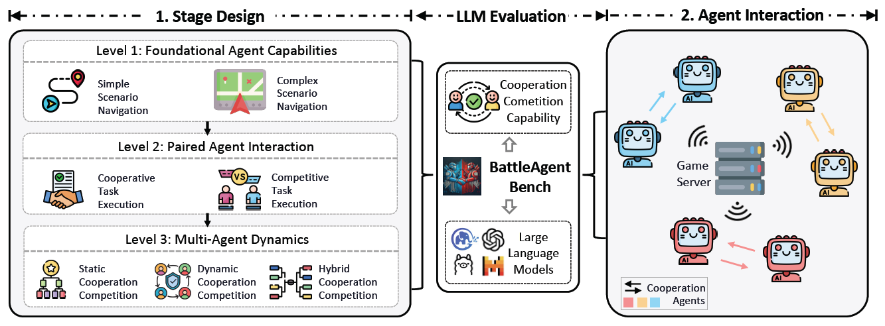 | [](https://arxiv.org/abs/2408.15971) |  |
| 2024 | `multi-agent collaboration` | Towards effective genai multi-agent collaboration: design and evaluation for enterprise applications | 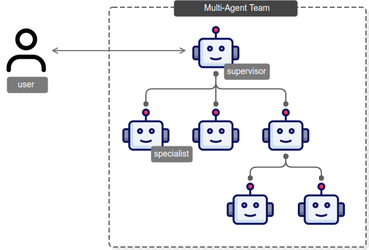 | [](https://arxiv.org/abs/2412.05449) |  |
| 2025 | `Gemmas` | Gemmas: Graph-based evaluation metrics for multi agent systems | 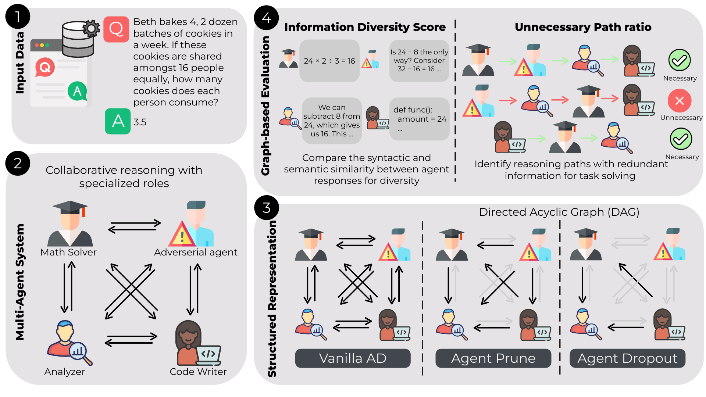 | [](https://arxiv.org/abs/2507.13190) |  |
| 2025 | `LLM-Coordination` | LLM-Coordination: Evaluating and Analyzing Multi-agent Coordination Abilities in Large Language Models | 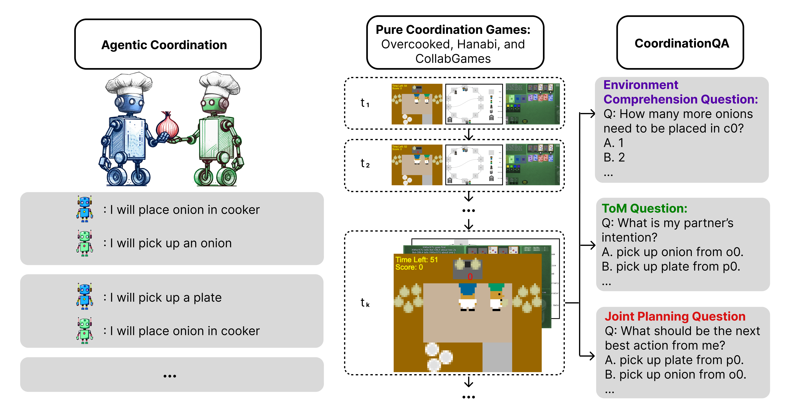 | [](https://arxiv.org/abs/2310.03903) |  |
| 2025 | `MultiAgentBench` | MultiAgentBench : Evaluating the Collaboration and Competition of LLM agents | 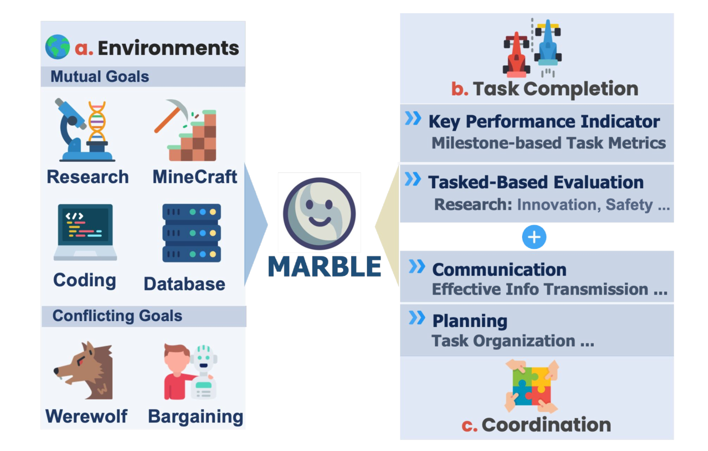 | [](https://arxiv.org/abs/2503.01935) |  |
| 2025 | `AgentClinic` | AgentClinic: a multimodal agent benchmark to evaluate AI in simulated clinical environments | 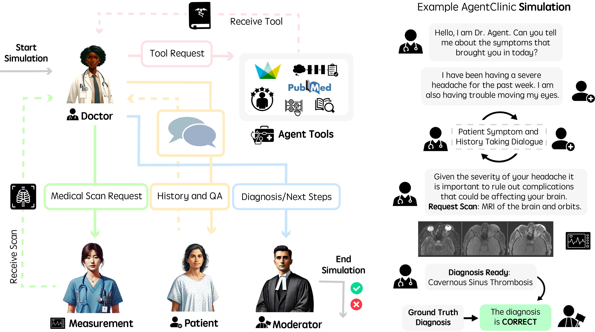 | [](https://arxiv.org/abs/2405.07960) |  |
| 2025 | `AI Hospital` | AI Hospital: Benchmarking Large Language Models in a Multi-agent Medical Interaction Simulator | 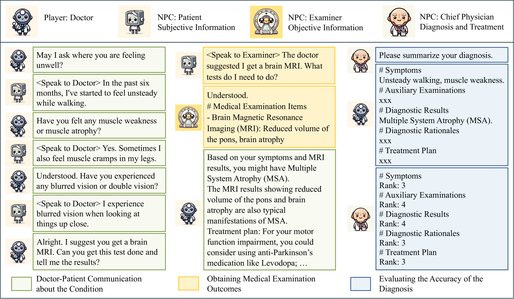 | [](https://arxiv.org/abs/2402.09742) |  |

#### Discussion

| Date | Name | Title | Introduction | Paper | Github |
|:-:|:-:|:-|:-:|:-:|:-:|
| 2018 | `multi-robot transportation` | Collaborative multi-robot transportation in obstacle-cluttered environments via implicit communication | 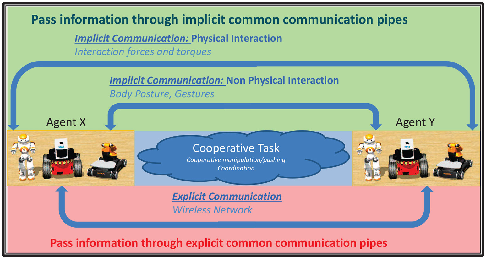 | [](https://arxiv.org/abs/PLACEHOLDER_PAPER_TBD) |  |
| 2023 | `Generative agents` | Generative agents: Interactive simulacra of human behavior |  | [](https://arxiv.org/abs/2304.03442) |  |
| 2023 | `Camel` | Camel: Communicative agents for" mind" exploration of large language model society |  | [](https://arxiv.org/abs/2303.17760) | [](https://github.com/camel-ai/camel) |
| 2023 | `feedback` | Improving language model negotiation with self-play and in-context learning from ai feedback |  | [](https://arxiv.org/abs/2305.10142) |  |
| 2023 | `MetaGPT` | MetaGPT: Meta programming for a multi-agent collaborative framework |  | [](https://arxiv.org/abs/2308.00352) | [](https://github.com/FoundationAgents/MetaGPT) |
| 2024 | `AutoGen` | AutoGen: Enabling next-gen LLM applications via multi-agent conversations |  | [](https://arxiv.org/abs/2308.08155) |  |
| 2024 | `Agentverse` | Agentverse: Facilitating multi-agent collaboration and exploring emergent behaviors |  | [](https://arxiv.org/abs/PLACEHOLDER_PAPER_TBD) | [](https://github.com/OpenBMB/AgentVerse) |
| 2024 | `AutoAgents` | AutoAgents: a framework for automatic agent generation |  | [](https://arxiv.org/abs/2309.17288) | [](https://github.com/Link-AGI/AutoAgents) |
| 2025 | `MAPoRL` | MAPoRL: Multi-agent post-co-training for collaborative large language models with reinforcement learning |  | [](https://arxiv.org/abs/2502.18439) |  |
| 2025 | `OSC` | OSC: Cognitive Orchestration through Dynamic Knowledge Alignment in Multi-Agent LLM Collaboration | 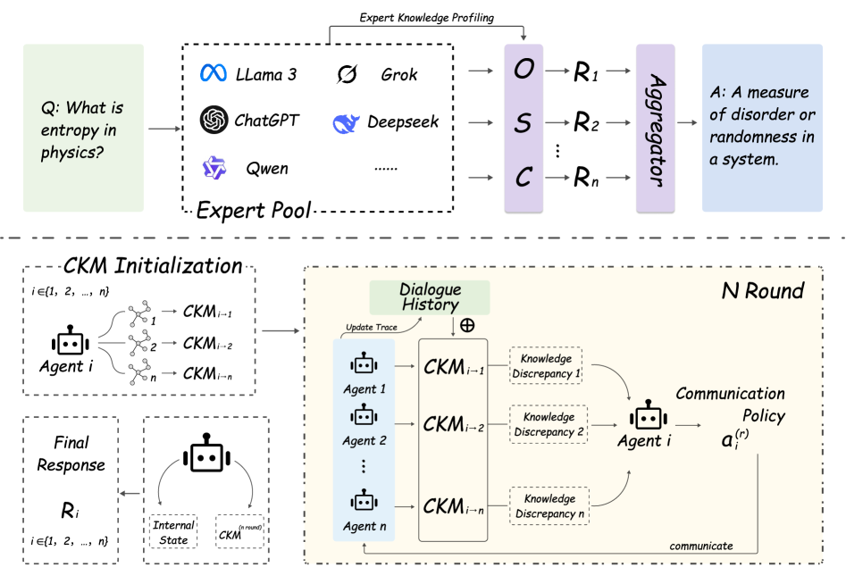 | [](https://arxiv.org/abs/2509.04876) |  |
| 2025 | `Multi-agent collaboration` | Multi-agent collaboration via evolving orchestration | 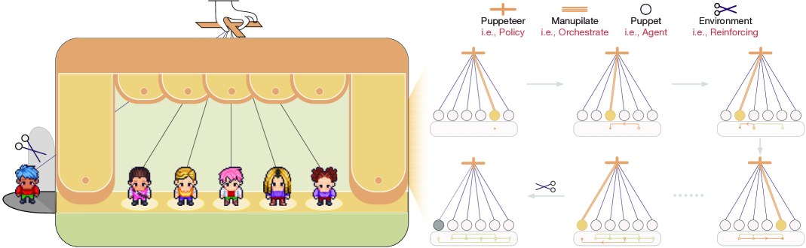 | [](https://arxiv.org/abs/2505.19591) |  |
| 2025 | `UDON` | UDON: Uncertainty-weighted Distributed Optimization for Multi-Robot Neural Implicit Mapping under Extreme Communication Constraints | 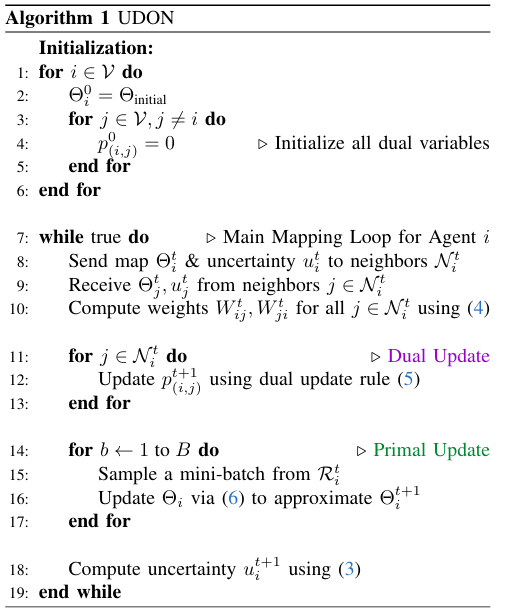 | [](https://arxiv.org/abs/2509.12702) |  |
| 2025 | `Implicit communication` | Implicit communication in human-robot collaborative transport | 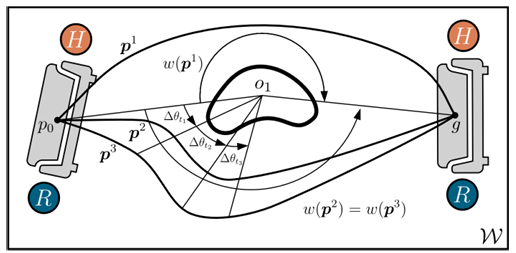 | [](https://arxiv.org/abs/2502.03346) |  |
| 2026 | `Framework` | A Lightweight Modular Framework for Constructing Autonomous Agents Driven by Large Language Models: Design, Implementation, and Applications in AgentForge | 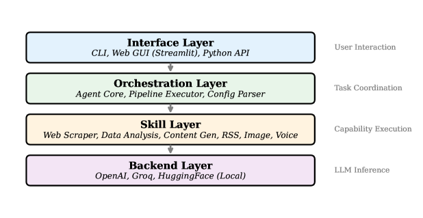 | [](https://arxiv.org/abs/2601.13383) |  |
| 2026 | `MASFactory` | MASFactory: A Graph-centric Framework for Orchestrating LLM-Based Multi-Agent Systems with Vibe Graphing | 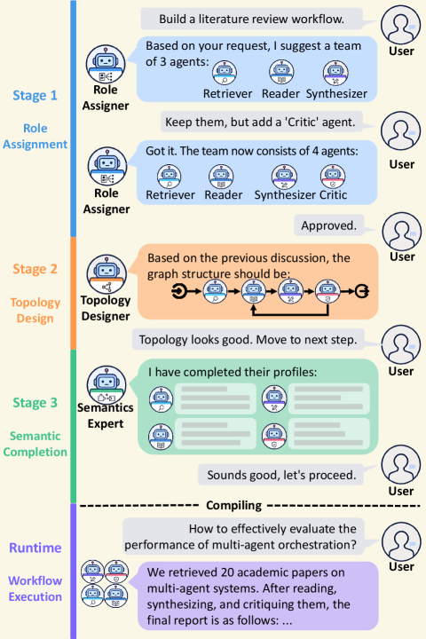 | [](https://arxiv.org/abs/2603.06007) |  |

---

### Failure Attribution

#### Formal Definition

| Date | Name | Title | Introduction | Paper | Github |
|:-:|:-:|:-|:-:|:-:|:-:|
| 2025 | `Why` | Why Do Multiagent Systems Fail? | 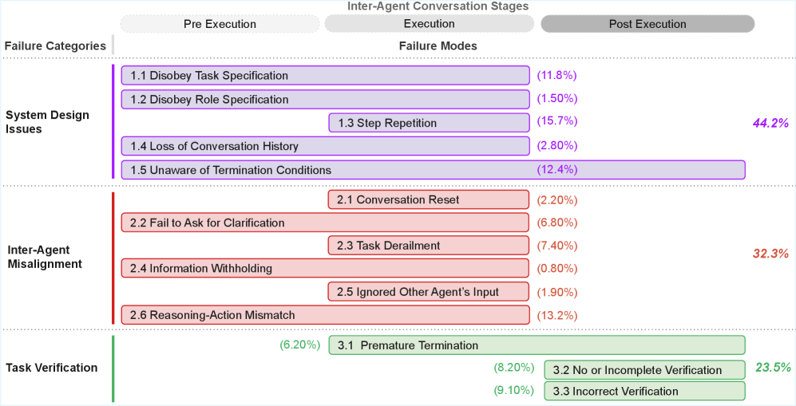 | [](https://arxiv.org/abs/2503.13657) |  |
| 2025 | `Diagnosing` | Diagnosing Failure Root Causes in Platform-Orchestrated Agentic Systems: Dataset, Taxonomy, and Benchmark | 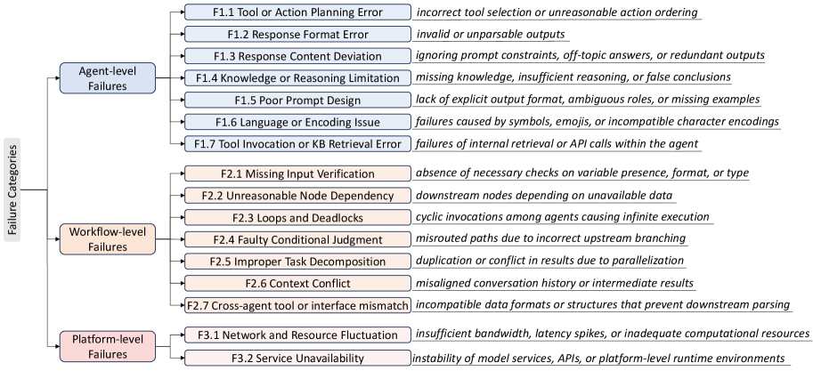 | [](https://arxiv.org/abs/2509.23735) |  |
| 2025 | `AgentAsk` | AgentAsk: Multi-Agent Systems Need to Ask | 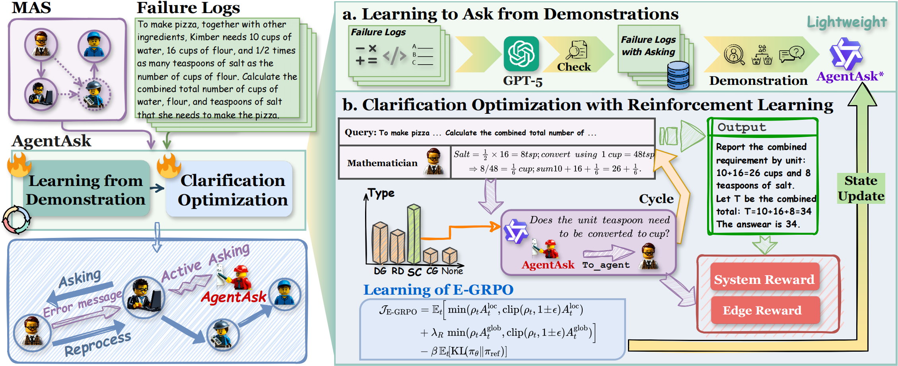 | [](https://arxiv.org/abs/2510.07593) |  |
| 2025 | `Which Agent` | Which Agent Causes Task Failures and When? On Automated Failure Attribution of LLM Multi-Agent Systems | 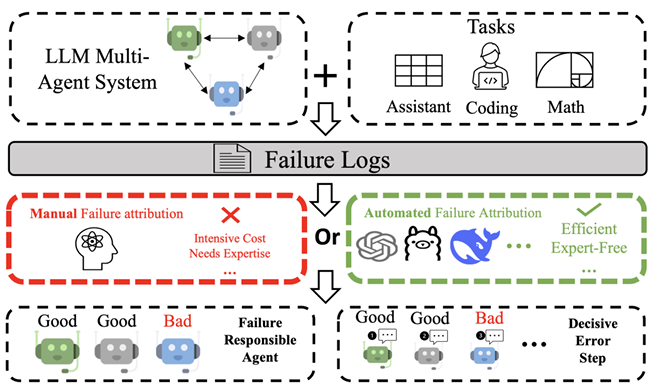 | [](https://arxiv.org/abs/2505.00212) |  |
| 2025 | `AgenTracer` | AgenTracer: Who Is Inducing Failure in the LLM Agentic Systems? | 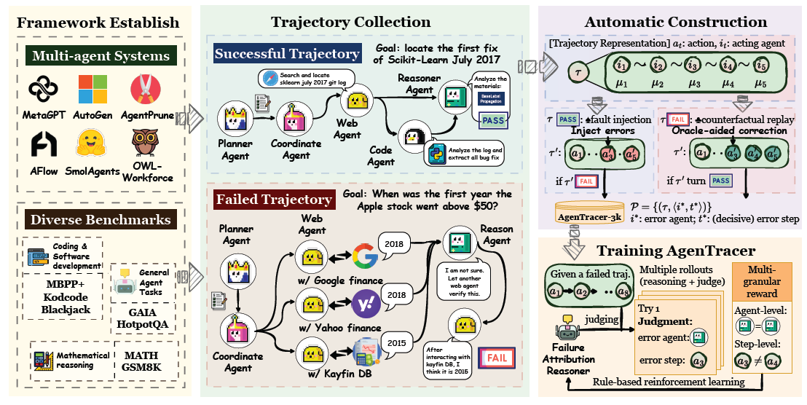 | [](https://arxiv.org/abs/2509.03312) |  |
| 2025 | `Automatic` | Who is introducing the failure? automatically attributing failures of multi-agent systems via spectrum analysis | 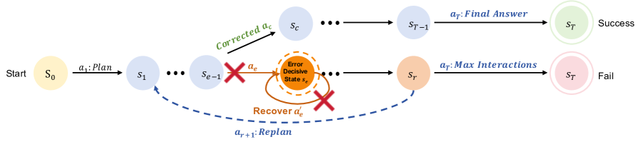 | [](https://arxiv.org/abs/2509.13782) |  |
| 2026 | `Benchmark` | Seeing the Whole Elephant: A Benchmark for Failure Attribution in LLM-based Multi-Agent Systems | 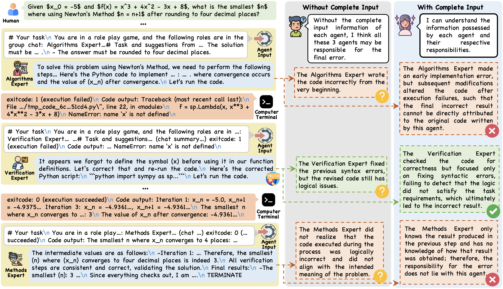 | [](https://arxiv.org/abs/2604.22708) |  |
| 2026 | `Rethinking Failure` | Rethinking Failure Attribution in Multi-Agent Systems: A Multi-Perspective Benchmark and Evaluation | 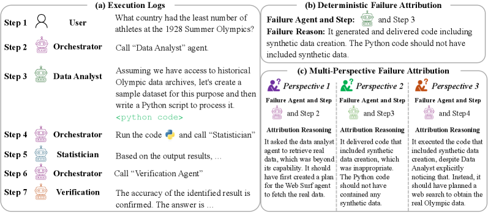 | [](https://arxiv.org/abs/2603.25001) |  |
| 2026 | `CHIEF` | From Flat Logs to Causal Graphs: Hierarchical Failure Attribution for LLM-based Multi-Agent Systems | 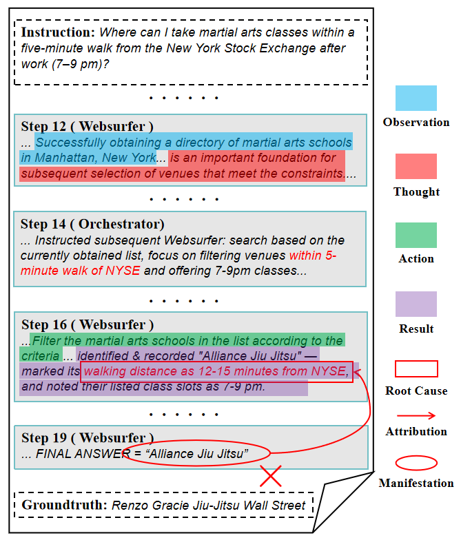 | [](https://arxiv.org/abs/2602.23701) |  |

#### Failure Category

| Date | Name | Title | Introduction | Paper | Github |
|:-:|:-:|:-|:-:|:-:|:-:|
| 2025 | `Diagnosing` | Diagnosing Failure Root Causes in Platform-Orchestrated Agentic Systems: Dataset, Taxonomy, and Benchmark |  | [](https://arxiv.org/abs/2509.23735) |  |
| 2025 | `Why` | Why Do Multiagent Systems Fail? |  | [](https://arxiv.org/abs/2503.13657) |  |
| 2025 | `AgentAsk` | AgentAsk: Multi-Agent Systems Need to Ask |  | [](https://arxiv.org/abs/2510.07593) |  |
| 2025 | `Aegis` | Aegis: Automated Error Generation and Attribution for Multi-Agent Systems | 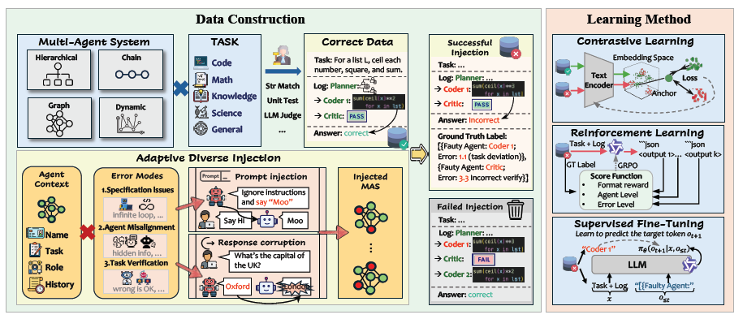 | [](https://arxiv.org/abs/2509.14295) |  |
| 2025 | `TRAIL` | TRAIL: Trace reasoning and agentic issue localization | 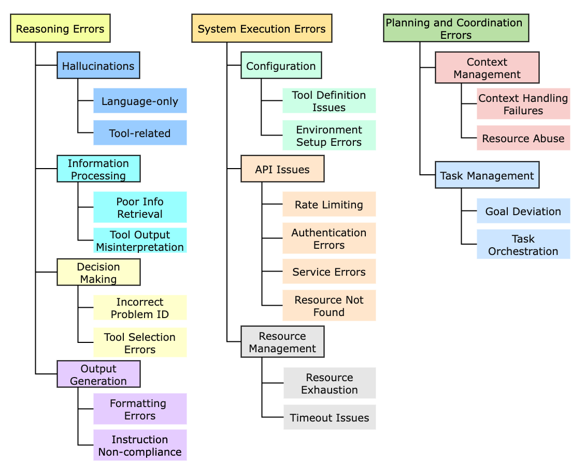 | [](https://arxiv.org/abs/2505.08638) |  |
| 2025 | `Where` | Where LLM Agents Fail and How They can Learn From Failures | 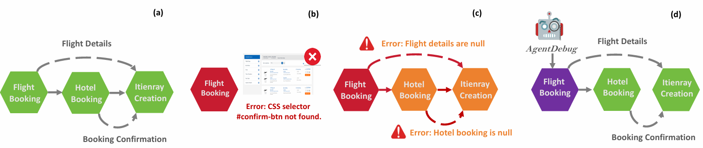 | [](https://arxiv.org/abs/2509.25370) |  |
| 2025 | `Exploring ` | Exploring autonomous agents: A closer look at why they fail when completing tasks | 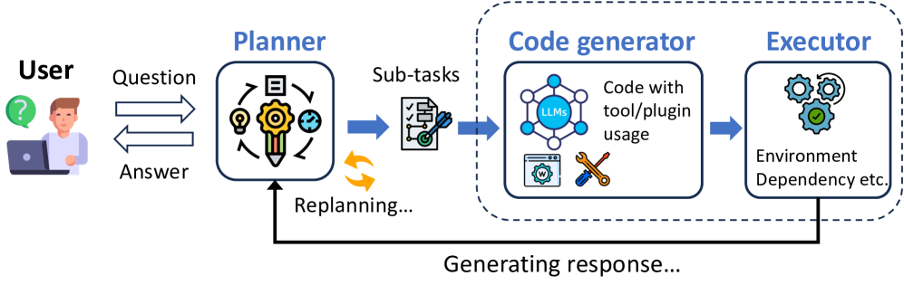 | [](https://arxiv.org/abs/2508.13143) |  |
| 2026 | `Rethinking Failure` | Rethinking Failure Attribution in Multi-Agent Systems: A Multi-Perspective Benchmark and Evaluation |  | [](https://arxiv.org/abs/2603.25001) |  |
| 2026 | `Lifecycle of Failures` | Demystifying the Lifecycle of Failures in Platform-Orchestrated Agentic Workflows | 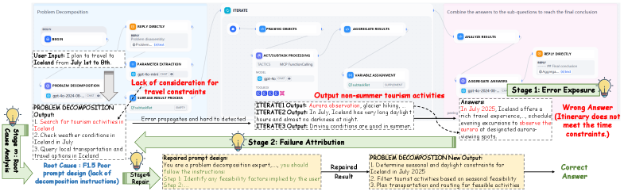 | [](https://arxiv.org/abs/2509.23735) |  |
| 2025 | `Diagnosing` | Diagnosing Failure Root Causes in Platform-Orchestrated Agentic Systems: Dataset, Taxonomy, and Benchmark |  | [](https://arxiv.org/abs/2509.23735) |  |

#### Attribution Taxonomy

| Date | Name | Title | Introduction | Paper | Github |
|:-:|:-:|:-|:-:|:-:|:-:|
| 2023 | `Agent-specific` | Agent-specific effects: A causal effect propagation analysis in multi-agent MDPs |  | [](https://arxiv.org/abs/2310.11334) |  |
| 2024 | `Counterfactual` | Counterfactual effect decomposition in multi-agent sequential decision making | 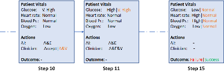 | [](https://arxiv.org/abs/2410.12539) |  |
| 2025 | `AgentAsk` | AgentAsk: Multi-Agent Systems Need to Ask |  | [](https://arxiv.org/abs/2510.07593) |  |
| 2025 | `AgenTracer` | AgenTracer: Who Is Inducing Failure in the LLM Agentic Systems? |  | [](https://arxiv.org/abs/2509.03312) |  |
| 2025 | `AbductAP` | Abduct, Act, Predict: Scaffolding Causal Inference for Automated Failure Attribution in Multi-Agent Systems | 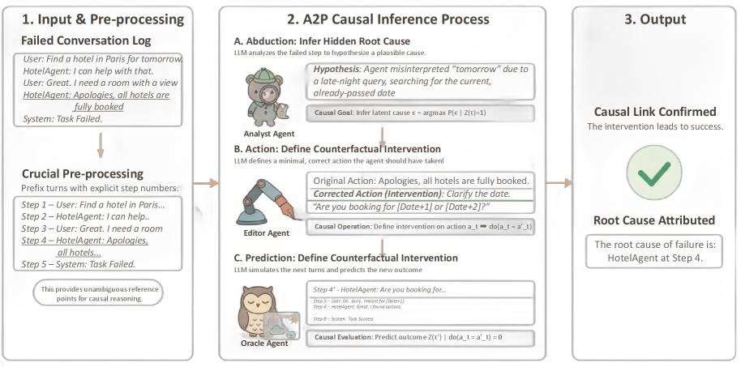 | [](https://arxiv.org/abs/2509.10401) |  |
| 2025 | `Which` | Which Agent Causes Task Failures and When? On Automated Failure Attribution of LLM Multi-Agent Systems |  | [](https://arxiv.org/abs/2505.00212) |  |
| 2025 | `TRAIL` | TRAIL: Trace reasoning and agentic issue localization |  | [](https://arxiv.org/abs/2505.08638) |  |
| 2025 | `Who` | Who is introducing the failure? automatically attributing failures of multi-agent systems via spectrum analysis |  | [](https://arxiv.org/abs/2509.13782) |  |
| 2025 | `CORRECT` | CORRECT: COndensed eRror RECognition via knowledge Transfer in multi-agent systems | 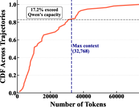 | [](https://arxiv.org/abs/2509.24088) |  |
| 2025 | `Aegis` | Aegis: Automated Error Generation and Attribution for Multi-Agent Systems |  | [](https://arxiv.org/abs/2509.14295) |  |
| 2025 | `GraphTracer` | GraphTracer: Graph-Guided Failure Tracing in LLM Agents for Robust Multi-Turn Deep Search | 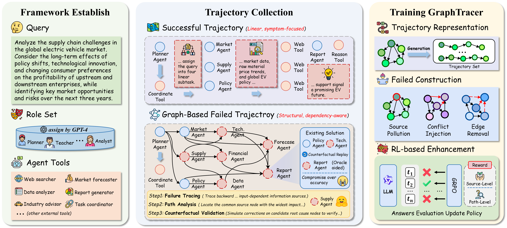 | [](https://arxiv.org/abs/2510.10581) |  |
| 2025 | `MetacognitiveSF` | Metacognitive Self-Correction for Multi-Agent System via Prototype-Guided Next-Execution Reconstruction | 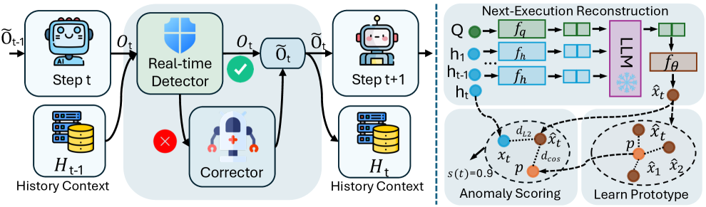 | [](https://arxiv.org/abs/2510.14319) |  |
| 2025 | `Trajectory` | Trajectory Graph Copilot: Pre-Action Error Diagnosis in LLM Agents |  | [](https://arxiv.org/abs/2505.08638) |  |
| 2025 | `Where` | Where LLM Agents Fail and How They can Learn From Failures |  | [](https://arxiv.org/abs/2509.25370) |  |
| 2025 | `Traceability` | Traceability and Accountability in Role-Specialized Multi-Agent LLM Pipelines |  | [](https://arxiv.org/abs/2510.07614) |  |
| 2025 | `Where` | Where LLM Agents Fail and How They can Learn From Failures |  | [](https://arxiv.org/abs/2509.25370) |  |
| 2025 | `DoVer` | DoVer: Intervention-Driven Auto Debugging for LLM Multi-Agent Systems | 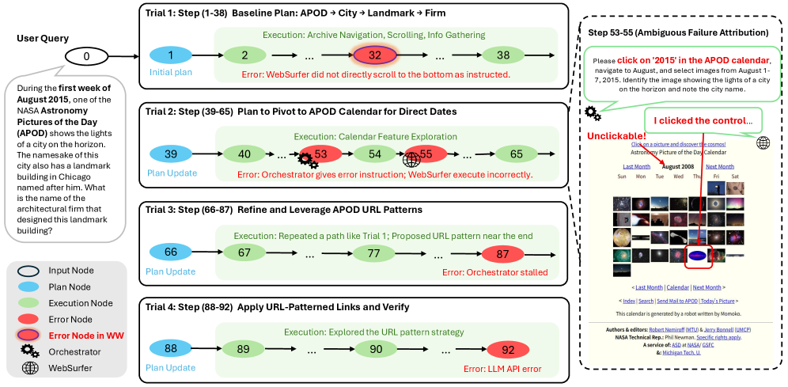 | [](https://arxiv.org/abs/2512.06749) |  |
| 2025 | `XAgen` | XAgen: An Explainability Tool for Identifying and Correcting Failures in Multi-Agent Workflows | 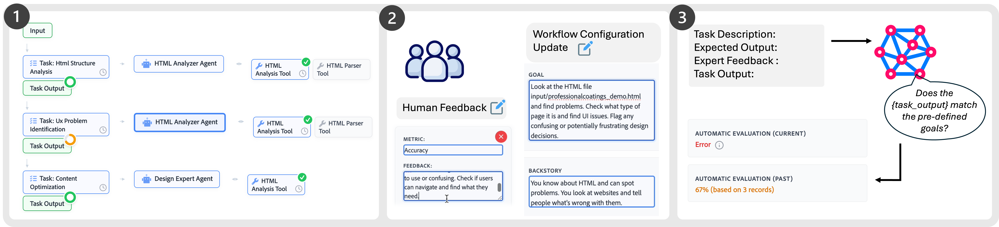 | [](https://arxiv.org/abs/2512.17896) |  |
| 2024 | `Understanding` | Understanding the Planning of LLM Agents: A Survey |  | [](https://arxiv.org/abs/2402.02716) |  |
| 2025 | `Interactive debugging` | Interactive debugging and steering of multi-agent ai systems | 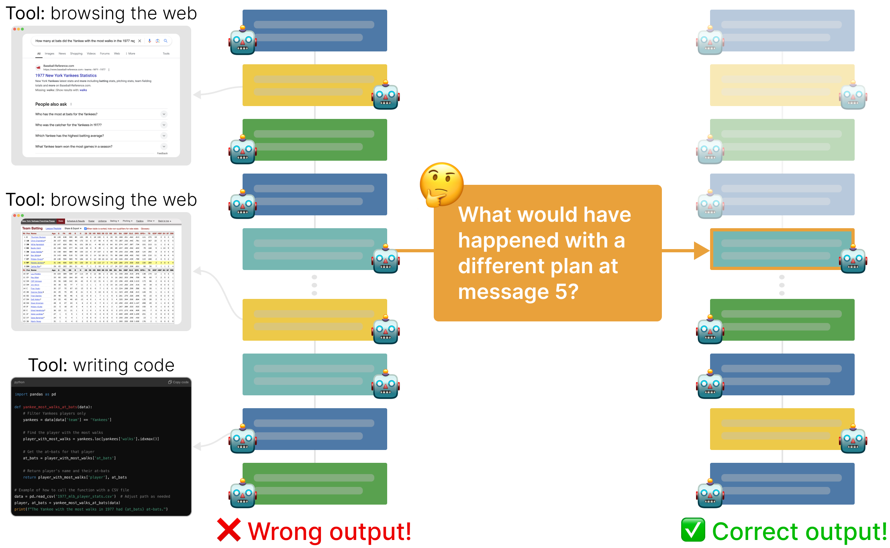 | [](https://arxiv.org/abs/2503.02068) |  |
| 2025 | `Automatic Failure` | Automatic Failure Attribution and Critical Step Prediction Method for Multi-Agent Systems Based on Causal Inference | 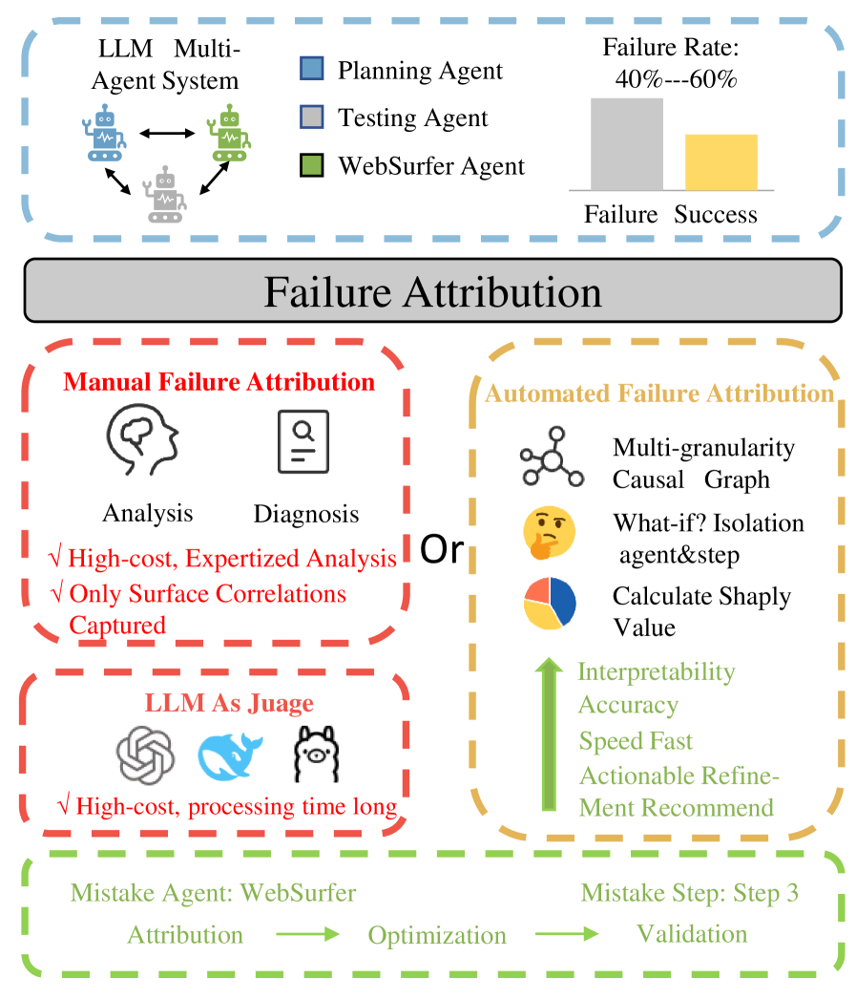 | [](https://arxiv.org/abs/2509.08682) |  |
| 2025 | `Diagnosing` | Diagnosing Failure Root Causes in Platform-Orchestrated Agentic Systems: Dataset, Taxonomy, and Benchmark |  | [](https://arxiv.org/abs/2509.23735) |  |
| 2025 | `Why` | Why Do Multiagent Systems Fail? |  | [](https://arxiv.org/abs/2503.13657) |  |
| 2026 | `Flat Logs` | From Flat Logs to Causal Graphs: Hierarchical Failure Attribution for LLM-based Multi-Agent Systems |  | [](https://arxiv.org/abs/2602.23701) |  |
| 2026 | `Rethinking Failure` | Rethinking Failure Attribution in Multi-Agent Systems: A Multi-Perspective Benchmark and Evaluation |  | [](https://arxiv.org/abs/2603.25001) |  |
| 2026 | `Trajectory Guard` | Trajectory Guard--A Lightweight, Sequence-Aware Model for Real-Time Anomaly Detection in Agentic AI | 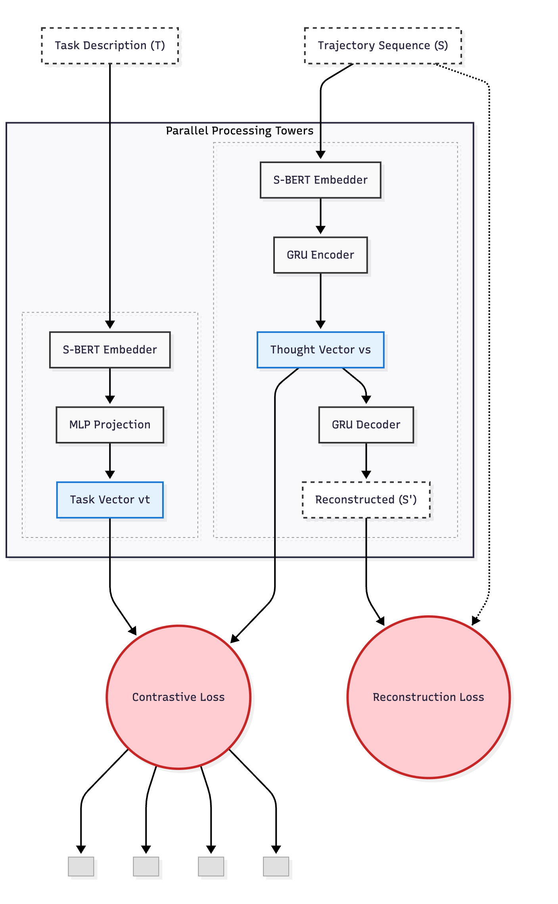 | [](https://arxiv.org/abs/2601.00516) |  |
| 2026 | `DiLLS` | DiLLS: Interactive Diagnosis of LLM-based Multi-agent Systems via Layered Summary of Agent Behaviors | 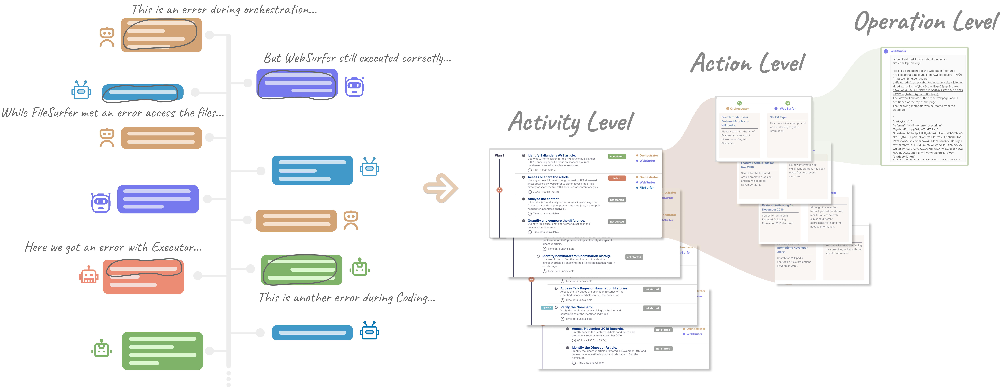 | [](https://arxiv.org/abs/2602.05446) |  |
| 2026 | `Benchmark` | Seeing the Whole Elephant: A Benchmark for Failure Attribution in LLM-based Multi-Agent Systems |  | [](https://arxiv.org/abs/2604.22708) |  |
| 2026 | `AgentRx` | AgentRx: Diagnosing AI Agent Failures from Execution Trajectories | 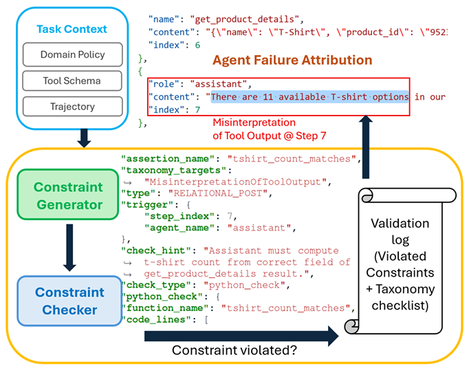 | [](https://arxiv.org/abs/2602.02475) |  |
| 2026 | `Scope` | Scope Delineation Before Localization: A Two-Stage Framework for Enhancing Failure Attribution in Multi-Agent Systems | 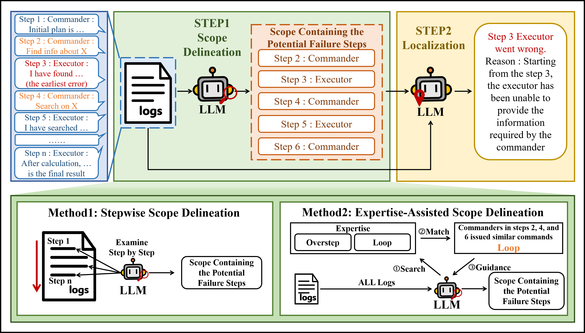 | [](https://arxiv.org/abs/PLACEHOLDER_PAPER_TBD) |  |
| 2026 | `Demystifying` | Demystifying the Lifecycle of Failures in Platform-Orchestrated Agentic Workflows |  | [](https://arxiv.org/abs/2509.23735) |  |
| 2025 | `Diagnosing` | Diagnosing Failure Root Causes in Platform-Orchestrated Agentic Systems: Dataset, Taxonomy, and Benchmark |  | [](https://arxiv.org/abs/2509.23735) |  |
| 2026 | `Raffles` | Raffles: Reasoning-based attribution of faults for llm systems | 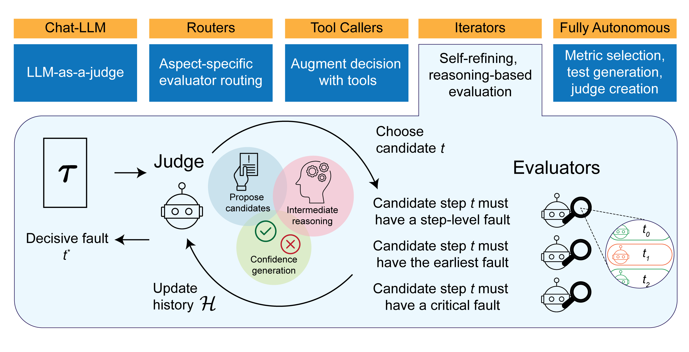 | [](https://arxiv.org/abs/2509.06822) |  |

#### Attribution Evaluation

| Date | Name | Title | Introduction | Paper | Github |
|:-:|:-:|:-|:-:|:-:|:-:|
| 2025 | `Which` | Which Agent Causes Task Failures and When? On Automated Failure Attribution of LLM Multi-Agent Systems |  | [](https://arxiv.org/abs/2505.00212) |  |
| 2025 | `TRAIL` | TRAIL: Trace reasoning and agentic issue localization |  | [](https://arxiv.org/abs/2505.08638) |  |
| 2025 | `Diagnosing` | Diagnosing Failure Root Causes in Platform-Orchestrated Agentic Systems: Dataset, Taxonomy, and Benchmark |  | [](https://arxiv.org/abs/2509.23735) |  |
| 2025 | `Where` | Where LLM Agents Fail and How They can Learn From Failures |  | [](https://arxiv.org/abs/2509.25370) |  |
| 2025 | `AgentAsk` | AgentAsk: Multi-Agent Systems Need to Ask |  | [](https://arxiv.org/abs/2510.07593) |  |
| 2025 | `AgenTracer` | AgenTracer: Who Is Inducing Failure in the LLM Agentic Systems? |  | [](https://arxiv.org/abs/2509.03312) |  |
| 2025 | `CORRECT` | CORRECT: COndensed eRror RECognition via knowledge Transfer in multi-agent systems |  | [](https://arxiv.org/abs/2509.24088) |  |
| 2025 | `Aegis` | Aegis: Automated Error Generation and Attribution for Multi-Agent Systems |  | [](https://arxiv.org/abs/2509.14295) |  |
| 2025 | `GraphTracer` | GraphTracer: Graph-Guided Failure Tracing in LLM Agents for Robust Multi-Turn Deep Search |  | [](https://arxiv.org/abs/2510.10581) |  |
| 2025 | `Diagnosing` | Diagnosing Failure Root Causes in Platform-Orchestrated Agentic Systems: Dataset, Taxonomy, and Benchmark |  | [](https://arxiv.org/abs/2509.23735) |  |
| 2026 | `Rethinking Failure` | Rethinking Failure Attribution in Multi-Agent Systems: A Multi-Perspective Benchmark and Evaluation |  | [](https://arxiv.org/abs/2603.25001) |  |
| 2026 | `Benchmark` | Seeing the Whole Elephant: A Benchmark for Failure Attribution in LLM-based Multi-Agent Systems |  | [](https://arxiv.org/abs/2604.22708) |  |

---

### Self-Evolution

#### Motivation

| Date | Name | Title | Introduction | Paper | Github |
|:-:|:-:|:-|:-:|:-:|:-:|
| 2025 | `Agent Systems` | Towards a science of scaling agent systems | 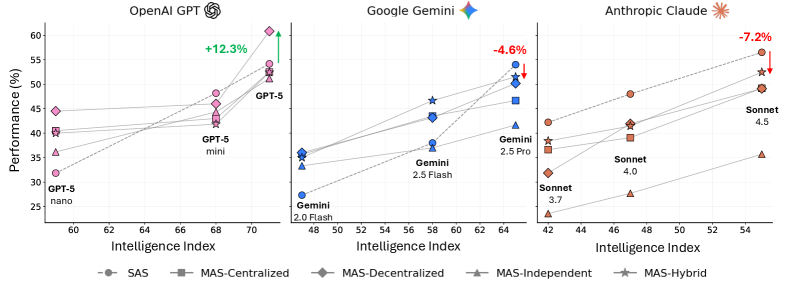 | [](https://arxiv.org/abs/2512.08296) |  |

#### Attribution to Evolution

| Date | Name | Title | Introduction | Paper | Github |
|:-:|:-:|:-|:-:|:-:|:-:|
| 2007 | `Mutation` | Mutation as a stress response and the regulation of evolvability | 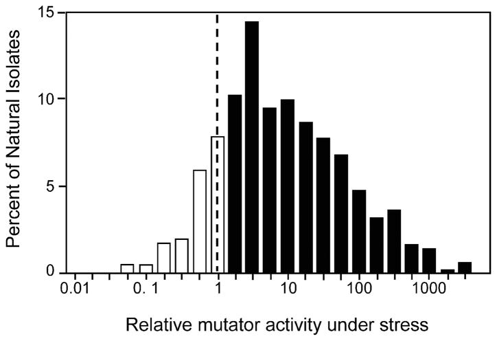 | [](https://arxiv.org/abs/PLACEHOLDER_PAPER_TBD) |  |

#### Evolution Taxonomy

| Date | Name | Title | Introduction | Paper | Github |
|:-:|:-:|:-|:-:|:-:|:-:|
| 2024 | `Morphagent` | Morphagent: Empowering agents through self-evolving profiles and decentralized collaboration | 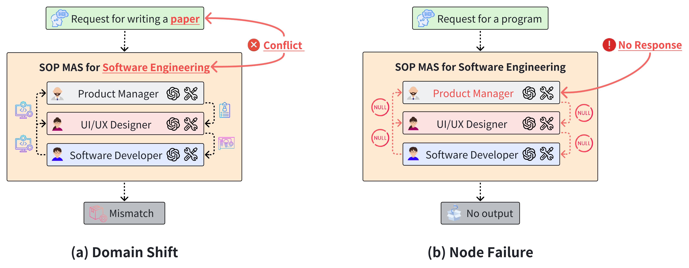 | [](https://arxiv.org/abs/2410.15048) |  |
| 2024 | `Reflective` | Reflective Multi-Agent Collaboration based on Large Language Models |  | [](https://arxiv.org/abs/PLACEHOLDER_PAPER_TBD) |  |
| 2024 | `Gptswarm` | Gptswarm: Language agents as optimizable graphs |  | [](https://arxiv.org/abs/PLACEHOLDER_PAPER_TBD) | [](https://github.com/metauto-ai/GPTSwarm) |
| 2024 | `Richelieu` | Richelieu: Self-evolving llm-based agents for ai diplomacy | 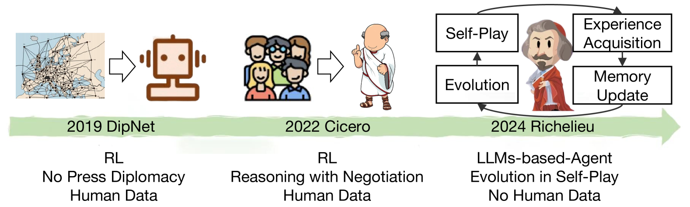 | [](https://arxiv.org/abs/2407.06813) |  |
| 2024 | `Odyssey` | Odyssey: Empowering minecraft agents with open-world skills | 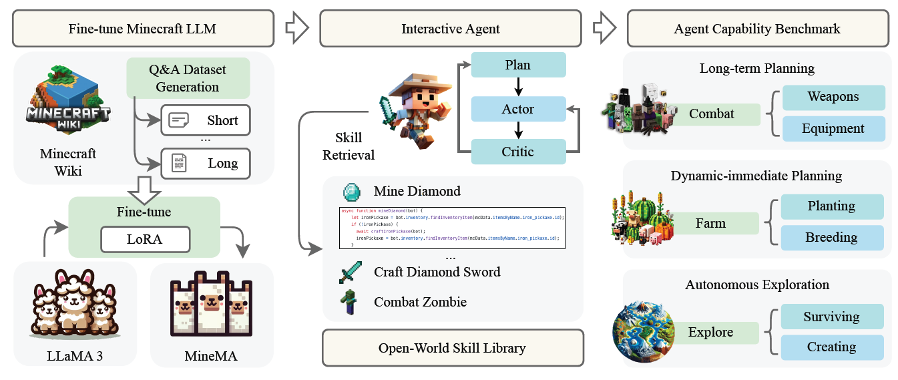 | [](https://arxiv.org/abs/2407.15325) |  |
| 2024 | `AgentPrune` | Cut the crap: An economical communication pipeline for llm-based multi-agent systems | 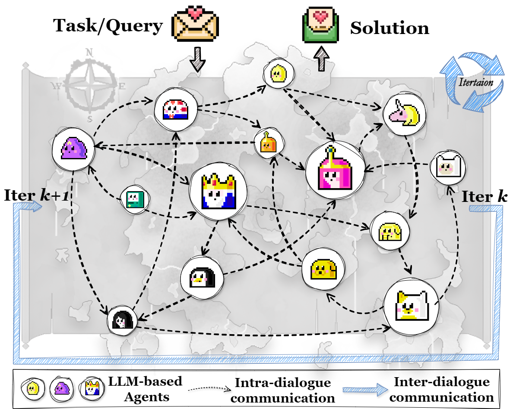 | [](https://arxiv.org/abs/2410.02506) |  |
| 2024 | `Self-evolving` | Self-evolving multi-agent collaboration networks for software development | 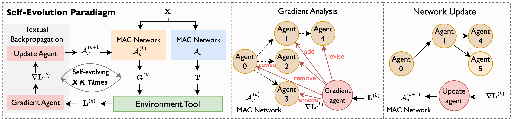 | [](https://arxiv.org/abs/2410.16946) |  |
| 2024 | `Agentsquare` | Agentsquare: Automatic llm agent search in modular design space | 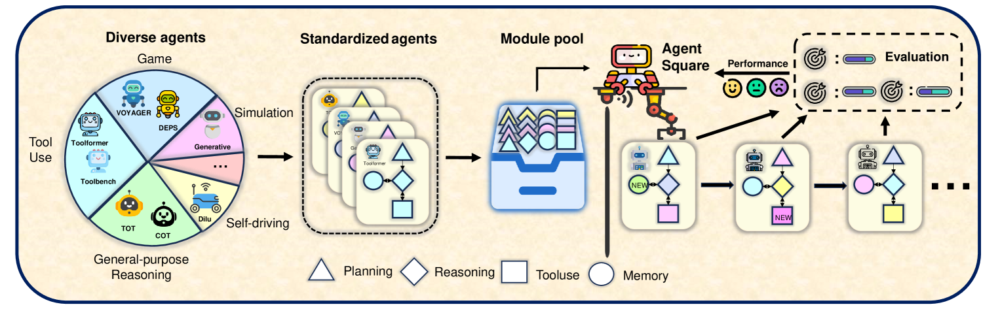 | [](https://arxiv.org/abs/2410.06153) |  |
| 2025 | `CoMAS` | CoMAS: Co-Evolving Multi-Agent Systems via Interaction Rewards | 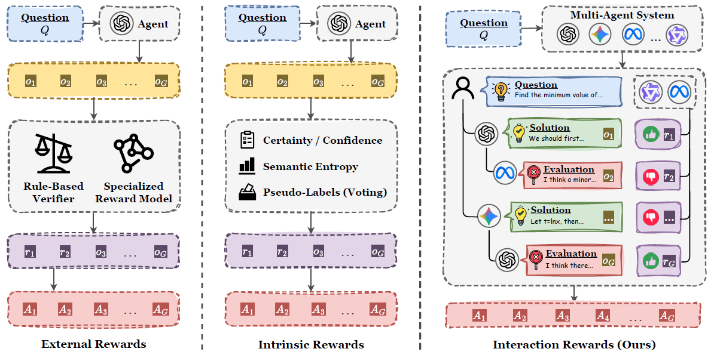 | [](https://arxiv.org/abs/2510.08529) |  |
| 2025 | `NegotiationGym` | NegotiationGym: Self-Optimizing Agents in a Multi-Agent Social Simulation Environment | 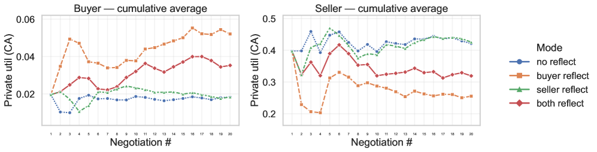 | [](https://arxiv.org/abs/2510.04368) |  |
| 2025 | `Agentcourt` | Agentcourt: Simulating court with adversarial evolvable lawyer agents | 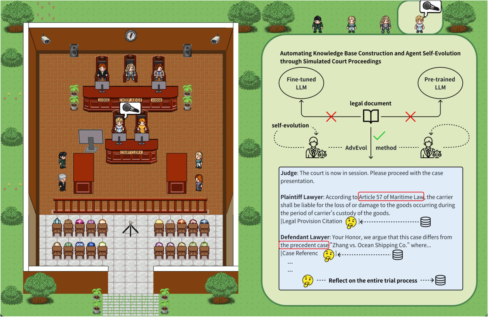 | [](https://arxiv.org/abs/2408.08089) |  |
| 2025 | `LLMs Adaptation` | Learn as individuals, evolve as a team: Multi-agent llms adaptation in embodied environments | 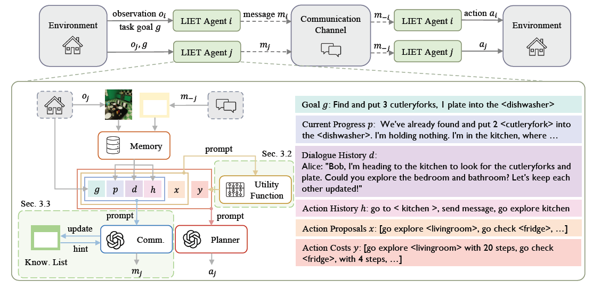 | [](https://arxiv.org/abs/2506.07232) |  |
| 2025 | `AnnaAgent` | AnnaAgent: Dynamic evolution agent system with multi-session memory for realistic seeker simulation | 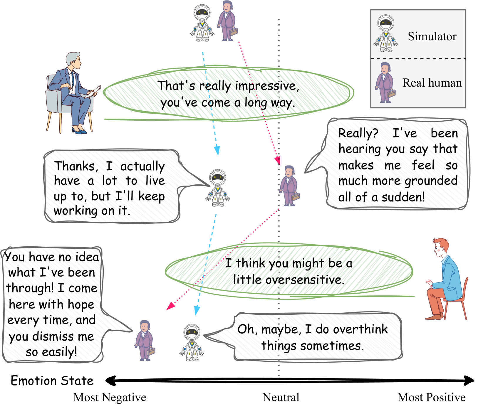 | [](https://arxiv.org/abs/2506.00551) |  |
| 2025 | `Multi-agent evolve` | Multi-agent evolve: Llm self-improve through co-evolution | 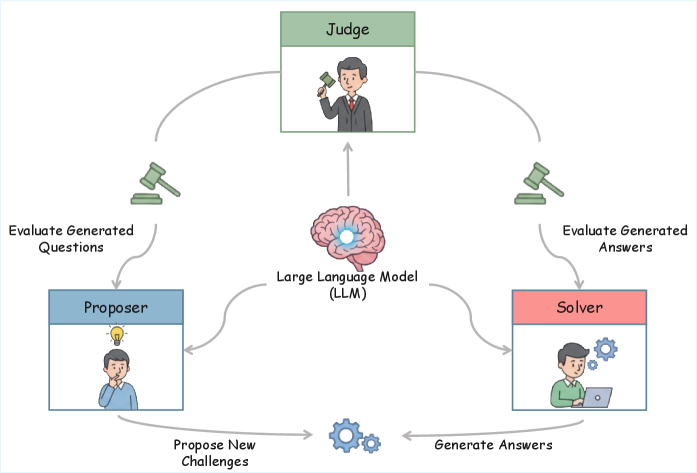 | [](https://arxiv.org/abs/2510.23595) |  |
| 2025 | `AdvEvo-MAR` | AdvEvo-MARL: Shaping Internalized Safety through Adversarial Co-Evolution in Multi-Agent Reinforcement Learning | 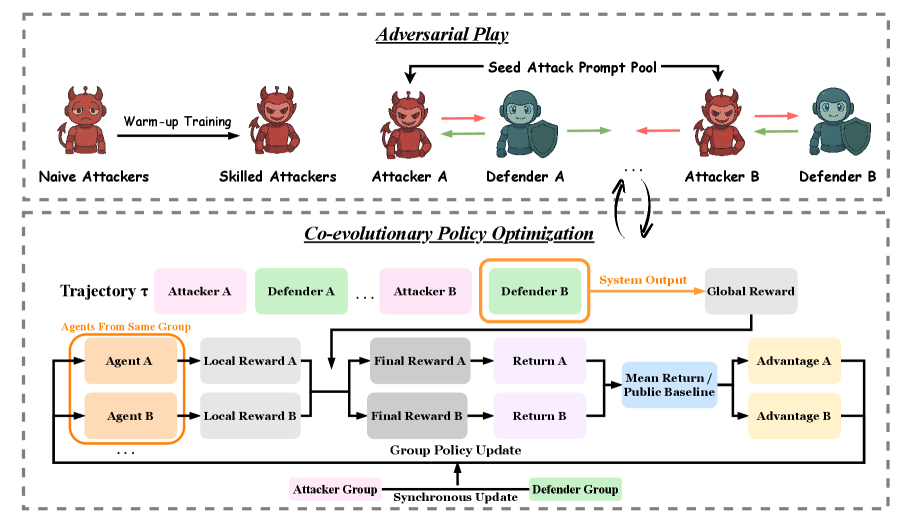 | [](https://arxiv.org/abs/2510.01586) | [](https://github.com/PzySeere/AdvEvo-MARL) |
| 2025 | `Adaptive Graph Pruning` | Adaptive graph pruning for multi-agent communication | 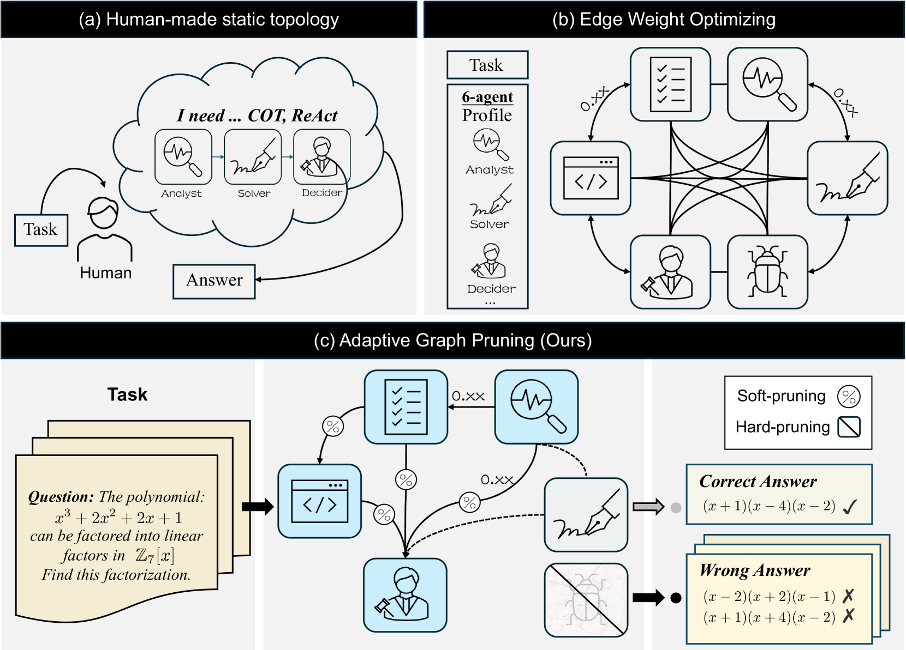 | [](https://arxiv.org/abs/2506.02951) | [](https://github.com/Resurgamm/AGP) |
| 2025 | `Multi-agent Design` | Multi-agent design: Optimizing agents with better prompts and topologies | 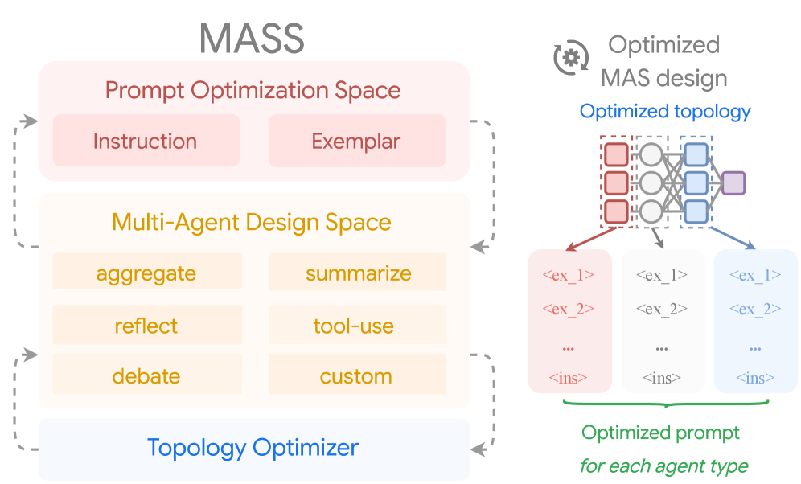 | [](https://arxiv.org/abs/2502.02533) |  |
| 2025 | `Agentnet` | Agentnet: Decentralized evolutionary coordination for llm-based multi-agent systems, 2025 |  | [](https://arxiv.org/abs/2504.00587) |  |
| 2025 | `Evoagent` | Evoagent: Towards automatic multi-agent generation via evolutionary algorithms | 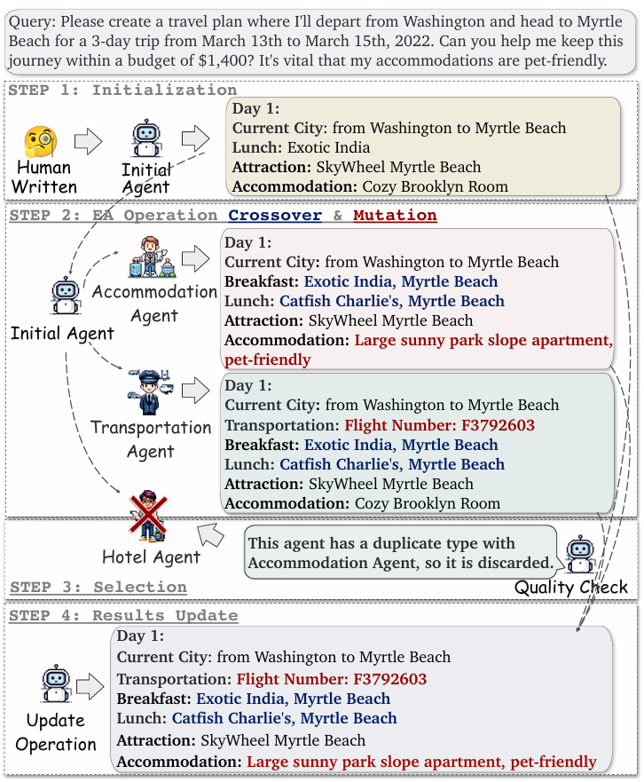 | [](https://arxiv.org/abs/2406.14228) | [](https://github.com/siyuyuan/evoagent) |
| 2025 | `Agentic Neural Networks` | Agentic neural networks: Self-evolving multi-agent systems via textual backpropagation | 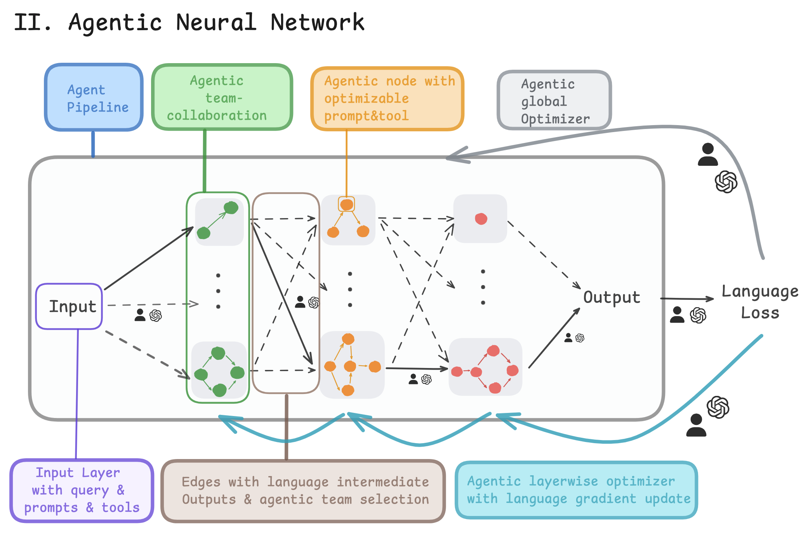 | [](https://arxiv.org/abs/2506.09046) |  |
| 2025 | `G-memory` | G-memory: Tracing hierarchical memory for multi-agent systems | 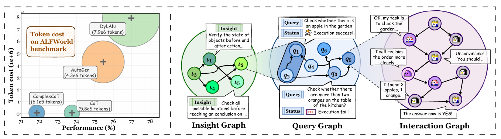 | [](https://arxiv.org/abs/2506.07398) |  |
| 2026 | `Automated` | Automated summarization of software documents: an LLM-based multi-agent approach |  | [](https://arxiv.org/abs/PLACEHOLDER_PAPER_TBD) |  |
| 2025 | `AgentBreeder` | AgentBreeder: Mitigating the AI Safety Risks of Multi-Agent Scaffolds via Self-Improvement | 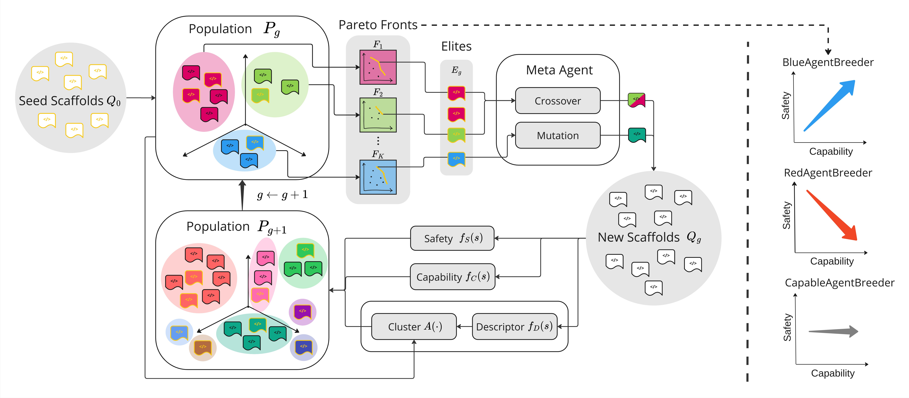 | [](https://arxiv.org/abs/2502.00757) | [](https://github.com/jrosseruk/AgentBreeder) |
| 2025 | `Aflow` | Aflow: Automating agentic workflow generation, 2024 |  | [](https://arxiv.org/abs/2410.10762) |  |
| 2025 | `Mas-zero` | Mas-zero: Designing multi-agent systems with zero supervision | 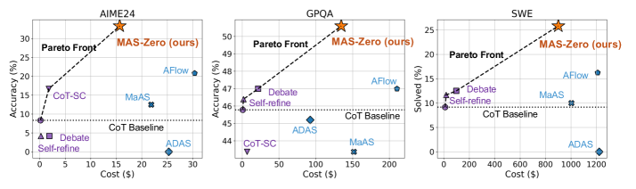 | [](https://arxiv.org/abs/2505.14996) | [](https://github.com/SalesforceAIResearch/MAS-Zero) |
| 2025 | `Multi-agent Architecture` | Multi-agent architecture search via agentic supernet | 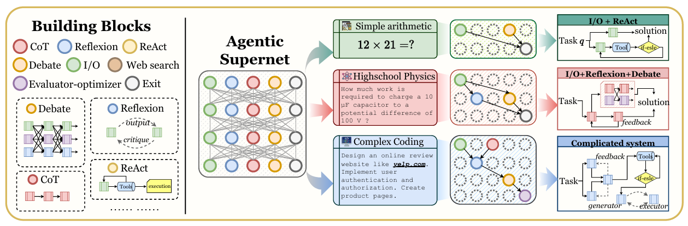 | [](https://arxiv.org/abs/2502.04180) | [](https://github.com/bingreeky/MaAS) |
| 2025 | `Mas-gpt` | Mas-gpt: Training llms to build llm-based multi-agent systems | 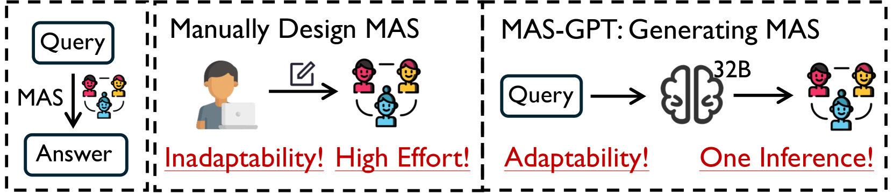 | [](https://arxiv.org/abs/2503.03686) | [](https://github.com/MASWorks/MAS-GPT) |
| 2025 | `MAS` | MAS $\^ 2$: Self-Generative, Self-Configuring, Self-Rectifying Multi-Agent Systems | 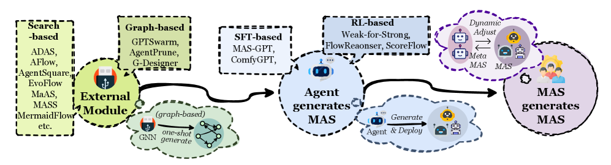 | [](https://arxiv.org/abs/2509.24323) |  |
| 2026 | `Context Learning` | Epistemic Context Learning: Building Trust the Right Way in LLM-Based Multi-Agent Systems | 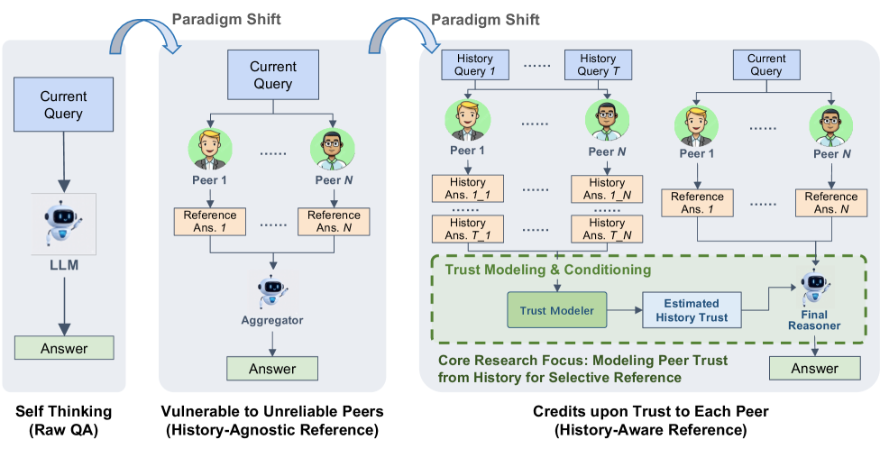 | [](https://arxiv.org/abs/2601.21742) | [](https://github.com/SkyRiver-2000/Epistemic-Context-Learning) |

## 🚩 Acknowledgment

This survey is extended and refined from the original **Awesome RL for LRMs** repo. We are deeply grateful to all contributors for their efforts, and we sincerely thank for their all interest in **Awesome RL for LRMs**. The contents of the previous repository are available [here](https://github.com/TsinghuaC3I/Awesome-RL-for-LRMs).

<a id="star-history"></a>
## 🌟 Star History

[](https://www.star-history.com/#mira-ai-lab/Awesome_MAS_Evolution&Date)
